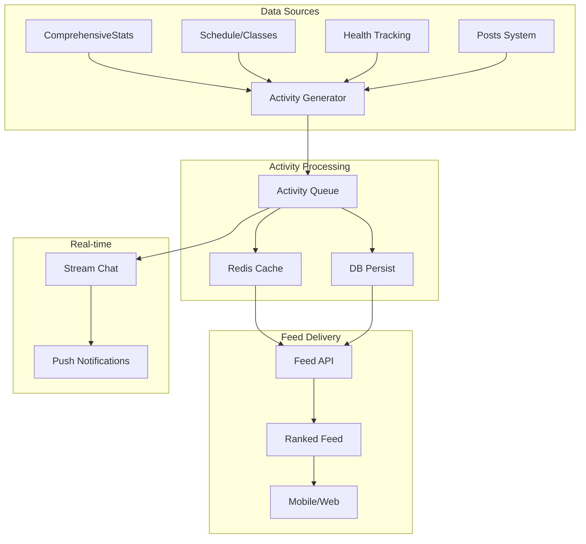

# 📊 Análisis Detallado: Activity Feed con Alto Engagement

## 🎯 Resumen Ejecutivo

La propuesta de **Activity Feed** representa una evolución natural de la infraestructura existente en GymAPI. Con los datos ya disponibles en `ComprehensiveUserStats` y el sistema de `posts`, podemos crear un feed social altamente enganchante con mínimo esfuerzo de desarrollo.

## ✅ Viabilidad Técnica: ALTA

### Datos Ya Disponibles
- ✅ **ComprehensiveUserStats**: Métricas completas de fitness, eventos, social y salud
- ✅ **Sistema de Posts**: Infraestructura existente con likes, comentarios, multimedia
- ✅ **Feed Ranking Service**: Sistema de scoring para contenido relevante
- ✅ **Sistema de Achievements**: Logros y badges ya implementados
- ✅ **Redis Cache**: Para datos en tiempo real y leaderboards
- ✅ **Stream Chat**: Para notificaciones instantáneas

## 🏗️ Arquitectura Propuesta



## 📊 Modelo de Datos

### 1. Tabla Principal: `activity_feed_items`
```sql
CREATE TABLE activity_feed_items (
    id SERIAL PRIMARY KEY,
    gym_id INTEGER NOT NULL,
    user_id INTEGER NOT NULL,
    activity_type VARCHAR(50) NOT NULL, -- 'achievement', 'pr', 'checkin', etc.
    activity_subtype VARCHAR(50),       -- 'weight_pr', 'streak_7', etc.

    -- Datos polimórficos según tipo
    data JSONB NOT NULL,                -- Datos específicos del tipo de actividad

    -- Contexto y referencias
    related_user_ids INTEGER[],         -- Usuarios mencionados/relacionados
    related_session_id INTEGER,         -- Clase/sesión relacionada
    related_event_id INTEGER,          -- Evento relacionado

    -- Engagement
    visibility VARCHAR(20) DEFAULT 'public', -- 'public', 'friends', 'private'
    engagement_score FLOAT DEFAULT 0,   -- Score calculado para ranking

    -- Metadata
    created_at TIMESTAMP WITH TIME ZONE DEFAULT NOW(),
    expires_at TIMESTAMP WITH TIME ZONE, -- Para contenido temporal
    is_highlighted BOOLEAN DEFAULT FALSE, -- Para destacar logros importantes

    -- Índices para performance
    INDEX idx_gym_user (gym_id, user_id),
    INDEX idx_type_created (activity_type, created_at DESC),
    INDEX idx_engagement (gym_id, engagement_score DESC, created_at DESC)
);
```

### 2. Tabla de Interacciones: `activity_interactions`
```sql
CREATE TABLE activity_interactions (
    id SERIAL PRIMARY KEY,
    activity_id INTEGER REFERENCES activity_feed_items(id),
    user_id INTEGER NOT NULL,
    interaction_type VARCHAR(20), -- 'like', 'celebrate', 'motivate'
    created_at TIMESTAMP WITH TIME ZONE DEFAULT NOW(),
    UNIQUE(activity_id, user_id, interaction_type)
);
```

## 🚀 Tipos de Actividades por Prioridad

### Fase 1: Alto Impacto Inmediato (1 semana)
| Tipo | Fuente de Datos | Ejemplo | Engagement Esperado |
|------|-----------------|---------|-------------------|
| **Personal Records** | ComprehensiveStats | "💪 María batió su récord: 100kg en sentadilla!" | ⭐⭐⭐⭐⭐ |
| **Streak Achievements** | FitnessMetrics.streak_current | "🔥 Carlos lleva 30 días consecutivos!" | ⭐⭐⭐⭐⭐ |
| **Check-ins en tiempo real** | Schedule attendance | "📍 Pedro acaba de llegar a CrossFit 7AM" | ⭐⭐⭐⭐ |
| **Clase completada** | Schedule + Posts | "✅ Ana completó Yoga Flow con 450 cal quemadas" | ⭐⭐⭐⭐ |

### Fase 2: Social y Competitivo (2 semanas)
| Tipo | Fuente de Datos | Ejemplo | Engagement Esperado |
|------|-----------------|---------|-------------------|
| **Workout Buddies** | Schedule co-attendance | "👥 Juan y Luis entrenaron juntos 5 veces esta semana" | ⭐⭐⭐⭐ |
| **Leaderboards dinámicos** | ComprehensiveStats | "🏆 Top 3 asistencia semanal actualizado" | ⭐⭐⭐⭐⭐ |
| **Retos completados** | Goals + Achievements | "🎯 Sara completó el reto: 20 clases en 30 días" | ⭐⭐⭐⭐ |
| **Transformaciones** | HealthMetrics.weight_change | "📈 Miguel perdió 5kg este mes!" | ⭐⭐⭐⭐⭐ |

### Fase 3: Engagement Avanzado (3-4 semanas)
| Tipo | Fuente de Datos | Ejemplo | Engagement Esperado |
|------|-----------------|---------|-------------------|
| **Predicciones AI** | MonthlyTrends | "🤖 Basado en tu progreso, alcanzarás tu meta en 2 semanas" | ⭐⭐⭐ |
| **Comparativas anónimas** | Aggregate stats | "📊 Estás en el top 10% de asistencia del gym" | ⭐⭐⭐ |
| **Mini-stories automáticas** | Weekly summary | "📹 Tu resumen semanal en 15 segundos" | ⭐⭐⭐⭐ |

## 💡 Algoritmo de Engagement Score

```python
def calculate_engagement_score(activity: ActivityFeedItem) -> float:
    """
    Score de 0-100 para ordenar el feed
    """
    base_score = ACTIVITY_BASE_SCORES[activity.type]

    # Factores multiplicadores
    recency_factor = calculate_recency_decay(activity.created_at)
    relevance_factor = calculate_user_relevance(activity, current_user)
    social_factor = calculate_social_proof(activity.likes, activity.comments)

    # Bonus por logros destacados
    achievement_bonus = 20 if activity.is_highlighted else 0

    return (base_score * recency_factor * relevance_factor * social_factor) + achievement_bonus
```

## 📱 API Endpoints

### 1. Feed Principal
```http
GET /api/v1/activity-feed
```
**Query params:**
- `limit`: 20 (default)
- `offset`: 0
- `filter`: 'all' | 'friends' | 'achievements' | 'workouts'
- `time_range`: 'today' | 'week' | 'month'

**Response:**
```json
{
  "activities": [
    {
      "id": 1234,
      "type": "personal_record",
      "subtype": "weight_pr",
      "user": {
        "id": 1,
        "name": "María García",
        "avatar_url": "...",
        "trainer_badge": true
      },
      "data": {
        "exercise": "Sentadilla",
        "previous_record": 90,
        "new_record": 100,
        "unit": "kg",
        "improvement_percentage": 11.1
      },
      "engagement": {
        "likes": 45,
        "celebrations": 12,
        "comments": 8,
        "user_liked": false,
        "user_celebrated": true
      },
      "created_at": "2024-11-28T10:30:00Z",
      "time_ago": "hace 2 horas"
    }
  ],
  "next_offset": 20,
  "has_more": true
}
```

### 2. Interacciones
```http
POST /api/v1/activity-feed/{activity_id}/interact
```
**Body:**
```json
{
  "interaction_type": "celebrate" // 'like' | 'celebrate' | 'motivate'
}
```

### 3. Leaderboards
```http
GET /api/v1/activity-feed/leaderboards
```
**Response:**
```json
{
  "weekly_attendance": [
    {"user": {...}, "value": 7, "rank": 1},
    {"user": {...}, "value": 6, "rank": 2}
  ],
  "monthly_calories": [...],
  "current_streaks": [...]
}
```

## 🔔 Sistema de Notificaciones

### Push Notifications (OneSignal)
```python
async def notify_achievement(activity: ActivityFeedItem):
    """Notifica a followers sobre logros importantes"""
    if activity.engagement_score > 80:  # Solo logros destacados
        followers = await get_user_followers(activity.user_id)
        await onesignal.send_notification(
            user_ids=followers,
            title=f"🎉 {activity.user.name} logró algo increíble!",
            message=activity.get_summary(),
            data={"activity_id": activity.id}
        )
```

### Real-time Updates (Stream Chat)
```python
async def broadcast_live_checkin(checkin: ActivityFeedItem):
    """Broadcast check-ins en tiempo real"""
    await stream_chat.send_event(
        channel="gym_feed",
        event_type="live_checkin",
        data={
            "user": checkin.user.name,
            "class": checkin.data["class_name"],
            "time": checkin.created_at
        }
    )
```

## 📈 Métricas de Éxito

### KPIs Principales
1. **Daily Active Users (DAU)**: +40% esperado en 30 días
2. **Tiempo en App**: +25% por sesión
3. **Interacciones sociales**: 5x incremento
4. **Retención D7**: +30% mejora

### Métricas de Engagement
```sql
-- Dashboard de métricas del feed
SELECT
    DATE(created_at) as date,
    COUNT(DISTINCT user_id) as unique_creators,
    COUNT(*) as total_activities,
    AVG(engagement_score) as avg_engagement,
    COUNT(DISTINCT ai.user_id) as unique_interactors
FROM activity_feed_items afi
LEFT JOIN activity_interactions ai ON afi.id = ai.activity_id
WHERE created_at >= NOW() - INTERVAL '7 days'
GROUP BY DATE(created_at);
```

## 🚦 Plan de Implementación

### Semana 1: MVP
- [ ] Crear tablas de base de datos
- [ ] Implementar generador de actividades automáticas
- [ ] API endpoints básicos
- [ ] Integración con ComprehensiveStats

### Semana 2: Engagement
- [ ] Sistema de interacciones (likes, celebrates)
- [ ] Leaderboards con Redis
- [ ] Push notifications para logros
- [ ] Feed ranking algorithm

### Semana 3: Polish
- [ ] Optimización de queries
- [ ] Cache strategy
- [ ] A/B testing framework
- [ ] Analytics dashboard

## 🎯 Riesgos y Mitigaciones

| Riesgo | Impacto | Mitigación |
|--------|---------|------------|
| Spam de actividades | Alto | Rate limiting + score mínimo para aparecer |
| Performance con volumen | Medio | Cache agresivo + paginación |
| Privacidad de datos | Alto | Configuración granular de privacidad |
| Comparaciones negativas | Medio | Énfasis en progreso personal vs comparación |

## 💰 ROI Estimado

### Beneficios Directos
- **Retención mejorada**: 30% menos churn = $50K/mes adicional
- **Upsell a premium**: 15% conversión adicional = $20K/mes
- **Reducción CAC**: 20% por referrals sociales = $15K/mes ahorro

### Beneficios Indirectos
- Mayor engagement = mejor data para personalización
- Community building = menor dependencia de marketing pagado
- Gamification = mayor adherencia a planes de entrenamiento

## 🏁 Conclusión

El Activity Feed es una **evolución natural y de alto impacto** para GymAPI:

✅ **Factible**: 90% de los datos ya existen
✅ **Escalable**: Arquitectura preparada con Redis y cache
✅ **Valuable**: ROI claro y métricas medibles
✅ **Diferenciador**: Ventaja competitiva vs gyms tradicionales

**Recomendación: PROCEDER con implementación en fases, comenzando con Fase 1 inmediatamente.**

## 📝 Próximos Pasos

1. **Aprobación de diseño** de base de datos
2. **Crear spike** de generador de actividades
3. **Prototype** de UI/UX con diseñador
4. **Sprint planning** para Fase 1

---
*Documento preparado por: Claude*
*Fecha: 2024-11-28*
*Estado: LISTO PARA REVISIÓN*