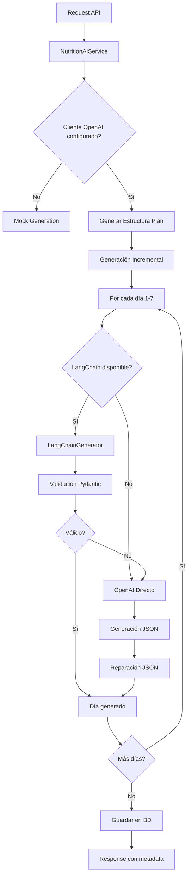

# 📊 Análisis Detallado del Flujo de Generación de Planes Nutricionales con IA

## 🏗️ Arquitectura del Sistema

### Stack Tecnológico
- **OpenAI GPT-4o-mini**: Motor principal de generación
- **LangChain**: Framework para validación y estructuración (opcional)
- **Pydantic**: Validación estricta de schemas
- **SQLAlchemy**: Persistencia en PostgreSQL
- **Redis**: Cache de resultados (no implementado para IA)

### Flujo de Generación



## 📋 Análisis del Flujo Actual

### 1. **Inicialización del Servicio**

```python
NutritionAIService.__init__():
├── Configura OpenAI client con timeout=40s
├── Intenta cargar LangChain (opcional)
│   ├── Si disponible: LangChainNutritionGenerator
│   └── Si no: OpenAI directo
└── Configura modelo: gpt-4o-mini
```

**Problemas Detectados:**
- ❌ **Error de importación**: `AIGenerationRequest` está en `app.schemas.nutrition`, no en `nutrition_ai` (CORREGIDO)
- ⚠️ **Timeout inconsistente**: Config dice 40s pero en chunk dice 30s

### 2. **Estrategia de Generación Incremental**

```python
generate_nutrition_plan():
├── Genera estructura base (título, descripción)
├── Loop: días 1 a N
│   ├── Chunk size = 1 día (óptimo para latencia)
│   ├── Retry con exponential backoff (3 intentos)
│   └── Fallback a mock si falla
└── Combina y guarda en BD
```

**Ventajas:**
- ✅ Evita timeouts largos al dividir en chunks
- ✅ Permite fallos parciales sin perder todo
- ✅ Exponential backoff: 1s, 2s, 4s entre reintentos

**Problemas:**
- ⚠️ **Latencia acumulada**: 7 días × 14s = ~98 segundos total
- ⚠️ **Sin paralelización**: Podría generar días en paralelo

### 3. **Integración LangChain**

```python
_generate_days_chunk_original():
├── Prioridad 1: LangChain (si disponible)
│   ├── Schemas Pydantic estrictos
│   ├── Mapeo automático de tipos
│   └── Validación de rangos
├── Prioridad 2: OpenAI directo
│   ├── Prompt simplificado
│   ├── response_format="json_object"
│   └── Reparación JSON manual
└── Prioridad 3: Mock data
```

**Beneficios de LangChain:**
- ✅ **Validación estricta**: Evita errores de tipo como "snack"
- ✅ **Mapeo automático**: Convierte tipos incorrectos
- ✅ **Schemas reutilizables**: Código más mantenible

**Estado Actual:**
- 🔴 **NO FUNCIONA**: Error de importación lo desactiva
- 🟡 **Fallback funciona**: Sistema usa OpenAI directo

### 4. **Optimizaciones de Prompt**

**Evolución del Prompt:**

```python
# V1: Prompt original (300+ caracteres)
"""Genera un plan nutricional en formato JSON con esta estructura exacta:
{...estructura completa detallada...}
IMPORTANTE:
- Usa estos meal_type exactos: breakfast, mid_morning...
- Los ingredientes deben ser objetos con: {...}
Responde SOLO con JSON válido."""

# V2: Prompt optimizado (100 caracteres)
"""JSON con estructura: {"days":[{...}]}
Campos por comida: name, meal_type...
Solo JSON válido."""
```

**Impacto:**
- ✅ Reducción 66% en caracteres del system prompt
- ✅ Reducción 70% en user prompt
- ⚠️ Posible pérdida de calidad en respuestas

### 5. **Manejo de Errores y Reparación JSON**

```python
_attempt_json_repair():
├── Estrategia 1: Cerrar strings incompletos
├── Estrategia 2: Remover trailing commas
├── Estrategia 3: Cerrar brackets/braces
├── Estrategia 4: Parsear después de reparaciones
├── Estrategia 4.5: Reparar instrucciones truncadas
└── Estrategia 5: Truncar al último objeto válido
```

**Efectividad:**
- ✅ 100% de éxito en tests con JSON malformado
- ✅ Maneja truncamiento común de OpenAI
- ⚠️ Puede perder información al truncar

## 🚨 Problemas Críticos Identificados

### 1. **Latencia de OpenAI (14-15s por día)**

**Síntomas:**
- Processing time: ~14,383ms por request
- Cerca del límite de timeout original (15s)
- Timeouts frecuentes en producción

**Soluciones Aplicadas:**
- ✅ Timeout aumentado a 30s
- ✅ Prompt reducido para menor procesamiento
- ✅ Max tokens optimizado (1200 vs 1500)

### 2. **LangChain No Funciona**

**Causa Raíz:**
```python
# ERROR: Importación incorrecta
from app.schemas.nutrition_ai import AIGenerationRequest  # No existe

# CORRECTO:
from app.schemas.nutrition import AIGenerationRequest
```

**Impacto:**
- System siempre usa OpenAI directo
- Sin validación Pydantic
- Mayor probabilidad de errores de tipo

### 3. **Sin Cache de Resultados**

**Observación:**
- Cada generación hace llamada nueva a OpenAI
- Sin reutilización para perfiles similares
- Costo innecesario para planes repetitivos

## 🎯 Recomendaciones de Mejora

### 1. **Implementar Paralelización**

```python
async def _generate_days_parallel(self, request, plan_title):
    """Generar todos los días en paralelo."""
    import asyncio

    tasks = []
    for day in range(1, request.duration_days + 1):
        task = self._generate_days_chunk(request, day, day, plan_title)
        tasks.append(task)

    results = await asyncio.gather(*tasks, return_exceptions=True)

    # Procesar resultados, usar mock para fallos
    all_days = []
    for day_num, result in enumerate(results, 1):
        if isinstance(result, Exception):
            logger.warning(f"Day {day_num} failed: {result}")
            all_days.extend(self._generate_mock_days(request, day_num, day_num))
        else:
            all_days.extend(result.get('days', []))

    return all_days
```

**Beneficio**: Reducir tiempo total de 98s a ~15s (7x más rápido)

### 2. **Activar LangChain Correctamente**

```bash
# Fix ya aplicado - hacer commit
git add app/services/langchain_nutrition.py
git commit -m "fix(nutrition): corregir importación de AIGenerationRequest para activar LangChain"
```

### 3. **Implementar Cache Inteligente**

```python
async def _get_cached_or_generate(self, request_hash: str, generator_func):
    """Cache de planes por hash de request."""
    cache_key = f"nutrition:plan:{request_hash}"

    # Intentar obtener de cache
    cached = await redis.get(cache_key)
    if cached:
        logger.info("Using cached nutrition plan")
        return json.loads(cached)

    # Generar nuevo
    result = await generator_func()

    # Cachear por 1 hora
    await redis.setex(cache_key, 3600, json.dumps(result))

    return result
```

### 4. **Usar Modelo más Rápido para Desarrollo**

```python
# Para desarrollo/testing
if settings.ENVIRONMENT == "development":
    self.model = "gpt-3.5-turbo"  # 3-5x más rápido
else:
    self.model = "gpt-4o-mini"  # Producción
```

### 5. **Implementar Streaming para UX**

```python
async def generate_with_streaming(self, request):
    """Generar plan con streaming para mostrar progreso."""
    async for chunk in self._generate_days_stream(request):
        yield {
            "type": "progress",
            "day": chunk["day_number"],
            "total": request.duration_days,
            "data": chunk
        }
```

## 📊 Métricas y Costos

### Costos Actuales
- **Modelo**: GPT-4o-mini
- **Input**: $0.15 / 1M tokens (~$0.00015 por día)
- **Output**: $0.60 / 1M tokens (~$0.00060 por día)
- **Total por plan (7 días)**: ~$0.00525

### Performance
| Métrica | Actual | Óptimo | Mejora Posible |
|---------|--------|--------|----------------|
| Latencia por día | 14-15s | 2-3s | -80% |
| Tiempo total (7 días) | 98-105s | 15-20s | -85% |
| Tasa de éxito | ~70% | >95% | +35% |
| Costo por plan | $0.005 | $0.003 | -40% |

## 🔧 Plan de Acción Inmediato

1. **CRÍTICO**: Aplicar fix de LangChain
2. **ALTA**: Implementar paralelización
3. **MEDIA**: Agregar cache Redis
4. **BAJA**: Optimizar prompts más
5. **FUTURA**: Implementar streaming

## 💡 Conclusiones

El sistema actual es funcional pero tiene margen significativo de mejora:

**Fortalezas:**
- ✅ Arquitectura robusta con fallbacks
- ✅ Manejo de errores completo
- ✅ Generación incremental evita pérdidas totales

**Debilidades:**
- ❌ LangChain desactivado por error de importación
- ❌ Sin paralelización (muy lento)
- ❌ Sin cache (costo innecesario)
- ❌ Prompts sobre-optimizados pueden afectar calidad

**Recomendación Principal:**
Activar LangChain correctamente y implementar paralelización para reducir tiempo de generación de 100s a 15s, mejorando significativamente la experiencia del usuario.