# Sistema de Chat - Documentación para Desarrollador Swift

## 📱 Introducción

Esta documentación explica cómo integrar y trabajar con el sistema de chat del GymApi desde una aplicación iOS/Swift. El sistema utiliza **Stream Chat** como backend de mensajería en tiempo real, integrado con nuestra API REST para gestión de gimnasios.

---

## 🏗️ Arquitectura General

```
┌─────────────────┐    ┌─────────────────┐    ┌─────────────────┐
│   App iOS       │    │    GymApi       │    │   Stream Chat   │
│   (Swift)       │◄──►│   (Python)      │◄──►│   (Backend)     │
└─────────────────┘    └─────────────────┘    └─────────────────┘
        │                       │                       │
        │                       │                       │
        ▼                       ▼                       ▼
┌─────────────────┐    ┌─────────────────┐    ┌─────────────────┐
│ Stream Chat SDK │    │ PostgreSQL DB   │    │ Stream Servers  │
│   (iOS)         │    │                 │    │                 │
└─────────────────┘    └─────────────────┘    └─────────────────┘
```

### Componentes Clave:
- **GymApi**: Maneja autenticación, salas, miembros y permisos
- **Stream Chat**: Servicio de mensajería en tiempo real
- **App iOS**: Cliente que consume ambos servicios

---

## 🔐 Autenticación y Tokens

### 1. Flujo de Autenticación

```mermaid
sequenceDiagram
    participant iOS as App iOS
    participant API as GymApi
    participant Stream as Stream Chat
    
    iOS->>API: POST /auth/token (gym_id)
    API->>API: Validar membresía gym
    API->>Stream: Generar token usuario
    Stream-->>API: Token Stream
    API-->>iOS: StreamTokenResponse
    iOS->>Stream: Conectar con token
```



### 2. Endpoint de Token

**GET** `/api/v1/chat/token`

**Headers requeridos:**
```http
Authorization: Bearer <jwt_token>
X-Gym-ID: <gym_id>
```

**Respuesta:**
```json
{
    "token": "eyJhbGciOiJIUzI1NiIsInR5cCI6IkpXVCJ9...",
    "api_key": "stream_api_key_here", 
    "internal_user_id": 123
}
```

### 3. Implementación Swift

```swift
struct StreamTokenResponse: Codable {
    let token: String
    let apiKey: String
    let internalUserId: Int
    
    enum CodingKeys: String, CodingKey {
        case token, apiKey = "api_key", internalUserId = "internal_user_id"
    }
}

class ChatAuthService {
    func getStreamToken(gymId: Int) async throws -> StreamTokenResponse {
        var request = URLRequest(url: URL(string: "\(baseURL)/chat/token")!)
        request.addValue("Bearer \(jwtToken)", forHTTPHeaderField: "Authorization")
        request.addValue("\(gymId)", forHTTPHeaderField: "X-Gym-ID")
        
        let (data, _) = try await URLSession.shared.data(for: request)
        return try JSONDecoder().decode(StreamTokenResponse.self, from: data)
    }
}
```

---

## 💬 Estructura de Datos

### 1. Modelos de Chat Room

```swift
enum ChatRoomStatus: String, Codable {
    case active = "ACTIVE"
    case closed = "CLOSED"
}

struct ChatRoom: Codable, Identifiable {
    let id: Int
    let streamChannelId: String
    let streamChannelType: String
    let name: String?
    let gymId: Int
    let eventId: Int?
    let isDirect: Bool
    let status: ChatRoomStatus
    let createdAt: Date
    let updatedAt: Date
    
    enum CodingKeys: String, CodingKey {
        case id
        case streamChannelId = "stream_channel_id"
        case streamChannelType = "stream_channel_type"
        case name
        case gymId = "gym_id"
        case eventId = "event_id"
        case isDirect = "is_direct"
        case status
        case createdAt = "created_at"
        case updatedAt = "updated_at"
    }
}
```

### 2. Modelos de Chat Member

```swift
struct ChatMember: Codable, Identifiable {
    let id: Int
    let roomId: Int
    let userId: Int
    let joinedAt: Date
    let auth0UserId: String?  // Para retrocompatibilidad
    
    enum CodingKeys: String, CodingKey {
        case id
        case roomId = "room_id"
        case userId = "user_id"
        case joinedAt = "joined_at"
        case auth0UserId = "auth0_user_id"
    }
}
```

### 3. Modelos de Mensajes

```swift
struct StreamMessageSend: Codable {
    let text: String
    let attachments: [MessageAttachment]?
    let mentionedUsers: [Int]?  // IDs internos de usuarios
    
    enum CodingKeys: String, CodingKey {
        case text, attachments
        case mentionedUsers = "mentioned_users"
    }
}

struct MessageAttachment: Codable {
    let type: String  // "image", "file", etc.
    let assetUrl: String?
    let title: String?
    let titleLink: String?
    
    enum CodingKeys: String, CodingKey {
        case type
        case assetUrl = "asset_url"
        case title
        case titleLink = "title_link"
    }
}
```

---

## 🔌 Endpoints de la API

### 1. Gestión de Salas de Chat

#### Crear Sala Grupal
**POST** `/api/v1/chat/rooms`

```swift
struct CreateChatRoomRequest: Codable {
    let name: String?
    let memberIds: [Int]  // IDs internos de usuarios
    let isDirect: Bool = false
    let eventId: Int?
    
    enum CodingKeys: String, CodingKey {
        case name
        case memberIds = "member_ids"
        case isDirect = "is_direct"
        case eventId = "event_id"
    }
}
```

#### Obtener Chat Directo (1:1)
**GET** `/api/v1/chat/rooms/direct/{user_id}`

#### Obtener Chat de Evento
**GET** `/api/v1/chat/rooms/event/{event_id}`

#### Mis Salas del Gimnasio Actual
**GET** `/api/v1/chat/my-rooms`

#### Todas mis Salas (Multi-Gimnasio)
**GET** `/api/v1/chat/user-rooms`

### 2. Gestión de Miembros

#### Agregar Miembro
**POST** `/api/v1/chat/rooms/{room_id}/members/{user_id}`

#### Remover Miembro
**DELETE** `/api/v1/chat/rooms/{room_id}/members/{user_id}`

### 3. Canal General del Gimnasio

#### Información del Canal General
**GET** `/api/v1/chat/general-channel/info`

#### Unirse al Canal General
**POST** `/api/v1/chat/general-channel/join`

#### Salir del Canal General
**DELETE** `/api/v1/chat/general-channel/leave`

---

## 🚀 Implementación en Swift

### 1. Setup Inicial del Stream SDK

```swift
import StreamChat
import StreamChatUI

class ChatManager: ObservableObject {
    private var chatClient: ChatClient!
    private var currentUserId: UserId?
    
    func setup(with tokenResponse: StreamTokenResponse) {
        // Configurar cliente Stream
        let config = ChatClientConfig(apiKey: .init(tokenResponse.apiKey))
        chatClient = ChatClient(config: config)
        
        // ID de usuario para Stream (formato especial)
        let streamUserId = "user_\(tokenResponse.internalUserId)"
        currentUserId = UserId(streamUserId)
        
        // Conectar con token
        chatClient.connectUser(
            userInfo: .init(id: streamUserId),
            token: .init(rawValue: tokenResponse.token)
        ) { error in
            if let error = error {
                print("Error conectando a Stream: \(error)")
            } else {
                print("Conectado exitosamente a Stream")
            }
        }
    }
}
```

### 2. Servicio de Chat Completo

```swift
class ChatService: ObservableObject {
    private let apiService: APIService
    private let chatManager: ChatManager
    
    init(apiService: APIService) {
        self.apiService = apiService
        self.chatManager = ChatManager()
    }
    
    // MARK: - Autenticación
    func authenticateChat(gymId: Int) async throws {
        let tokenResponse = try await apiService.getStreamToken(gymId: gymId)
        await MainActor.run {
            chatManager.setup(with: tokenResponse)
        }
    }
    
    // MARK: - Crear Salas
    func createGroupChat(name: String?, memberIds: [Int], eventId: Int? = nil) async throws -> ChatRoom {
        let request = CreateChatRoomRequest(
            name: name,
            memberIds: memberIds,
            eventId: eventId
        )
        
        let response = try await apiService.post("/chat/rooms", body: request)
        return try JSONDecoder().decode(ChatRoom.self, from: response)
    }
    
    // MARK: - Chat Directo
    func getDirectChat(withUserId userId: Int) async throws -> ChatRoom {
        let response = try await apiService.get("/chat/rooms/direct/\(userId)")
        return try JSONDecoder().decode(ChatRoom.self, from: response)
    }
    
    // MARK: - Chat de Evento
    func getEventChat(eventId: Int) async throws -> ChatRoom {
        let response = try await apiService.get("/chat/rooms/event/\(eventId)")
        return try JSONDecoder().decode(ChatRoom.self, from: response)
    }
    
    // MARK: - Listar Salas
    func getMyRooms() async throws -> [ChatRoom] {
        let response = try await apiService.get("/chat/my-rooms")
        return try JSONDecoder().decode([ChatRoom].self, from: response)
    }
    
    // MARK: - Canal General
    func joinGeneralChannel() async throws -> ChatRoom {
        let response = try await apiService.post("/chat/general-channel/join", body: EmptyBody())
        return try JSONDecoder().decode(ChatRoom.self, from: response)
    }
    
    func leaveGeneralChannel() async throws {
        _ = try await apiService.delete("/chat/general-channel/leave")
    }
    
    // MARK: - Gestión de Miembros
    func addMember(userId: Int, toRoom roomId: Int) async throws {
        _ = try await apiService.post("/chat/rooms/\(roomId)/members/\(userId)", body: EmptyBody())
    }
    
    func removeMember(userId: Int, fromRoom roomId: Int) async throws {
        _ = try await apiService.delete("/chat/rooms/\(roomId)/members/\(userId)")
    }
}

struct EmptyBody: Codable {}
```

### 3. Vista de Lista de Chats

```swift
import SwiftUI
import StreamChat

struct ChatListView: View {
    @StateObject private var chatService = ChatService(apiService: APIService.shared)
    @State private var chatRooms: [ChatRoom] = []
    @State private var isLoading = false
    @State private var errorMessage: String?
    
    var body: some View {
        NavigationView {
            List(chatRooms) { room in
                NavigationLink(destination: ChatDetailView(room: room)) {
                    ChatRoomRowView(room: room)
                }
            }
            .navigationTitle("Chats")
            .onAppear {
                Task {
                    await loadChatRooms()
                }
            }
        }
    }
    
    private func loadChatRooms() async {
        isLoading = true
        defer { isLoading = false }
        
        do {
            // Primero autenticar con Stream
            await chatService.authenticateChat(gymId: UserDefaults.gymId)
            
            // Luego cargar las salas
            chatRooms = try await chatService.getMyRooms()
        } catch {
            errorMessage = error.localizedDescription
        }
    }
}

struct ChatRoomRowView: View {
    let room: ChatRoom
    
    var body: some View {
        VStack(alignment: .leading, spacing: 4) {
            HStack {
                Text(room.name ?? "Chat Directo")
                    .font(.headline)
                    .lineLimit(1)
                
                Spacer()
                
                if room.eventId != nil {
                    Image(systemName: "calendar")
                        .foregroundColor(.blue)
                }
            }
            
            Text("Miembros: \(room.streamChannelId)")
                .font(.caption)
                .foregroundColor(.secondary)
                .lineLimit(1)
        }
        .padding(.vertical, 2)
    }
}
```

### 4. Vista de Chat Individual

```swift
import StreamChatUI

struct ChatDetailView: View {
    let room: ChatRoom
    
    var body: some View {
        // Usar el SDK de Stream directamente
        ChatChannelView(
            viewFactory: DefaultViewFactory.shared,
            channelController: ChatClient.shared.channelController(
                for: ChannelId(type: .messaging, id: room.streamChannelId)
            )
        )
        .navigationTitle(room.name ?? "Chat")
        .navigationBarTitleDisplayMode(.inline)
    }
}
```

---

## 📋 Tipos de Chat y Casos de Uso

### 1. Chat Directo (1:1)
- **Uso**: Conversaciones privadas entre miembros
- **Creación**: Automática al solicitar chat con otro usuario
- **Formato ID**: `gym_{gym_id}_direct_{user_id_menor}_{user_id_mayor}`

### 2. Chat de Evento
- **Uso**: Discusiones relacionadas a clases/eventos
- **Creación**: Automática al crear evento
- **Formato ID**: `gym_{gym_id}_event_{event_id}`
- **Cierre**: Automático 2 horas después del evento

### 3. Chat Grupal
- **Uso**: Grupos creados manualmente por trainers/admins
- **Creación**: Manual mediante API
- **Formato ID**: `gym_{gym_id}_group_{timestamp}`

### 4. Canal General
- **Uso**: Anuncios y comunicación general del gimnasio
- **Creación**: Uno por gimnasio
- **Formato ID**: `gym_{gym_id}_general`

---

## 🔐 Seguridad y Multi-Tenant

### 1. Validación de Acceso
El sistema implementa seguridad multi-tenant estricta:

```swift
// SIEMPRE incluir el gym_id en los headers
func setupAPIHeaders(gymId: Int, jwtToken: String) -> [String: String] {
    return [
        "Authorization": "Bearer \(jwtToken)",
        "X-Gym-ID": "\(gymId)",
        "Content-Type": "application/json"
    ]
}
```

### 2. IDs de Canal Seguros
Los IDs de canal incluyen el `gym_id` para prevenir acceso cruzado:
- ✅ Correcto: `gym_123_event_456`
- ❌ Incorrecto: `event_456`

### 3. Validación de Membresía
Antes de mostrar cualquier chat, verificar membresía:

```swift
func validateGymAccess() async throws -> Bool {
    // Verificar que el usuario tiene acceso al gimnasio actual
    let membership = try await apiService.getCurrentMembership()
    return membership.gymId == UserDefaults.gymId && membership.isActive
}
```

---

## 📊 Analíticas y Métricas

### 1. Endpoints de Analíticas

```swift
struct ChatAnalytics {
    // Resumen de actividad del gimnasio
    func getGymSummary() async throws -> GymChatSummary {
        let response = try await apiService.get("/chat/analytics/gym-summary")
        return try JSONDecoder().decode(GymChatSummary.self, from: response)
    }
    
    // Actividad de usuario específico
    func getUserActivity(userId: Int) async throws -> UserChatActivity {
        let response = try await apiService.get("/chat/analytics/user-activity?user_id=\(userId)")
        return try JSONDecoder().decode(UserChatActivity.self, from: response)
    }
}

struct GymChatSummary: Codable {
    let totalRooms: Int
    let activeRooms: Int
    let totalMessages: Int
    let activeUsers: Int
    let popularTimes: [PopularTime]
    
    enum CodingKeys: String, CodingKey {
        case totalRooms = "total_rooms"
        case activeRooms = "active_rooms"
        case totalMessages = "total_messages"
        case activeUsers = "active_users"
        case popularTimes = "popular_times"
    }
}
```

---

## 🔔 Notificaciones Push

### 1. Configuración
Las notificaciones se envían automáticamente vía OneSignal cuando:
- Se recibe un mensaje nuevo
- El usuario es mencionado (@usuario)
- Se agrega a una nueva sala

### 2. Implementación
```swift
import OneSignal

class NotificationManager {
    func setupPushNotifications(internalUserId: Int) {
        // Configurar OneSignal con el ID interno
        OneSignal.setExternalUserId("\(internalUserId)")
        
        // Suscribirse a notificaciones de chat
        OneSignal.setNotificationWillShowInForegroundHandler { notification, completion in
            // Manejar notificación en primer plano
            if notification.notificationType == .chat {
                // Mostrar banner personalizado o actualizar UI
            }
            completion(notification)
        }
    }
}
```

---

## ⚡ Mejores Prácticas

### 1. Cache y Performance
```swift
class ChatCache {
    private var tokenCache: (token: StreamTokenResponse, expiry: Date)?
    private var roomsCache: (rooms: [ChatRoom], expiry: Date)?
    
    func getCachedToken() -> StreamTokenResponse? {
        guard let cache = tokenCache,
              cache.expiry > Date() else { return nil }
        return cache.token
    }
    
    func cacheToken(_ token: StreamTokenResponse) {
        // Cache por 5 minutos (igual que el backend)
        tokenCache = (token, Date().addingTimeInterval(300))
    }
}
```

### 2. Manejo de Errores
```swift
enum ChatError: Error, LocalizedError {
    case notAuthenticated
    case gymAccessDenied
    case streamConnectionFailed
    case rateLimited
    
    var errorDescription: String? {
        switch self {
        case .notAuthenticated:
            return "No autenticado. Inicia sesión nuevamente."
        case .gymAccessDenied:
            return "No tienes acceso a este gimnasio."
        case .streamConnectionFailed:
            return "Error de conexión con el chat."
        case .rateLimited:
            return "Demasiadas solicitudes. Intenta más tarde."
        }
    }
}
```

### 3. Estados de Conexión
```swift
class ChatConnectionManager: ObservableObject {
    @Published var connectionState: ConnectionState = .disconnected
    
    enum ConnectionState {
        case disconnected
        case connecting  
        case connected
        case reconnecting
        case failed(Error)
    }
    
    func monitorConnection() {
        ChatClient.shared.connectionController.delegate = self
    }
}

extension ChatConnectionManager: ConnectionControllerDelegate {
    func connectionController(_ controller: ConnectionController, didUpdateConnectionStatus status: ConnectionStatus) {
        DispatchQueue.main.async {
            switch status {
            case .connecting:
                self.connectionState = .connecting
            case .connected:
                self.connectionState = .connected
            case .disconnected:
                self.connectionState = .disconnected
            }
        }
    }
}
```

---

## 🧪 Testing

### 1. Tests de Unidad
```swift
import XCTest
@testable import YourApp

class ChatServiceTests: XCTestCase {
    var chatService: ChatService!
    var mockAPIService: MockAPIService!
    
    override func setUp() {
        mockAPIService = MockAPIService()
        chatService = ChatService(apiService: mockAPIService)
    }
    
    func testCreateDirectChat() async throws {
        // Given
        let expectedRoom = ChatRoom.mockDirect()
        mockAPIService.mockResponse = expectedRoom
        
        // When
        let room = try await chatService.getDirectChat(withUserId: 123)
        
        // Then
        XCTAssertEqual(room.isDirect, true)
        XCTAssertEqual(room.streamChannelId, expectedRoom.streamChannelId)
    }
}
```

### 2. Tests de Integración
```swift
func testFullChatFlow() async throws {
    // 1. Autenticar
    try await chatService.authenticateChat(gymId: 1)
    
    // 2. Crear chat grupal
    let room = try await chatService.createGroupChat(
        name: "Test Group",
        memberIds: [1, 2, 3]
    )
    
    // 3. Verificar que se puede enviar mensaje
    // (usando Stream SDK directamente)
    
    // 4. Limpiar
    // Remover sala de prueba
}
```

---

## 🚨 Resolución de Problemas Comunes

### 1. Error de Autenticación
**Problema**: Token inválido o expirado
**Solución**:
```swift
func handleAuthError() async {
    // Limpiar cache de token
    ChatCache.shared.clearTokenCache()
    
    // Solicitar nuevo token
    try await chatService.authenticateChat(gymId: currentGymId)
}
```

### 2. Canal No Encontrado
**Problema**: `StreamChannelId` no existe en Stream
**Solución**:
```swift
func handleChannelNotFound(roomId: Int) async {
    // Recrear canal en Stream basado en datos locales
    try await chatService.syncRoomWithStream(roomId: roomId)
}
```

### 3. Mensajes No Llegan
**Problema**: Notificaciones push no funcionan
**Verificar**:
- OneSignal configurado correctamente
- IDs de usuario coinciden (interno vs Stream)
- Permisos de notificación activos

---

## 📚 Recursos Adicionales

### 1. Documentación de Stream Chat
- [Stream Chat iOS SDK](https://getstream.io/chat/sdk/ios/)
- [SwiftUI Integration](https://getstream.io/chat/sdk/ios/tutorial/swiftui-overview/)

### 2. Códigos de Ejemplo
- Ver `debug_stream_chats.py` para ejemplos de consultas
- Ver `test_chat_webhook.py` para tests de integración

### 3. Monitoreo
- Dashboard de Stream para métricas en tiempo real
- Logs del backend en `/api/v1/chat/analytics/`

---

## ✅ Checklist de Implementación

### Configuración Inicial
- [ ] Instalar Stream Chat SDK
- [ ] Configurar OneSignal para push notifications
- [ ] Implementar servicio de autenticación con tokens
- [ ] Setup de headers con gym_id

### Funcionalidades Core  
- [ ] Lista de chats del usuario
- [ ] Chat directo 1:1
- [ ] Chat grupal
- [ ] Chat de eventos
- [ ] Canal general del gimnasio

### Características Avanzadas
- [ ] Menciones (@usuario)
- [ ] Adjuntos (imágenes, archivos)
- [ ] Notificaciones push
- [ ] Cache de datos
- [ ] Manejo de reconexión

### Testing y Deploy
- [ ] Tests unitarios
- [ ] Tests de integración
- [ ] Manejo de errores
- [ ] Performance en listas grandes
- [ ] Testing en diferentes gimnasios

---

## 📞 Soporte

Para dudas sobre implementación:
1. Revisar logs del backend en `/api/v1/chat/analytics/health-metrics`
2. Usar scripts de debug en el directorio del proyecto
3. Verificar estado de Stream en dashboard oficial

**¡La documentación está completa y lista para implementación!** 🚀