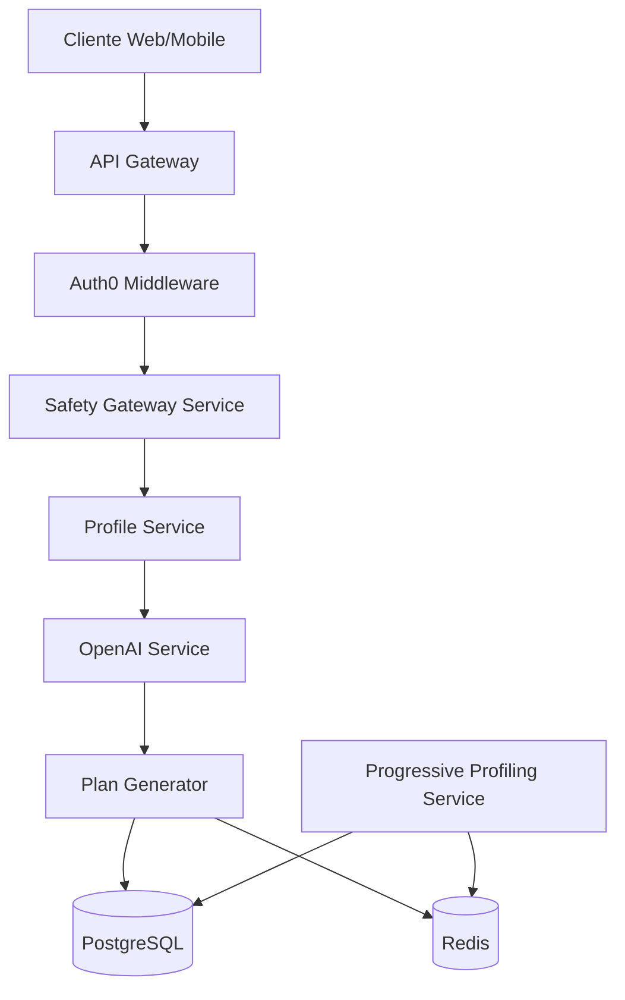

# 🔧 IMPLEMENTACIÓN BACKEND - Sistema Nutricional con IA

## 📋 Resumen Ejecutivo

Documentación técnica completa para implementar el backend del sistema nutricional con IA basado en las decisiones aprobadas por Product Management.

## 🏗️ Arquitectura General



## 📊 Modelos de Base de Datos

### 1. Tabla de Screening de Seguridad

```sql
-- Nueva tabla para auditoría de seguridad
CREATE TABLE nutrition_safety_screenings (
    id SERIAL PRIMARY KEY,
    user_id INTEGER NOT NULL REFERENCES users(id) ON DELETE CASCADE,
    gym_id INTEGER NOT NULL REFERENCES gyms(id) ON DELETE CASCADE,

    -- Datos del screening
    age INTEGER NOT NULL CHECK (age >= 13 AND age <= 120),
    has_diabetes BOOLEAN DEFAULT FALSE,
    has_heart_condition BOOLEAN DEFAULT FALSE,
    has_kidney_disease BOOLEAN DEFAULT FALSE,
    has_liver_disease BOOLEAN DEFAULT FALSE,
    has_eating_disorder BOOLEAN DEFAULT FALSE,
    is_pregnant BOOLEAN DEFAULT FALSE,
    is_breastfeeding BOOLEAN DEFAULT FALSE,
    is_minor BOOLEAN DEFAULT FALSE,

    -- Consentimientos
    accepts_disclaimer BOOLEAN NOT NULL DEFAULT FALSE,
    parental_consent_email VARCHAR(255),
    parental_consent_token UUID,
    parental_consent_verified BOOLEAN DEFAULT FALSE,

    -- Resultado del screening
    risk_score INTEGER NOT NULL CHECK (risk_score >= 0 AND risk_score <= 10),
    can_proceed BOOLEAN NOT NULL,
    requires_professional BOOLEAN NOT NULL,
    warnings JSONB,

    -- Metadata
    created_at TIMESTAMP WITH TIME ZONE DEFAULT CURRENT_TIMESTAMP,
    expires_at TIMESTAMP WITH TIME ZONE,
    ip_address INET,
    user_agent TEXT,

    CONSTRAINT unique_active_screening UNIQUE (user_id, gym_id, created_at)
);

CREATE INDEX idx_screening_user_gym ON nutrition_safety_screenings(user_id, gym_id);
CREATE INDEX idx_screening_expires ON nutrition_safety_screenings(expires_at);
CREATE INDEX idx_screening_risk ON nutrition_safety_screenings(risk_score);
```

### 2. Tabla de Perfiles Nutricionales

```sql
-- Tabla principal de perfiles (datos mínimos)
CREATE TABLE nutrition_profiles (
    id SERIAL PRIMARY KEY,
    user_id INTEGER NOT NULL REFERENCES users(id) ON DELETE CASCADE,
    gym_id INTEGER NOT NULL REFERENCES gyms(id) ON DELETE CASCADE,

    -- Datos básicos (Paso 1)
    goal VARCHAR(50) NOT NULL CHECK (goal IN ('weight_loss', 'muscle_gain', 'maintain', 'energy')),
    weight_kg DECIMAL(5,2) NOT NULL CHECK (weight_kg > 30 AND weight_kg < 300),
    height_cm DECIMAL(5,2) NOT NULL CHECK (height_cm > 100 AND height_cm < 250),
    age INTEGER NOT NULL CHECK (age >= 13 AND age <= 120),
    biological_sex VARCHAR(10) NOT NULL CHECK (biological_sex IN ('male', 'female')),
    activity_level VARCHAR(20) NOT NULL CHECK (activity_level IN ('low', 'moderate', 'high')),

    -- Cálculos automáticos (generados en backend)
    bmi DECIMAL(4,2) GENERATED ALWAYS AS (weight_kg / POWER(height_cm/100, 2)) STORED,
    bmr INTEGER,
    tdee INTEGER,
    target_calories INTEGER,
    target_protein_g INTEGER,
    target_carbs_g INTEGER,
    target_fat_g INTEGER,

    -- Restricciones (Paso 2)
    dietary_restriction VARCHAR(50),
    allergies TEXT[], -- Array de alergias
    disliked_foods TEXT, -- Máximo 200 caracteres
    budget_level VARCHAR(20) DEFAULT 'moderate' CHECK (budget_level IN ('low', 'moderate', 'high')),
    cooking_time_minutes INTEGER DEFAULT 30,

    -- Progressive profiling (capturado después)
    cooks_for_family BOOLEAN,
    family_size INTEGER,
    eats_out_weekly INTEGER,
    meal_prep_experience VARCHAR(50),
    supplements TEXT[],
    waist_cm DECIMAL(5,2),
    body_fat_percentage DECIMAL(4,2),

    -- Metadata
    created_at TIMESTAMP WITH TIME ZONE DEFAULT CURRENT_TIMESTAMP,
    updated_at TIMESTAMP WITH TIME ZONE DEFAULT CURRENT_TIMESTAMP,
    last_plan_generated_at TIMESTAMP WITH TIME ZONE,
    profile_completion_percentage INTEGER DEFAULT 0,

    CONSTRAINT unique_user_profile UNIQUE (user_id, gym_id)
);

CREATE INDEX idx_profile_user_gym ON nutrition_profiles(user_id, gym_id);
CREATE INDEX idx_profile_goal ON nutrition_profiles(goal);
CREATE INDEX idx_profile_completion ON nutrition_profiles(profile_completion_percentage);
```

### 3. Tabla de Planes Nutricionales

```sql
-- Tabla de planes generados
CREATE TABLE nutrition_plans (
    id SERIAL PRIMARY KEY,
    user_id INTEGER NOT NULL REFERENCES users(id) ON DELETE CASCADE,
    gym_id INTEGER NOT NULL REFERENCES gyms(id) ON DELETE CASCADE,
    profile_id INTEGER NOT NULL REFERENCES nutrition_profiles(id) ON DELETE CASCADE,
    screening_id INTEGER REFERENCES nutrition_safety_screenings(id),

    -- Información del plan
    name VARCHAR(255) NOT NULL,
    description TEXT,
    goal VARCHAR(50) NOT NULL,
    duration_weeks INTEGER DEFAULT 1,

    -- Targets nutricionales
    target_calories INTEGER NOT NULL,
    target_protein_g INTEGER NOT NULL,
    target_carbs_g INTEGER NOT NULL,
    target_fat_g INTEGER NOT NULL,
    target_fiber_g INTEGER DEFAULT 30,

    -- Generación con IA
    ai_generated BOOLEAN DEFAULT TRUE,
    ai_model VARCHAR(50) DEFAULT 'gpt-4o-mini',
    ai_prompt TEXT,
    ai_response JSONB,
    generation_time_ms INTEGER,

    -- Warnings y validaciones
    safety_warnings JSONB,
    nutritional_warnings JSONB,
    requires_professional_review BOOLEAN DEFAULT FALSE,

    -- Estado y tracking
    status VARCHAR(20) DEFAULT 'draft' CHECK (status IN ('draft', 'active', 'completed', 'archived')),
    adherence_percentage INTEGER,
    user_satisfaction_score INTEGER CHECK (user_satisfaction_score >= 1 AND user_satisfaction_score <= 10),

    -- Metadata
    created_at TIMESTAMP WITH TIME ZONE DEFAULT CURRENT_TIMESTAMP,
    updated_at TIMESTAMP WITH TIME ZONE DEFAULT CURRENT_TIMESTAMP,
    activated_at TIMESTAMP WITH TIME ZONE,
    completed_at TIMESTAMP WITH TIME ZONE,

    CONSTRAINT fk_plan_profile FOREIGN KEY (profile_id) REFERENCES nutrition_profiles(id)
);

CREATE INDEX idx_plan_user_gym ON nutrition_plans(user_id, gym_id);
CREATE INDEX idx_plan_status ON nutrition_plans(status);
CREATE INDEX idx_plan_created ON nutrition_plans(created_at DESC);
```

### 4. Tabla de Progressive Profiling

```sql
-- Tabla para tracking de progressive profiling
CREATE TABLE nutrition_progressive_profiles (
    id SERIAL PRIMARY KEY,
    user_id INTEGER NOT NULL REFERENCES users(id) ON DELETE CASCADE,
    profile_id INTEGER NOT NULL REFERENCES nutrition_profiles(id) ON DELETE CASCADE,

    -- Preguntas y respuestas
    question_set VARCHAR(50) NOT NULL, -- 'day_1', 'week_1', 'week_2', etc
    questions JSONB NOT NULL,
    responses JSONB,

    -- Estado
    presented_at TIMESTAMP WITH TIME ZONE DEFAULT CURRENT_TIMESTAMP,
    responded_at TIMESTAMP WITH TIME ZONE,
    skipped BOOLEAN DEFAULT FALSE,

    -- Ajustes sugeridos basados en respuestas
    suggested_adjustments JSONB,
    adjustments_applied BOOLEAN DEFAULT FALSE,

    CONSTRAINT unique_question_set UNIQUE (profile_id, question_set)
);

CREATE INDEX idx_progressive_profile ON nutrition_progressive_profiles(profile_id);
CREATE INDEX idx_progressive_responded ON nutrition_progressive_profiles(responded_at);
```

## 🔌 Endpoints API

### 1. Safety Gateway Endpoints

```python
# app/api/v1/endpoints/nutrition_safety.py

from fastapi import APIRouter, Depends, HTTPException, status
from sqlalchemy.ext.asyncio import AsyncSession
from typing import Dict, Optional

router = APIRouter(prefix="/nutrition/safety", tags=["nutrition-safety"])

@router.post("/screening", response_model=SafetyScreeningResponse)
async def create_safety_screening(
    screening: SafetyScreeningRequest,
    gym_id: int = Depends(get_current_gym_id),
    current_user: User = Depends(get_current_user),
    db: AsyncSession = Depends(get_db),
    cache: RedisClient = Depends(get_redis)
) -> SafetyScreeningResponse:
    """
    Paso 0: Gateway de seguridad obligatorio

    Request:
    {
        "age": 25,
        "has_diabetes": false,
        "has_heart_condition": false,
        "has_kidney_disease": false,
        "has_liver_disease": false,
        "has_eating_disorder": false,
        "is_pregnant": false,
        "is_breastfeeding": false,
        "accepts_disclaimer": true,
        "parental_consent_email": null  // Si es menor
    }

    Response:
    {
        "screening_id": 123,
        "risk_score": 0,
        "can_proceed": true,
        "requires_professional": false,
        "warnings": [],
        "next_step": "profile",
        "expires_in_hours": 24
    }
    """
    # Validar si es menor y necesita consentimiento
    if screening.age < 18 and not screening.parental_consent_email:
        raise HTTPException(
            status_code=status.HTTP_400_BAD_REQUEST,
            detail="Minors require parental consent email"
        )

    # Calcular risk score
    risk_score = calculate_risk_score(screening)

    # Determinar si puede proceder
    can_proceed, warnings = evaluate_safety(screening, risk_score)

    # Guardar screening
    screening_record = await save_screening(
        db, current_user.id, gym_id, screening, risk_score, can_proceed, warnings
    )

    # Cache por 24 horas
    await cache.setex(
        f"screening:{current_user.id}:{gym_id}",
        86400,  # 24 horas
        screening_record.id
    )

    # Si es menor, enviar email de consentimiento
    if screening.age < 18:
        await send_parental_consent_email(
            screening.parental_consent_email,
            screening_record.id
        )

    return SafetyScreeningResponse(
        screening_id=screening_record.id,
        risk_score=risk_score,
        can_proceed=can_proceed,
        requires_professional=risk_score >= 5,
        warnings=warnings,
        next_step="profile" if can_proceed else "professional_referral",
        expires_in_hours=24
    )

@router.get("/screening/{screening_id}/validate")
async def validate_screening(
    screening_id: int,
    gym_id: int = Depends(get_current_gym_id),
    current_user: User = Depends(get_current_user),
    db: AsyncSession = Depends(get_db)
) -> Dict:
    """
    Valida si un screening sigue vigente
    """
    screening = await db.get(NutritionSafetyScreening, screening_id)

    if not screening:
        raise HTTPException(404, "Screening not found")

    if screening.user_id != current_user.id:
        raise HTTPException(403, "Not authorized")

    # Verificar expiración (24 horas)
    hours_old = (datetime.utcnow() - screening.created_at).total_seconds() / 3600
    if hours_old > 24:
        return {"valid": False, "reason": "expired"}

    return {
        "valid": True,
        "can_proceed": screening.can_proceed,
        "risk_score": screening.risk_score
    }

@router.post("/screening/{screening_id}/parental-consent")
async def verify_parental_consent(
    screening_id: int,
    token: str,
    db: AsyncSession = Depends(get_db)
) -> Dict:
    """
    Verifica el consentimiento parental
    """
    screening = await db.get(NutritionSafetyScreening, screening_id)

    if not screening:
        raise HTTPException(404, "Screening not found")

    if screening.parental_consent_token != token:
        raise HTTPException(400, "Invalid consent token")

    screening.parental_consent_verified = True
    await db.commit()

    return {"success": True, "message": "Parental consent verified"}
```

### 2. Profile Management Endpoints

```python
# app/api/v1/endpoints/nutrition_profile.py

@router.post("/profile", response_model=NutritionProfileResponse)
async def create_nutrition_profile(
    profile_data: NutritionProfileRequest,
    screening_id: int,
    gym_id: int = Depends(get_current_gym_id),
    current_user: User = Depends(get_current_user),
    db: AsyncSession = Depends(get_db),
    cache: RedisClient = Depends(get_redis)
) -> NutritionProfileResponse:
    """
    Crear o actualizar perfil nutricional

    Request:
    {
        "screening_id": 123,  // Obligatorio, debe ser válido
        "goal": "weight_loss",
        "weight_kg": 75,
        "height_cm": 175,
        "age": 25,
        "biological_sex": "male",
        "activity_level": "moderate",
        "dietary_restriction": "none",
        "allergies": ["nuts"],
        "disliked_foods": "cilantro, broccoli",
        "budget_level": "moderate",
        "cooking_time_minutes": 30
    }

    Response incluye cálculos automáticos:
    {
        "profile_id": 456,
        "bmi": 24.5,
        "bmi_category": "normal",
        "bmr": 1750,
        "tdee": 2400,
        "target_calories": 1900,
        "target_protein_g": 150,
        "target_carbs_g": 200,
        "target_fat_g": 60,
        "warnings": [],
        "profile_completion": 60
    }
    """
    # Validar screening
    screening = await validate_screening_for_profile(
        db, screening_id, current_user.id
    )

    if not screening.can_proceed:
        raise HTTPException(400, "Safety screening does not allow proceeding")

    # Calcular valores nutricionales
    calculations = calculate_nutritional_values(profile_data)

    # Validaciones de seguridad adicionales
    safety_warnings = []

    # Validar IMC vs objetivo
    if calculations.bmi < 18.5 and profile_data.goal == "weight_loss":
        raise HTTPException(
            400,
            "Cannot create weight loss plan for underweight BMI"
        )

    if calculations.bmi > 35:
        safety_warnings.append(
            "BMI indicates obesity. Professional supervision recommended."
        )

    # Validar déficit calórico
    if profile_data.goal == "weight_loss":
        deficit = calculations.tdee - calculations.target_calories
        if deficit > 750 or deficit > calculations.tdee * 0.25:
            safety_warnings.append(
                f"Caloric deficit of {deficit} kcal may be too aggressive"
            )

    # Crear o actualizar perfil
    profile = await create_or_update_profile(
        db, current_user.id, gym_id, profile_data, calculations
    )

    # Invalidar cache de perfil anterior
    await cache.delete(f"profile:{current_user.id}:{gym_id}")

    # Cache nuevo perfil
    await cache.setex(
        f"profile:{current_user.id}:{gym_id}",
        3600,  # 1 hora
        profile.id
    )

    return NutritionProfileResponse(
        profile_id=profile.id,
        bmi=calculations.bmi,
        bmi_category=calculations.bmi_category,
        bmr=calculations.bmr,
        tdee=calculations.tdee,
        target_calories=calculations.target_calories,
        target_protein_g=calculations.target_protein_g,
        target_carbs_g=calculations.target_carbs_g,
        target_fat_g=calculations.target_fat_g,
        warnings=safety_warnings,
        profile_completion=calculate_profile_completion(profile)
    )

@router.get("/profile/calculations")
async def get_realtime_calculations(
    weight_kg: float,
    height_cm: float,
    age: int,
    sex: str,
    activity: str,
    goal: str
) -> Dict:
    """
    Endpoint para cálculos en tiempo real (frontend)
    No guarda nada, solo calcula y retorna
    """
    try:
        data = SimpleProfileData(
            weight_kg=weight_kg,
            height_cm=height_cm,
            age=age,
            biological_sex=sex,
            activity_level=activity,
            goal=goal
        )

        calculations = calculate_nutritional_values(data)

        return {
            "bmi": calculations.bmi,
            "bmi_category": calculations.bmi_category,
            "bmr": calculations.bmr,
            "tdee": calculations.tdee,
            "target_calories": calculations.target_calories,
            "target_protein_g": calculations.target_protein_g,
            "target_carbs_g": calculations.target_carbs_g,
            "target_fat_g": calculations.target_fat_g,
            "deficit_or_surplus": calculations.tdee - calculations.target_calories
        }
    except Exception as e:
        return {"error": str(e)}
```

### 3. Plan Generation Endpoints

```python
# app/api/v1/endpoints/nutrition_plans.py

@router.post("/generate-plan", response_model=NutritionPlanResponse)
async def generate_nutrition_plan(
    profile_id: int,
    additional_notes: Optional[str] = None,
    gym_id: int = Depends(get_current_gym_id),
    current_user: User = Depends(get_current_user),
    db: AsyncSession = Depends(get_db),
    background_tasks: BackgroundTasks = BackgroundTasks()
) -> NutritionPlanResponse:
    """
    Genera plan nutricional con IA

    Request:
    {
        "profile_id": 456,
        "additional_notes": "Prefiero comidas picantes"  // Opcional
    }

    Response:
    {
        "plan_id": 789,
        "status": "generating",
        "estimated_time_seconds": 10,
        "warnings": [],
        "preview_url": "/api/v1/nutrition/plans/789/preview"
    }
    """
    # Obtener perfil
    profile = await get_user_profile(db, profile_id, current_user.id)
    if not profile:
        raise HTTPException(404, "Profile not found")

    # Verificar screening vigente
    screening = await get_latest_valid_screening(db, current_user.id, gym_id)
    if not screening:
        raise HTTPException(400, "Valid safety screening required")

    # Crear plan en estado "generating"
    plan = NutritionPlan(
        user_id=current_user.id,
        gym_id=gym_id,
        profile_id=profile_id,
        screening_id=screening.id,
        name=f"Plan {profile.goal} - {datetime.now().strftime('%B %Y')}",
        goal=profile.goal,
        target_calories=profile.target_calories,
        target_protein_g=profile.target_protein_g,
        target_carbs_g=profile.target_carbs_g,
        target_fat_g=profile.target_fat_g,
        status="generating",
        safety_warnings=screening.warnings
    )

    db.add(plan)
    await db.commit()

    # Generar en background
    background_tasks.add_task(
        generate_plan_with_ai,
        plan.id,
        profile,
        additional_notes
    )

    return NutritionPlanResponse(
        plan_id=plan.id,
        status="generating",
        estimated_time_seconds=10,
        warnings=screening.warnings or [],
        preview_url=f"/api/v1/nutrition/plans/{plan.id}/preview"
    )

@router.get("/plans/{plan_id}/status")
async def get_plan_generation_status(
    plan_id: int,
    current_user: User = Depends(get_current_user),
    db: AsyncSession = Depends(get_db)
) -> Dict:
    """
    Verifica estado de generación del plan
    """
    plan = await db.get(NutritionPlan, plan_id)

    if not plan or plan.user_id != current_user.id:
        raise HTTPException(404, "Plan not found")

    if plan.status == "generating":
        return {
            "status": "generating",
            "progress": 75,  # Estimado
            "message": "La IA está creando tu plan personalizado..."
        }
    elif plan.status == "active":
        return {
            "status": "ready",
            "plan_id": plan.id,
            "redirect_url": f"/nutrition/plans/{plan.id}"
        }
    else:
        return {
            "status": "error",
            "message": "Error generando el plan. Por favor intenta de nuevo."
        }

@router.get("/plans/{plan_id}", response_model=DetailedNutritionPlan)
async def get_nutrition_plan(
    plan_id: int,
    current_user: User = Depends(get_current_user),
    db: AsyncSession = Depends(get_db),
    cache: RedisClient = Depends(get_redis)
) -> DetailedNutritionPlan:
    """
    Obtiene plan completo con días y comidas
    """
    # Intentar obtener de cache
    cache_key = f"plan:{plan_id}:full"
    cached = await cache.get(cache_key)
    if cached:
        return DetailedNutritionPlan.parse_raw(cached)

    # Obtener de DB con eager loading
    plan = await db.execute(
        select(NutritionPlan)
        .options(
            joinedload(NutritionPlan.daily_plans)
            .joinedload(DailyNutritionPlan.meals)
            .joinedload(Meal.ingredients)
        )
        .where(NutritionPlan.id == plan_id)
        .where(NutritionPlan.user_id == current_user.id)
    )
    plan = plan.scalar_one_or_none()

    if not plan:
        raise HTTPException(404, "Plan not found")

    # Convertir a response model
    response = DetailedNutritionPlan.from_orm(plan)

    # Cache por 1 hora
    await cache.setex(cache_key, 3600, response.json())

    return response
```

### 4. Progressive Profiling Endpoints

```python
# app/api/v1/endpoints/nutrition_progressive.py

@router.get("/progressive/questions")
async def get_progressive_questions(
    current_user: User = Depends(get_current_user),
    db: AsyncSession = Depends(get_db)
) -> Dict:
    """
    Obtiene las preguntas de progressive profiling según el momento
    """
    profile = await get_user_latest_profile(db, current_user.id)
    if not profile:
        return {"questions": [], "reason": "no_profile"}

    # Calcular días desde creación del último plan
    latest_plan = await get_latest_plan(db, current_user.id)
    if not latest_plan:
        return {"questions": [], "reason": "no_plan"}

    days_since_plan = (datetime.utcnow() - latest_plan.created_at).days

    # Determinar qué preguntas mostrar
    questions = []
    question_set = None

    if days_since_plan == 0 and not await has_answered_set(db, profile.id, "day_1"):
        # Día 1: Post-generación
        questions = [
            {
                "id": "cooks_for_family",
                "question": "¿Cocinas para tu familia?",
                "type": "boolean"
            },
            {
                "id": "eats_out_weekly",
                "question": "¿Cuántas veces comes fuera por semana?",
                "type": "number",
                "min": 0,
                "max": 14
            }
        ]
        question_set = "day_1"

    elif days_since_plan == 7 and not await has_answered_set(db, profile.id, "week_1"):
        # Semana 1: Feedback
        questions = [
            {
                "id": "hunger_level",
                "question": "¿Cómo estuvo tu nivel de hambre esta semana?",
                "type": "scale",
                "min": 1,
                "max": 10
            },
            {
                "id": "energy_level",
                "question": "¿Cómo estuvo tu energía?",
                "type": "scale",
                "min": 1,
                "max": 10
            },
            {
                "id": "adherence",
                "question": "¿Qué porcentaje del plan seguiste?",
                "type": "percentage"
            }
        ]
        question_set = "week_1"

    elif days_since_plan == 14 and not await has_answered_set(db, profile.id, "week_2"):
        # Semana 2: Ajustes
        questions = [
            {
                "id": "current_weight",
                "question": "¿Cuál es tu peso actual?",
                "type": "number",
                "unit": "kg"
            },
            {
                "id": "want_adjustments",
                "question": "¿Necesitas ajustar algo?",
                "type": "multiselect",
                "options": [
                    "Más comida",
                    "Menos comida",
                    "Más variedad",
                    "Comidas más simples",
                    "Nada, está perfecto"
                ]
            }
        ]
        question_set = "week_2"

    if questions:
        # Registrar que se presentaron las preguntas
        await register_questions_presented(db, profile.id, question_set, questions)

        return {
            "questions": questions,
            "question_set": question_set,
            "optional": True,
            "can_skip": True
        }

    return {"questions": [], "reason": "no_questions_due"}

@router.post("/progressive/responses")
async def save_progressive_responses(
    question_set: str,
    responses: Dict,
    current_user: User = Depends(get_current_user),
    db: AsyncSession = Depends(get_db),
    background_tasks: BackgroundTasks = BackgroundTasks()
) -> Dict:
    """
    Guarda respuestas de progressive profiling
    """
    profile = await get_user_latest_profile(db, current_user.id)
    if not profile:
        raise HTTPException(404, "Profile not found")

    # Guardar respuestas
    progressive_record = await db.execute(
        select(NutritionProgressiveProfile)
        .where(NutritionProgressiveProfile.profile_id == profile.id)
        .where(NutritionProgressiveProfile.question_set == question_set)
    )
    progressive_record = progressive_record.scalar_one_or_none()

    if not progressive_record:
        raise HTTPException(404, "Question set not found")

    progressive_record.responses = responses
    progressive_record.responded_at = datetime.utcnow()

    # Actualizar perfil con nuevos datos
    if question_set == "day_1":
        if "cooks_for_family" in responses:
            profile.cooks_for_family = responses["cooks_for_family"]
        if "eats_out_weekly" in responses:
            profile.eats_out_weekly = responses["eats_out_weekly"]

    elif question_set == "week_1":
        # Si hay problemas de hambre o energía, sugerir ajustes
        if responses.get("hunger_level", 5) > 7:
            progressive_record.suggested_adjustments = {
                "increase_calories": 100,
                "reason": "High hunger reported"
            }
        elif responses.get("energy_level", 5) < 4:
            progressive_record.suggested_adjustments = {
                "increase_carbs": 20,
                "reason": "Low energy reported"
            }

    elif question_set == "week_2":
        if "current_weight" in responses:
            # Calcular cambio de peso
            weight_change = responses["current_weight"] - profile.weight_kg

            # Si el objetivo es perder peso y no ha bajado
            if profile.goal == "weight_loss" and weight_change >= 0:
                progressive_record.suggested_adjustments = {
                    "decrease_calories": 200,
                    "reason": "No weight loss detected"
                }

    # Actualizar porcentaje de completitud del perfil
    profile.profile_completion_percentage = calculate_profile_completion(profile)

    await db.commit()

    # Si hay ajustes sugeridos, aplicarlos en background
    if progressive_record.suggested_adjustments:
        background_tasks.add_task(
            apply_plan_adjustments,
            profile.id,
            progressive_record.suggested_adjustments
        )

    return {
        "success": True,
        "profile_completion": profile.profile_completion_percentage,
        "adjustments_suggested": bool(progressive_record.suggested_adjustments)
    }

@router.post("/progressive/skip")
async def skip_progressive_questions(
    question_set: str,
    current_user: User = Depends(get_current_user),
    db: AsyncSession = Depends(get_db)
) -> Dict:
    """
    Marca preguntas como omitidas
    """
    profile = await get_user_latest_profile(db, current_user.id)
    if not profile:
        raise HTTPException(404, "Profile not found")

    progressive_record = await db.execute(
        select(NutritionProgressiveProfile)
        .where(NutritionProgressiveProfile.profile_id == profile.id)
        .where(NutritionProgressiveProfile.question_set == question_set)
    )
    progressive_record = progressive_record.scalar_one_or_none()

    if progressive_record:
        progressive_record.skipped = True
        progressive_record.responded_at = datetime.utcnow()
        await db.commit()

    return {"success": True, "message": "Questions skipped"}
```

## 🧮 Servicios y Lógica de Negocio

### 1. Servicio de Cálculos Nutricionales

```python
# app/services/nutrition_calculator_service.py

from typing import Tuple
from decimal import Decimal

class NutritionCalculatorService:
    """
    Servicio para todos los cálculos nutricionales
    """

    @staticmethod
    def calculate_bmi(weight_kg: float, height_cm: float) -> Tuple[float, str]:
        """
        Calcula IMC y categoría
        """
        height_m = height_cm / 100
        bmi = weight_kg / (height_m ** 2)

        if bmi < 18.5:
            category = "underweight"
        elif bmi < 25:
            category = "normal"
        elif bmi < 30:
            category = "overweight"
        else:
            category = "obese"

        return round(bmi, 1), category

    @staticmethod
    def calculate_bmr(
        weight_kg: float,
        height_cm: float,
        age: int,
        sex: str
    ) -> int:
        """
        Calcula BMR usando ecuación Mifflin-St Jeor
        """
        if sex == "male":
            bmr = (10 * weight_kg) + (6.25 * height_cm) - (5 * age) + 5
        else:
            bmr = (10 * weight_kg) + (6.25 * height_cm) - (5 * age) - 161

        return int(bmr)

    @staticmethod
    def calculate_tdee(bmr: int, activity_level: str) -> int:
        """
        Calcula TDEE basado en nivel de actividad
        """
        multipliers = {
            "low": 1.2,
            "moderate": 1.55,
            "high": 1.725
        }

        return int(bmr * multipliers.get(activity_level, 1.2))

    @staticmethod
    def calculate_macros(
        calories: int,
        weight_kg: float,
        goal: str
    ) -> Dict[str, int]:
        """
        Calcula distribución de macronutrientes
        """
        if goal == "weight_loss":
            # Alta proteína para preservar músculo
            protein_g = int(weight_kg * 2.0)
            fat_percentage = 0.25
        elif goal == "muscle_gain":
            # Proteína moderada-alta, carbos altos
            protein_g = int(weight_kg * 1.8)
            fat_percentage = 0.25
        else:
            # Balance estándar
            protein_g = int(weight_kg * 1.5)
            fat_percentage = 0.30

        # Calcular grasas
        fat_calories = calories * fat_percentage
        fat_g = int(fat_calories / 9)

        # Calcular carbos con las calorías restantes
        protein_calories = protein_g * 4
        remaining_calories = calories - protein_calories - fat_calories
        carbs_g = int(remaining_calories / 4)

        # Validación de mínimos
        if fat_percentage < 0.20:
            # Mínimo 20% de grasas para salud hormonal
            fat_g = max(fat_g, int(calories * 0.20 / 9))

        return {
            "protein_g": protein_g,
            "carbs_g": carbs_g,
            "fat_g": fat_g,
            "fiber_g": 30 if goal == "weight_loss" else 25
        }

    @staticmethod
    def calculate_calorie_target(
        tdee: int,
        goal: str,
        weight_kg: float,
        bmi: float
    ) -> Tuple[int, int]:
        """
        Calcula calorías objetivo y déficit/superávit
        Returns: (target_calories, deficit_or_surplus)
        """
        if goal == "weight_loss":
            # Déficit moderado, máximo 20% o 750 kcal
            deficit = min(500, tdee * 0.20)

            # Si BMI es muy alto, permitir déficit mayor
            if bmi > 30:
                deficit = min(750, tdee * 0.25)

            # Nunca bajar de 1200 (mujeres) o 1500 (hombres)
            target = max(tdee - deficit, 1200)
            return int(target), int(deficit)

        elif goal == "muscle_gain":
            # Superávit moderado 300-500 kcal
            surplus = 350

            # Si es muy delgado, más superávit
            if bmi < 20:
                surplus = 500

            return int(tdee + surplus), -int(surplus)

        else:
            # Mantenimiento
            return tdee, 0

class SafetyCalculatorService:
    """
    Servicio para cálculos de seguridad
    """

    @staticmethod
    def calculate_risk_score(screening: SafetyScreeningRequest) -> int:
        """
        Calcula score de riesgo (0-10)
        """
        score = 0

        # Condiciones médicas graves (+2 cada una)
        serious_conditions = [
            'has_diabetes',
            'has_heart_condition',
            'has_kidney_disease',
            'has_eating_disorder'
        ]

        for condition in serious_conditions:
            if getattr(screening, condition, False):
                score += 2

        # Embarazo/lactancia (+3)
        if screening.is_pregnant or screening.is_breastfeeding:
            score += 3

        # Menor de edad (+2)
        if screening.age < 18:
            score += 2

        # Edad avanzada (+1)
        if screening.age > 65:
            score += 1

        return min(score, 10)

    @staticmethod
    def evaluate_safety(
        screening: SafetyScreeningRequest,
        risk_score: int
    ) -> Tuple[bool, List[str]]:
        """
        Evalúa si es seguro proceder y genera warnings
        """
        can_proceed = True
        warnings = []

        # No puede proceder si:
        # 1. Score >= 8
        if risk_score >= 8:
            can_proceed = False
            warnings.append("Risk score too high. Professional consultation required.")

        # 2. Embarazo/lactancia sin supervisión
        if screening.is_pregnant:
            warnings.append("Pregnancy requires professional nutritional supervision")
            if not screening.accepts_professional_supervision:
                can_proceed = False

        # 3. TCA activo
        if screening.has_eating_disorder:
            warnings.append("Eating disorder history requires specialized care")
            can_proceed = False

        # 4. Menor sin consentimiento
        if screening.age < 18 and not screening.parental_consent_email:
            can_proceed = False
            warnings.append("Minors require parental consent")

        # Warnings que no bloquean
        if screening.has_diabetes:
            warnings.append("Diabetes requires careful carbohydrate management")

        if screening.has_heart_condition:
            warnings.append("Heart condition may require sodium restriction")

        if risk_score >= 5:
            warnings.append("Multiple risk factors detected. Consider professional consultation")

        return can_proceed, warnings
```

### 2. Servicio de Generación con IA

```python
# app/services/nutrition_ai_service.py

import openai
from typing import Dict, List
import json

class NutritionAIService:
    """
    Servicio para generación de planes con OpenAI
    """

    def __init__(self):
        self.client = openai.AsyncOpenAI(
            api_key=settings.OPENAI_API_KEY
        )

    async def generate_plan(
        self,
        profile: NutritionProfile,
        screening_warnings: List[str],
        additional_notes: Optional[str] = None
    ) -> Dict:
        """
        Genera plan completo con OpenAI
        """
        # Construir prompt
        prompt = self._build_prompt(profile, screening_warnings, additional_notes)

        try:
            # Llamar a OpenAI
            response = await self.client.chat.completions.create(
                model="gpt-4o-mini",
                messages=[
                    {
                        "role": "system",
                        "content": "Eres un nutricionista experto. Genera planes nutricionales detallados y personalizados."
                    },
                    {
                        "role": "user",
                        "content": prompt
                    }
                ],
                response_format={"type": "json_object"},
                temperature=0.7,
                max_tokens=4000
            )

            # Parsear respuesta
            plan_data = json.loads(response.choices[0].message.content)

            # Validar estructura
            self._validate_plan_structure(plan_data)

            return plan_data

        except Exception as e:
            logger.error(f"Error generating plan with AI: {str(e)}")
            # Fallback a plan template básico
            return self._generate_fallback_plan(profile)

    def _build_prompt(
        self,
        profile: NutritionProfile,
        warnings: List[str],
        additional_notes: str
    ) -> str:
        """
        Construye prompt detallado para OpenAI
        """
        prompt = f"""
        Genera un plan nutricional personalizado de 7 días en formato JSON.

        PERFIL DEL USUARIO:
        - Objetivo: {profile.goal}
        - Edad: {profile.age} años, Sexo: {profile.biological_sex}
        - Peso: {profile.weight_kg} kg, Altura: {profile.height_cm} cm
        - IMC: {profile.bmi} ({self._get_bmi_category(profile.bmi)})
        - Nivel de actividad: {profile.activity_level}

        OBJETIVOS NUTRICIONALES:
        - Calorías diarias: {profile.target_calories} kcal
        - Proteína: {profile.target_protein_g}g
        - Carbohidratos: {profile.target_carbs_g}g
        - Grasas: {profile.target_fat_g}g
        - Fibra: mínimo 25-30g

        RESTRICCIONES Y PREFERENCIAS:
        - Restricción dietética: {profile.dietary_restriction or 'Ninguna'}
        - Alergias: {', '.join(profile.allergies) if profile.allergies else 'Ninguna'}
        - NO incluir: {profile.disliked_foods or 'N/A'}
        - Presupuesto: {profile.budget_level}
        - Tiempo de cocina: máximo {profile.cooking_time_minutes} minutos por comida
        """

        if warnings:
            prompt += f"\n\nCONSIDERACIONES DE SEGURIDAD:\n"
            for warning in warnings:
                prompt += f"- {warning}\n"

        if additional_notes:
            prompt += f"\n\nNOTAS ADICIONALES DEL USUARIO:\n{additional_notes}\n"

        if profile.cooks_for_family:
            prompt += "\n- El usuario cocina para su familia, preferir recetas que sirvan 4 porciones"

        if profile.eats_out_weekly and profile.eats_out_weekly > 3:
            prompt += f"\n- Come fuera {profile.eats_out_weekly} veces por semana, incluir opciones de restaurante"

        prompt += """

        FORMATO JSON REQUERIDO:
        {
            "plan_name": "Nombre descriptivo del plan",
            "description": "Descripción breve del enfoque del plan",
            "daily_plans": [
                {
                    "day_number": 1,
                    "day_name": "Lunes",
                    "total_calories": 1900,
                    "total_protein": 150,
                    "total_carbs": 200,
                    "total_fat": 60,
                    "total_fiber": 30,
                    "meals": [
                        {
                            "meal_type": "breakfast",
                            "name": "Nombre de la comida",
                            "time": "08:00",
                            "calories": 400,
                            "protein_g": 30,
                            "carbs_g": 45,
                            "fat_g": 12,
                            "fiber_g": 8,
                            "ingredients": [
                                {
                                    "name": "Avena",
                                    "amount": 50,
                                    "unit": "g",
                                    "calories": 195,
                                    "protein": 6.5,
                                    "carbs": 33.5,
                                    "fat": 3.5
                                }
                            ],
                            "instructions": ["Paso 1", "Paso 2"],
                            "prep_time_minutes": 10,
                            "notes": "Opcional: agregar canela"
                        }
                    ]
                }
            ],
            "shopping_list": {
                "proteins": ["Pollo 500g", "Huevos 1 docena"],
                "vegetables": ["Brócoli 500g", "Espinacas 200g"],
                "carbs": ["Avena 500g", "Arroz integral 1kg"],
                "dairy": ["Yogurt griego 500g"],
                "others": ["Aceite de oliva 250ml", "Especias varias"]
            },
            "meal_prep_tips": [
                "Cocinar el pollo para 3 días",
                "Preparar ensaladas en frascos"
            ],
            "nutritionist_notes": "Este plan está diseñado para..."
        }

        IMPORTANTE:
        1. RESPETAR ESTRICTAMENTE las restricciones y alergias
        2. Mantener las calorías y macros dentro del 5% del objetivo
        3. Incluir variedad (no repetir misma comida >2 veces/semana)
        4. Tiempo de preparación máximo según lo especificado
        5. Usar ingredientes accesibles según el presupuesto
        6. Si hay warnings de seguridad, ajustar apropiadamente
        7. Asegurar mínimo 5 porciones de frutas/verduras al día
        8. Incluir fuentes de omega-3 al menos 2 veces/semana
        """

        return prompt

    def _validate_plan_structure(self, plan_data: Dict) -> bool:
        """
        Valida que el plan tenga la estructura correcta
        """
        required_keys = ['plan_name', 'daily_plans', 'shopping_list']

        for key in required_keys:
            if key not in plan_data:
                raise ValueError(f"Missing required key: {key}")

        if len(plan_data['daily_plans']) != 7:
            raise ValueError("Plan must have exactly 7 days")

        for day in plan_data['daily_plans']:
            if len(day.get('meals', [])) < 3:
                raise ValueError(f"Day {day.get('day_number')} has less than 3 meals")

        return True

    def _generate_fallback_plan(self, profile: NutritionProfile) -> Dict:
        """
        Genera plan básico de respaldo si falla OpenAI
        """
        # Plan template básico basado en el perfil
        return {
            "plan_name": f"Plan {profile.goal} Básico",
            "description": "Plan nutricional balanceado generado automáticamente",
            "daily_plans": self._generate_basic_days(profile),
            "shopping_list": self._generate_basic_shopping_list(),
            "meal_prep_tips": [
                "Preparar proteínas para 3 días",
                "Lavar y cortar vegetales con anticipación",
                "Cocinar granos en batch"
            ]
        }
```

## 🧪 Testing

### 1. Tests de Seguridad

```python
# tests/test_nutrition_safety.py

import pytest
from httpx import AsyncClient
from app.main import app

@pytest.mark.asyncio
async def test_safety_gateway_blocks_minors():
    """Test que menores sin consentimiento son bloqueados"""
    async with AsyncClient(app=app, base_url="http://test") as client:
        response = await client.post(
            "/api/v1/nutrition/safety/screening",
            json={
                "age": 16,
                "has_diabetes": False,
                "has_heart_condition": False,
                "has_kidney_disease": False,
                "has_liver_disease": False,
                "has_eating_disorder": False,
                "is_pregnant": False,
                "is_breastfeeding": False,
                "accepts_disclaimer": True
                # Falta parental_consent_email
            },
            headers={"Authorization": f"Bearer {TEST_TOKEN}"}
        )

        assert response.status_code == 400
        assert "parental consent" in response.json()["detail"].lower()

@pytest.mark.asyncio
async def test_safety_gateway_blocks_pregnancy_weight_loss():
    """Test que embarazadas no pueden crear planes de pérdida de peso"""
    async with AsyncClient(app=app, base_url="http://test") as client:
        # Primero crear screening
        screening_response = await client.post(
            "/api/v1/nutrition/safety/screening",
            json={
                "age": 28,
                "is_pregnant": True,
                "has_diabetes": False,
                "has_heart_condition": False,
                "accepts_disclaimer": True
            },
            headers={"Authorization": f"Bearer {TEST_TOKEN}"}
        )

        assert screening_response.status_code == 200
        screening_id = screening_response.json()["screening_id"]

        # Intentar crear perfil con pérdida de peso
        profile_response = await client.post(
            "/api/v1/nutrition/profile",
            json={
                "screening_id": screening_id,
                "goal": "weight_loss",  # No permitido con embarazo
                "weight_kg": 70,
                "height_cm": 165,
                "age": 28,
                "biological_sex": "female",
                "activity_level": "moderate"
            },
            headers={"Authorization": f"Bearer {TEST_TOKEN}"}
        )

        assert profile_response.status_code == 400
        assert "pregnancy" in profile_response.json()["detail"].lower()

@pytest.mark.asyncio
async def test_bmi_validation():
    """Test que IMC bajo no permite pérdida de peso"""
    async with AsyncClient(app=app, base_url="http://test") as client:
        # Screening normal
        screening_response = await client.post(
            "/api/v1/nutrition/safety/screening",
            json={
                "age": 25,
                "has_diabetes": False,
                "has_heart_condition": False,
                "accepts_disclaimer": True
            },
            headers={"Authorization": f"Bearer {TEST_TOKEN}"}
        )

        screening_id = screening_response.json()["screening_id"]

        # Perfil con IMC bajo (17.3)
        profile_response = await client.post(
            "/api/v1/nutrition/profile",
            json={
                "screening_id": screening_id,
                "goal": "weight_loss",
                "weight_kg": 45,  # IMC = 17.3
                "height_cm": 161,
                "age": 25,
                "biological_sex": "female",
                "activity_level": "moderate"
            },
            headers={"Authorization": f"Bearer {TEST_TOKEN}"}
        )

        assert profile_response.status_code == 400
        assert "underweight" in profile_response.json()["detail"].lower()
```

### 2. Tests de Cálculos

```python
# tests/test_nutrition_calculations.py

@pytest.mark.asyncio
async def test_realtime_calculations():
    """Test endpoint de cálculos en tiempo real"""
    async with AsyncClient(app=app, base_url="http://test") as client:
        response = await client.get(
            "/api/v1/nutrition/profile/calculations",
            params={
                "weight_kg": 75,
                "height_cm": 175,
                "age": 30,
                "sex": "male",
                "activity": "moderate",
                "goal": "weight_loss"
            }
        )

        assert response.status_code == 200
        data = response.json()

        # Verificar BMI
        assert data["bmi"] == 24.5
        assert data["bmi_category"] == "normal"

        # Verificar BMR (Mifflin-St Jeor)
        expected_bmr = (10 * 75) + (6.25 * 175) - (5 * 30) + 5
        assert abs(data["bmr"] - expected_bmr) < 10

        # Verificar TDEE
        assert data["tdee"] == int(data["bmr"] * 1.55)

        # Verificar déficit para pérdida de peso
        assert data["target_calories"] < data["tdee"]
        deficit = data["tdee"] - data["target_calories"]
        assert 400 <= deficit <= 750  # Déficit moderado

@pytest.mark.asyncio
async def test_macro_calculations():
    """Test cálculo de macronutrientes"""
    from app.services.nutrition_calculator_service import NutritionCalculatorService

    service = NutritionCalculatorService()

    # Test para pérdida de peso
    macros = service.calculate_macros(
        calories=1900,
        weight_kg=75,
        goal="weight_loss"
    )

    # Proteína alta para preservar músculo
    assert macros["protein_g"] == 150  # 2g/kg

    # Verificar que macros suman correctamente
    total_calories = (
        macros["protein_g"] * 4 +
        macros["carbs_g"] * 4 +
        macros["fat_g"] * 9
    )
    assert abs(total_calories - 1900) < 50  # Margen de error

    # Verificar mínimos de grasa (>20% calorías)
    fat_percentage = (macros["fat_g"] * 9) / 1900 * 100
    assert fat_percentage >= 20
```

### 3. Tests de Progressive Profiling

```python
# tests/test_progressive_profiling.py

@pytest.mark.asyncio
async def test_progressive_questions_day_1():
    """Test que se muestran preguntas correctas el día 1"""
    async with AsyncClient(app=app, base_url="http://test") as client:
        # Simular que se acaba de generar un plan
        # ... setup ...

        response = await client.get(
            "/api/v1/nutrition/progressive/questions",
            headers={"Authorization": f"Bearer {TEST_TOKEN}"}
        )

        assert response.status_code == 200
        data = response.json()

        assert data["question_set"] == "day_1"
        assert len(data["questions"]) == 2
        assert data["questions"][0]["id"] == "cooks_for_family"
        assert data["can_skip"] == True

@pytest.mark.asyncio
async def test_progressive_responses_update_profile():
    """Test que las respuestas actualizan el perfil"""
    async with AsyncClient(app=app, base_url="http://test") as client:
        # Setup: crear perfil y obtener preguntas
        # ...

        # Enviar respuestas
        response = await client.post(
            "/api/v1/nutrition/progressive/responses",
            json={
                "question_set": "day_1",
                "responses": {
                    "cooks_for_family": True,
                    "eats_out_weekly": 4
                }
            },
            headers={"Authorization": f"Bearer {TEST_TOKEN}"}
        )

        assert response.status_code == 200

        # Verificar que el perfil se actualizó
        profile = await get_user_profile(...)
        assert profile.cooks_for_family == True
        assert profile.eats_out_weekly == 4
```

## 📝 Migraciones de Base de Datos

```python
# alembic/versions/xxx_add_nutrition_safety_system.py

"""Add nutrition safety and progressive profiling system

Revision ID: xxx
Create Date: 2024-12-28
"""

from alembic import op
import sqlalchemy as sa
from sqlalchemy.dialects import postgresql

def upgrade():
    # 1. Crear tabla de screenings de seguridad
    op.create_table('nutrition_safety_screenings',
        # ... campos definidos arriba ...
    )

    # 2. Actualizar tabla de perfiles
    op.add_column('nutrition_profiles',
        sa.Column('bmi', sa.Numeric(4, 2))
    )
    op.add_column('nutrition_profiles',
        sa.Column('cooks_for_family', sa.Boolean())
    )
    # ... más campos de progressive profiling ...

    # 3. Crear tabla de progressive profiling
    op.create_table('nutrition_progressive_profiles',
        # ... campos definidos arriba ...
    )

    # 4. Actualizar tabla de planes
    op.add_column('nutrition_plans',
        sa.Column('screening_id', sa.Integer())
    )
    op.add_column('nutrition_plans',
        sa.Column('safety_warnings', postgresql.JSONB())
    )

    # 5. Crear índices
    op.create_index('idx_screening_user_gym', 'nutrition_safety_screenings', ['user_id', 'gym_id'])
    # ... más índices ...

def downgrade():
    # Reversar cambios
    op.drop_table('nutrition_progressive_profiles')
    op.drop_table('nutrition_safety_screenings')
    # ... etc ...
```

## 🚀 Plan de Implementación

### Sprint 1 (Semana 1-2)

#### Semana 1: Fundación
- [ ] Crear modelos de base de datos
- [ ] Implementar Safety Gateway Service
- [ ] Crear endpoints de screening
- [ ] Tests de seguridad

#### Semana 2: Core Features
- [ ] Implementar calculadora nutricional
- [ ] Crear endpoints de perfil
- [ ] Integración con OpenAI
- [ ] Tests de cálculos

### Sprint 2 (Semana 3-4)

#### Semana 3: Generación de Planes
- [ ] Servicio de generación con IA
- [ ] Endpoints de planes
- [ ] Sistema de cache
- [ ] Tests de generación

#### Semana 4: Progressive Profiling
- [ ] Implementar progressive profiling
- [ ] Sistema de ajustes automáticos
- [ ] Background tasks
- [ ] Tests completos

### Sprint 3 (Mes 2)

- [ ] Optimizaciones de performance
- [ ] Monitoring y métricas
- [ ] Documentación API
- [ ] Deploy a staging

## 📊 Métricas y Monitoring

```python
# app/metrics/nutrition_metrics.py

class NutritionMetrics:
    """
    Métricas para el sistema nutricional
    """

    # Contadores
    screenings_created = Counter('nutrition_screenings_total', 'Total screenings created')
    screenings_blocked = Counter('nutrition_screenings_blocked', 'Screenings blocked for safety')
    profiles_created = Counter('nutrition_profiles_total', 'Total profiles created')
    plans_generated = Counter('nutrition_plans_generated', 'Plans generated with AI')

    # Histogramas
    screening_risk_score = Histogram('screening_risk_score', 'Risk score distribution')
    plan_generation_time = Histogram('plan_generation_time_seconds', 'Time to generate plan')
    profile_completion = Histogram('profile_completion_percentage', 'Profile completion rate')

    # Gauges
    active_plans = Gauge('nutrition_active_plans', 'Currently active plans')
    progressive_response_rate = Gauge('progressive_response_rate', 'Response rate to questions')
```

---

## ✅ Resumen

Esta implementación backend incluye:

1. **Seguridad robusta** con gateway obligatorio
2. **Cálculos transparentes** en tiempo real
3. **Generación con IA** flexible y segura
4. **Progressive profiling** no intrusivo
5. **Testing completo** de casos edge
6. **Métricas** para monitoreo

El sistema está diseñado para ser **seguro médicamente**, **eficiente** y **escalable**, siguiendo las mejores prácticas de FastAPI y arquitectura clean.

---

*Documentación técnica para el equipo de desarrollo backend*
*Fecha: Diciembre 2024*
*Status: LISTO PARA IMPLEMENTACIÓN*