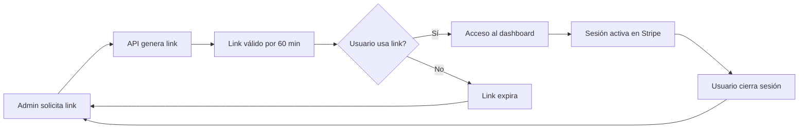

# 🔐 Acceso al Dashboard de Stripe para Gimnasios
**Fecha:** 2025-12-17
**Estado:** ✅ IMPLEMENTADO

---

## 📊 Resumen Ejecutivo

Se implementó el endpoint faltante para que los gimnasios puedan acceder directamente a su dashboard de Stripe Express. Ahora los administradores pueden gestionar pagos, configuración, reportes y más sin necesidad de crear una cuenta separada en Stripe.

**Problema:** No había forma de que un gym accediera a su dashboard de Stripe después de completar el onboarding inicial.

**Solución:** Implementado endpoint `POST /api/v1/stripe-connect/accounts/dashboard-link` que genera login links temporales al dashboard de Stripe.

---

## 🎯 Nuevo Endpoint Implementado

### POST /api/v1/stripe-connect/accounts/dashboard-link

**Descripción:** Genera un link seguro de acceso temporal al dashboard de Stripe Express.

**Autenticación:** ✅ Requerida (Solo ADMIN/OWNER del gym)

**Rate Limit:** 10 requests por minuto

**Headers Requeridos:**
```
Authorization: Bearer {token}
X-Gym-Id: {gym_id}
```

---

## 📋 Requisitos Previos

Antes de poder acceder al dashboard, el gym debe:

1. ✅ **Tener cuenta de Stripe creada**
   - Usar: `POST /api/v1/stripe-connect/accounts`

2. ✅ **Completar configuración inicial (onboarding)**
   - Usar: `POST /api/v1/stripe-connect/accounts/onboarding-link`
   - Completar formulario de Stripe (5-10 minutos)

---

## 🔄 Flujo Completo de Configuración

### 1️⃣ Crear Cuenta de Stripe

**Endpoint:**
```bash
POST /api/v1/stripe-connect/accounts
```

**Body:**
```json
{
  "country": "US",
  "account_type": "express"
}
```

**Respuesta:**
```json
{
  "message": "Cuenta de Stripe creada exitosamente",
  "account_id": "acct_1234567890",
  "account_type": "express",
  "country": "US",
  "onboarding_completed": false,
  "charges_enabled": false,
  "payouts_enabled": false,
  "status": "created"
}
```

---

### 2️⃣ Completar Onboarding

**Endpoint:**
```bash
POST /api/v1/stripe-connect/accounts/onboarding-link
```

**Respuesta:**
```json
{
  "message": "Link de onboarding creado exitosamente",
  "onboarding_url": "https://connect.stripe.com/setup/e/acct_xxx/yyy",
  "expires_in_minutes": 60,
  "instructions": "Complete la configuración de Stripe siguiendo el link. El proceso toma 5-10 minutos."
}
```

**Acción del Usuario:**
- Abrir `onboarding_url` en el navegador
- Completar formulario de Stripe:
  - Información de negocio
  - Datos bancarios para pagos
  - Verificación de identidad
  - Aceptar términos de servicio

---

### 3️⃣ Acceder al Dashboard (NUEVO)

**Endpoint:**
```bash
POST /api/v1/stripe-connect/accounts/dashboard-link
```

**Respuesta:**
```json
{
  "message": "Link de acceso al dashboard creado exitosamente",
  "dashboard_url": "https://connect.stripe.com/express/acct_xxx/login/yyy",
  "created_at": "2025-12-17T04:30:00Z",
  "expires_in_minutes": 60,
  "account_id": "acct_1234567890",
  "instructions": "El link es válido por 60 minutos. Puede acceder a pagos, reportes, configuración y más."
}
```

**Acción del Usuario:**
- Abrir `dashboard_url` en el navegador
- Acceso directo al dashboard de Stripe Express
- Sin necesidad de password o autenticación adicional

---

## 🎯 Casos de Uso del Dashboard

Una vez en el dashboard de Stripe, el gym puede:

### 💰 Pagos y Transacciones
- Ver historial completo de pagos
- Buscar transacciones específicas
- Exportar reportes de pagos
- Ver detalles de reembolsos

### 📊 Reportes Financieros
- Balance actual de la cuenta
- Pagos próximos (payouts)
- Gráficas de ingresos
- Exportar reportes a CSV/Excel

### 👥 Clientes (Customers)
- Lista de todos los clientes
- Historial de pagos por cliente
- Suscripciones activas

### ⚙️ Configuración
- Información bancaria
- Métodos de pago aceptados
- Configuración de correos
- Webhooks y notificaciones

### 🔔 Disputas y Fraude
- Gestionar disputas de pagos
- Ver alertas de fraude
- Configurar reglas de seguridad

---

## 🔒 Seguridad

### Validaciones Implementadas

1. **Autenticación:**
   - Solo usuarios autenticados pueden acceder
   - Verificación de token JWT válido

2. **Autorización:**
   - Solo ADMIN/OWNER del gym pueden crear links
   - Verificación de pertenencia al gym vía `verify_gym_admin_access`

3. **Estado de Cuenta:**
   - Verificar que existe cuenta de Stripe
   - Verificar que onboarding está completado
   - Verificar que cuenta está activa

4. **Rate Limiting:**
   - Máximo 10 requests por minuto
   - Previene abuso del endpoint

5. **Expiración del Link:**
   - Links válidos solo por 60 minutos
   - Genera nuevos links cada vez que se solicitan

---

## 🛠️ Archivos Modificados

### 1. `app/services/stripe_connect_service.py`

**Nuevo Método:**
```python
async def create_dashboard_login_link(
    self,
    db: Session,
    gym_id: int
) -> str:
    """
    Crear link de acceso al dashboard de Stripe para el gym.

    Returns:
        str: URL de acceso al dashboard (válida por 60 minutos)
    """
```

**Ubicación:** Líneas 243-294

**Funcionalidad:**
- Valida que exista cuenta de Stripe
- Verifica que onboarding esté completado
- Llama a `stripe.Account.create_login_link()`
- Retorna URL temporal al dashboard

---

### 2. `app/api/v1/endpoints/stripe_connect.py`

**Nuevo Endpoint:**
```python
@router.post("/accounts/dashboard-link")
@limiter.limit("10 per minute")
async def create_dashboard_link(...) -> Dict[str, Any]:
```

**Ubicación:** Líneas 215-298

**Funcionalidad:**
- Endpoint REST para clientes
- Validaciones de seguridad y autorización
- Rate limiting
- Manejo de errores con códigos HTTP apropiados

**Imports Agregados:**
```python
from datetime import datetime
```

---

## 📝 Manejo de Errores

### Error 404: Cuenta No Existe
```json
{
  "detail": "El gimnasio no tiene cuenta de Stripe configurada. Cree una cuenta primero usando /accounts"
}
```

**Solución:** Ejecutar `POST /api/v1/stripe-connect/accounts` primero.

---

### Error 400: Onboarding No Completado
```json
{
  "detail": "Debe completar la configuración inicial de Stripe antes de acceder al dashboard. Use /accounts/onboarding-link para completar la configuración."
}
```

**Solución:**
1. Ejecutar `POST /api/v1/stripe-connect/accounts/onboarding-link`
2. Completar formulario en el link proporcionado
3. Intentar nuevamente después de completar

---

### Error 500: Error de Stripe
```json
{
  "detail": "Error al crear link de acceso al dashboard: {mensaje_de_stripe}"
}
```

**Causas Comunes:**
- Cuenta de Stripe desactivada o suspendida
- Problemas de conectividad con Stripe API
- Configuración incorrecta de API keys

---

## 🧪 Testing

### Prueba Manual

**1. Verificar Estado del Dashboard:**
```bash
GET /api/v1/stripe-connect/dashboard
Authorization: Bearer {token}
X-Gym-Id: 4
```

**2. Crear Dashboard Link:**
```bash
POST /api/v1/stripe-connect/accounts/dashboard-link
Authorization: Bearer {token}
X-Gym-Id: 4
```

**3. Abrir URL en Navegador:**
- Copiar `dashboard_url` de la respuesta
- Pegar en navegador
- Verificar acceso al dashboard de Stripe

---

## 📱 Integración con App iOS

### Flujo Recomendado

**Opción 1: WebView Interno (Recomendado)**
```swift
// Mostrar dashboard en WebView dentro de la app
func showStripeDashboard() {
    let url = response.dashboard_url
    let webView = WKWebView()
    webView.load(URLRequest(url: URL(string: url)!))
    present(webView, animated: true)
}
```

**Ventajas:**
- Usuario permanece en la app
- Control sobre navegación
- Mejor UX

---

**Opción 2: Safari Externo**
```swift
// Abrir en Safari
func openStripeDashboard() {
    let url = URL(string: response.dashboard_url)!
    UIApplication.shared.open(url)
}
```

**Ventajas:**
- Más simple de implementar
- Usuario puede guardar el link
- Mejor para sesiones largas

---

## 🔄 Ciclo de Vida del Link



---

## ✅ Conclusión

El sistema de acceso al dashboard de Stripe ahora está **completo** y funcional. Los gimnasios pueden:

1. ✅ Crear cuenta de Stripe Connect
2. ✅ Completar onboarding inicial
3. ✅ **Acceder al dashboard de Stripe (NUEVO)**
4. ✅ Gestionar pagos, reportes y configuración

**Estado:** ✅ **LISTO PARA PRODUCCIÓN**

---

## 📚 Referencias

- [Stripe Connect Documentation](https://stripe.com/docs/connect)
- [Account Login Links API](https://stripe.com/docs/api/account_links/create)
- [Express Dashboard Overview](https://stripe.com/docs/connect/express-dashboard)

---

**Última actualización:** 2025-12-17
**Autor:** Claude Code
**Revisado:** Sistema de Stripe Connect
