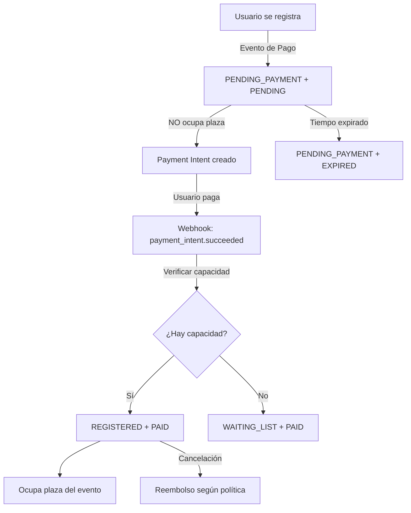
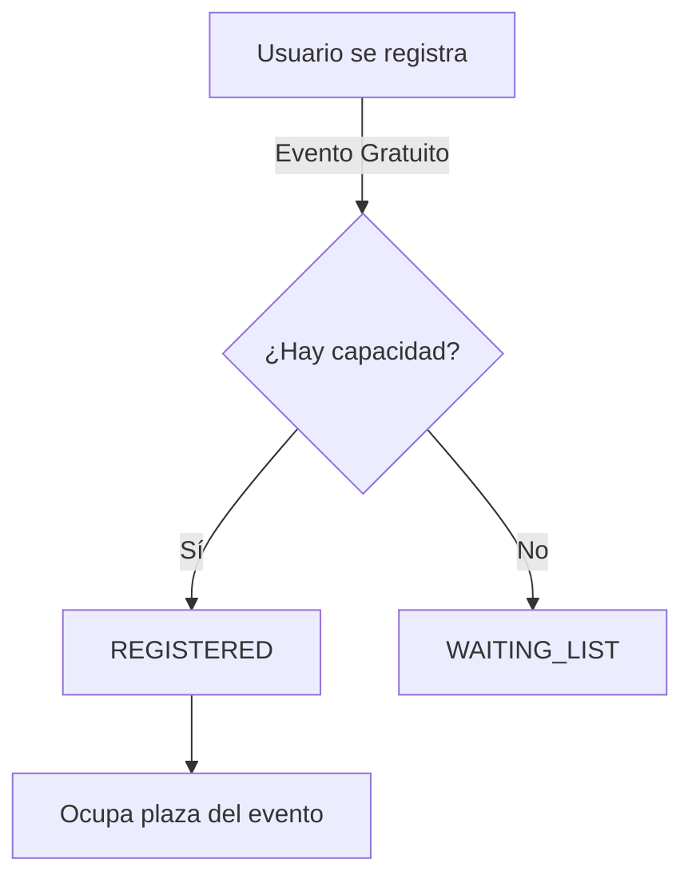

# 💰 Sistema de Monetización de Eventos

## 📋 Resumen

El sistema de monetización de eventos permite a los gimnasios cobrar por la participación en eventos especiales, workshops, seminarios o clases premium. Integrado completamente con Stripe Connect, ofrece gestión de pagos, políticas de reembolso configurables y manejo automático de listas de espera con plazos de pago.

## 🎯 Características Principales

- **Eventos Gratuitos o de Pago**: Configurable por evento
- **Payment Intent API**: Pagos directos con Stripe
- **Políticas de Reembolso Flexibles**: Sin reembolso, completo, parcial o crédito
- **Lista de Espera Inteligente**: Promoción automática con plazo de pago
- **Multi-tenancy**: Aislamiento completo por gimnasio
- **Gestión Administrativa**: Endpoints para control total de pagos

## 🚀 Configuración Inicial

### 1. Variables de Entorno

```env
# Stripe Configuration (Requerido)
STRIPE_SECRET_KEY=sk_test_... # Tu clave secreta de Stripe
STRIPE_WEBHOOK_SECRET=whsec_... # Para webhooks (futuro)
```

### 2. Aplicar Migraciones de Base de Datos

```bash
# Opción 1: Usar Alembic
alembic upgrade head

# Opción 2: Script directo (si hay conflictos)
python scripts/apply_event_monetization.py
```

### 3. Verificar Requisitos

Para que un gimnasio pueda crear eventos de pago:
1. Módulo `billing` debe estar activo
2. Cuenta de Stripe Connect configurada y con `charges_enabled = true`

## 📊 Modelo de Datos

### Campos en Tabla `events`

| Campo | Tipo | Descripción | Por Defecto |
|-------|------|-------------|-------------|
| `is_paid` | Boolean | Si el evento requiere pago | false |
| `price_cents` | Integer | Precio en centavos (ej: 2999 = €29.99) | null |
| `currency` | String(3) | Código ISO de moneda | 'EUR' |
| `refund_policy` | Enum | Política de reembolso | null |
| `refund_deadline_hours` | Integer | Horas antes del evento para reembolso | 24 |
| `partial_refund_percentage` | Integer | Porcentaje de reembolso parcial | 50 |
| `stripe_product_id` | String | ID del producto en Stripe | null |
| `stripe_price_id` | String | ID del precio en Stripe | null |

### Políticas de Reembolso (`RefundPolicyType`)

- **NO_REFUND**: Sin reembolso bajo ninguna circunstancia
- **FULL_REFUND**: Reembolso completo dentro del plazo
- **PARTIAL_REFUND**: Reembolso parcial según porcentaje configurado
- **CREDIT**: Crédito para futuros eventos (no dinero)

### Estados de Pago (`PaymentStatusType`)

- **PENDING**: Pago pendiente
- **PAID**: Pago completado exitosamente
- **REFUNDED**: Reembolsado total o parcialmente
- **CREDITED**: Crédito otorgado en lugar de reembolso
- **EXPIRED**: Plazo de pago expirado (lista de espera)

## 🔧 Uso de la API

### 1. Crear un Evento de Pago

```http
POST /api/v1/events
Authorization: Bearer {token}
Content-Type: application/json

{
  "title": "Workshop de Nutrición Deportiva",
  "description": "Aprende los fundamentos de la nutrición para deportistas",
  "start_time": "2025-02-15T10:00:00Z",
  "end_time": "2025-02-15T13:00:00Z",
  "location": "Sala de conferencias",
  "max_participants": 20,

  // Campos de monetización
  "is_paid": true,
  "price_cents": 4999,  // €49.99
  "currency": "EUR",
  "refund_policy": "PARTIAL_REFUND",
  "refund_deadline_hours": 48,
  "partial_refund_percentage": 75
}
```

### 2. Registrarse a un Evento de Pago

```http
POST /api/v1/events/participation
Authorization: Bearer {token}
Content-Type: application/json

{
  "event_id": 123
}
```

**Respuesta para evento de pago:**
```json
{
  "id": 456,
  "event_id": 123,
  "member_id": 789,
  "status": "REGISTERED",
  "payment_status": "PENDING",
  "registered_at": "2025-01-27T10:00:00Z",

  // Información de pago
  "payment_required": true,
  "payment_client_secret": "pi_xxx_secret_xxx",
  "payment_amount": 4999,
  "payment_currency": "EUR",
  "payment_deadline": null,  // Solo para lista de espera
  "stripe_account_id": "acct_1RjWs7PZfGCbdUwY"  // ID de la cuenta de Stripe Connect del gym
}
```

### 3. Procesar el Pago en el Frontend

**IMPORTANTE**: Al usar Stripe Connect, debes incluir el `stripeAccount` en la configuración de Stripe.

```javascript
// Inicializar Stripe con tu publishable key
const stripe = Stripe('pk_test_...');

// Si el evento requiere pago, obtendrás estos datos del backend
const {
  payment_client_secret,
  stripe_account_id  // ⭐ NUEVO: Necesario para Stripe Connect
} = responseData;

// ⭐ IMPORTANTE: Incluir stripeAccount para Stripe Connect
const {error} = await stripe.confirmCardPayment(
  payment_client_secret,
  {
    payment_method: {
      card: cardElement,
      billing_details: {
        name: 'John Doe'
      }
    }
  },
  {
    stripeAccount: stripe_account_id  // ⭐ Necesario para procesar en la cuenta del gym
  }
);

if (!error) {
  // Confirmar el pago en el backend
  await confirmPayment(participation_id, payment_intent_id);
}
```

**Nota para iOS/Swift**: Al usar el Stripe SDK en iOS, configura el `stripeAccount`:

```swift
// Swift example para iOS
let paymentIntentParams = STPPaymentIntentParams(clientSecret: paymentClientSecret)
paymentIntentParams.stripeAccount = stripeAccountId  // ⭐ Necesario para Stripe Connect

STPPaymentHandler.shared().confirmPayment(
    paymentIntentParams,
    with: self
) { status, paymentIntent, error in
    // Handle result
}
```

### 4. Confirmar el Pago

```http
POST /api/v1/events/participation/{participation_id}/confirm-payment
Authorization: Bearer {token}
Content-Type: application/json

{
  "payment_intent_id": "pi_xxx"
}
```

### 5. Cancelar Participación con Reembolso

```http
DELETE /api/v1/events/participation/{event_id}
Authorization: Bearer {token}
```

El sistema calculará automáticamente el reembolso según:
- Política del evento
- Tiempo restante hasta el evento
- Porcentaje configurado (si aplica)

## 🎫 Lista de Espera con Pagos

### Flujo Automático

1. **Usuario en lista de espera**: No se cobra inmediatamente
2. **Se libera un lugar**: Usuario promovido automáticamente
3. **Plazo de 24 horas**: Para completar el pago
4. **Obtener Payment Intent**:

```http
POST /api/v1/events/participation/{participation_id}/payment-intent
Authorization: Bearer {token}
```

Respuesta:
```json
{
  "client_secret": "pi_xxx_secret_xxx",
  "payment_intent_id": "pi_xxx",
  "amount": 4999,
  "currency": "EUR",
  "payment_deadline": "2025-01-28T10:00:00Z",
  "stripe_account_id": "acct_1RjWs7PZfGCbdUwY"
}
```

5. **Si no paga en 24h**: Plaza se ofrece al siguiente en lista

## 👨‍💼 Endpoints Administrativos

### Ver Todos los Eventos de Pago

```http
GET /api/v1/events/admin/payments/events?only_active=true
Authorization: Bearer {admin_token}
```

### Ver Estado de Pagos por Evento

```http
GET /api/v1/events/admin/events/{event_id}/payments?payment_status=PAID
Authorization: Bearer {admin_token}
```

### Procesar Reembolso Manual

```http
POST /api/v1/events/admin/participation/{participation_id}/refund
Authorization: Bearer {admin_token}
Content-Type: application/json

{
  "reason": "Evento cancelado por mal tiempo"
}
```

### Actualizar Estado de Pago Manual

```http
PUT /api/v1/events/admin/participation/{participation_id}/payment-status
Authorization: Bearer {admin_token}
Content-Type: application/json

{
  "new_status": "PAID"  // Para pagos en efectivo o cortesías
}
```

## 📊 Casos de Uso Comunes

### Evento Gratuito

```json
{
  "title": "Clase abierta de Yoga",
  "is_paid": false
  // No incluir campos de precio ni políticas
}
```

### Workshop Premium con Reembolso Total

```json
{
  "title": "Masterclass con Entrenador Internacional",
  "is_paid": true,
  "price_cents": 9999,  // €99.99
  "currency": "EUR",
  "refund_policy": "FULL_REFUND",
  "refund_deadline_hours": 72  // 3 días antes
}
```

### Seminario Sin Reembolsos

```json
{
  "title": "Certificación de Primeros Auxilios",
  "is_paid": true,
  "price_cents": 15000,  // €150.00
  "currency": "EUR",
  "refund_policy": "NO_REFUND"
}
```

### Evento con Crédito en Lugar de Reembolso

```json
{
  "title": "Serie de 4 Workshops",
  "is_paid": true,
  "price_cents": 20000,  // €200.00
  "currency": "EUR",
  "refund_policy": "CREDIT"  // Solo crédito para otros eventos
}
```

## ⚠️ Consideraciones Importantes

### 🔒 Control de Capacidad (IMPORTANTE)

**Desde v2.1+**, los eventos de pago implementan un flujo de dos fases para evitar que usuarios sin pagar ocupen plazas:

1. **Fase 1 - Registro sin Plaza (`PENDING_PAYMENT`)**:
   - Usuario se registra al evento de pago
   - Estado inicial: `PENDING_PAYMENT` + `payment_status: PENDING`
   - **NO ocupa plaza** en `max_participants`
   - Payment Intent se crea inmediatamente

2. **Fase 2 - Confirmación de Pago (`REGISTERED`)**:
   - Usuario paga exitosamente con Stripe
   - Webhook `payment_intent.succeeded` o endpoint `/confirm-payment`
   - Sistema verifica capacidad disponible
   - Si hay espacio: `REGISTERED` + `payment_status: PAID` → **SÍ ocupa plaza**
   - Si no hay espacio: `WAITING_LIST` + `payment_status: PAID` → No ocupa plaza (pero pagó)

**Ventajas**:
- ✅ Solo usuarios pagados ocupan plazas reales
- ✅ No se bloquean espacios por pagos pendientes
- ✅ Evita "reservas fantasma" que nunca se pagan
- ✅ Capacidad del evento refleja asistentes confirmados

**Eventos Gratuitos**: Mantienen el comportamiento anterior (REGISTERED inmediato según capacidad)

### Validaciones

1. **Precio requerido**: Si `is_paid = true`, debe especificar `price_cents > 0`
2. **Política requerida**: Eventos de pago requieren `refund_policy`
3. **Coherencia**: No se puede establecer precio en eventos gratuitos
4. **Stripe activo**: El gimnasio debe tener Stripe configurado

### Seguridad

- Todos los pagos pasan por Stripe (PCI compliant)
- Los Payment Intents son de un solo uso
- Multi-tenancy estricto: usuarios solo pueden pagar eventos de su gimnasio
- Reembolsos requieren pago previo confirmado

### Límites y Timeouts

- **Payment Intent válido**: 24 horas por defecto
- **Lista de espera**: 24 horas para completar pago al ser promovido
- **Reembolsos**: Procesados inmediatamente vía Stripe API

## 🔄 Flujo de Estados de Participación y Pago

### Estados de Participación (`EventParticipationStatus`)

- **PENDING_PAYMENT**: Usuario registrado pero NO ocupa plaza hasta confirmar pago
- **REGISTERED**: Usuario confirmado que SÍ ocupa plaza en el evento
- **WAITING_LIST**: Usuario en lista de espera
- **CANCELLED**: Usuario canceló su participación

### Estados de Pago (`PaymentStatusType`)

- **PENDING**: Pago pendiente de confirmación
- **PAID**: Pago confirmado exitosamente
- **EXPIRED**: Plazo de pago expirado
- **REFUNDED**: Pago reembolsado
- **CREDITED**: Crédito otorgado en lugar de reembolso

### Flujo Completo para Eventos de Pago



### Flujo para Eventos Gratuitos



## 🐛 Troubleshooting

### Error: "El evento requiere pago pero el sistema de pagos no está configurado"

**Causa**: El gimnasio no tiene Stripe Connect configurado
**Solución**:
1. Verificar que el módulo `billing` esté activo
2. Configurar cuenta de Stripe Connect
3. Asegurar que `charges_enabled = true`

### Error: "No se puede reembolsar. Estado actual: PENDING"

**Causa**: Intentando reembolsar un pago no completado
**Solución**: Solo se pueden reembolsar pagos con estado `PAID`

### Payment Intent no se crea

**Verificar**:
1. `STRIPE_SECRET_KEY` configurada en `.env`
2. Usuario tiene email válido
3. Evento tiene `is_paid = true` y `price_cents > 0`

## 📈 Métricas y Reportes

### Consultas SQL Útiles

```sql
-- Total recaudado por evento
SELECT
    e.title,
    COUNT(CASE WHEN ep.payment_status = 'PAID' THEN 1 END) as pagos_completados,
    SUM(ep.amount_paid_cents) / 100.0 as total_recaudado
FROM events e
JOIN event_participations ep ON e.id = ep.event_id
WHERE e.is_paid = true
GROUP BY e.id, e.title;

-- Tasa de conversión de pagos
SELECT
    e.title,
    COUNT(*) as total_registros,
    COUNT(CASE WHEN ep.payment_status = 'PAID' THEN 1 END) as pagos_completados,
    ROUND(100.0 * COUNT(CASE WHEN ep.payment_status = 'PAID' THEN 1 END) / COUNT(*), 2) as tasa_conversion
FROM events e
JOIN event_participations ep ON e.id = ep.event_id
WHERE e.is_paid = true
GROUP BY e.id, e.title;
```

## ✅ Webhooks de Stripe Integrados

El sistema ahora incluye **sincronización automática completa** con Stripe a través de webhooks. Los siguientes eventos son procesados automáticamente:

### Eventos de Pago de Eventos

| Evento | Acción Automática | Estado Actualizado |
|--------|------------------|-------------------|
| `payment_intent.succeeded` | Confirma el pago del evento | `PAID` |
| `payment_intent.canceled` | Marca participación como expirada | `EXPIRED` |
| `charge.refunded` | Sincroniza reembolsos procesados | `REFUNDED` |
| `payment_intent.requires_payment_method` | Registra fallo de método de pago | Log de warning |

### Configuración de Webhooks en Stripe Dashboard

1. **URL del Endpoint**: `https://tu-dominio.com/api/v1/memberships/webhooks/stripe`
2. **Eventos a Activar**:
   - `payment_intent.succeeded`
   - `payment_intent.canceled`
   - `charge.refunded`
   - `payment_intent.requires_payment_method`
3. **Signing Secret**: Copiar a `STRIPE_WEBHOOK_SECRET` en `.env`

### Script de Prueba

```bash
# Probar los webhooks localmente
python scripts/test_event_payment_webhooks.py
```

## 🚧 Próximas Mejoras Planificadas

1. ~~**Webhooks de Stripe**: Sincronización automática de estados~~ ✅ **COMPLETADO**
2. **Descuentos y Cupones**: Sistema de códigos promocionales
3. **Planes de Pago**: Dividir pagos en cuotas
4. **Facturación Automática**: Generación de facturas PDF
5. **Sistema de Créditos**: Wallet interno para el gimnasio
6. **Notificaciones**: Email/Push para confirmaciones y recordatorios
7. **Reportes Avanzados**: Dashboard de ingresos y métricas

## 📞 Soporte

Para problemas con la implementación o preguntas sobre el sistema de monetización, contactar al equipo de desarrollo o revisar los logs del servidor para más detalles sobre errores específicos.