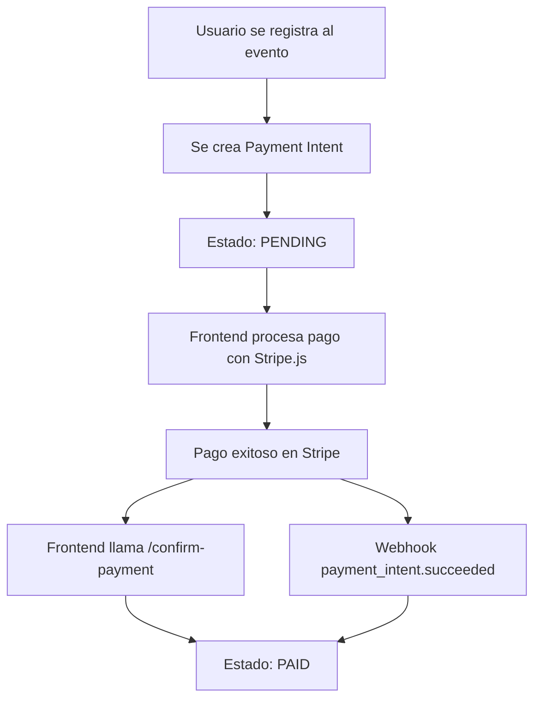

# 🔍 Troubleshooting: Pagos de Eventos en Estado PENDING

## Problema: Pago Queda en Estado PENDING

Cuando un pago de evento queda en estado "PENDING", significa que el Payment Intent fue creado pero el pago no se ha completado o confirmado.

## Flujo Normal de Pago



## Causas Comunes del Estado PENDING

### 1. Frontend No Procesa el Pago

**Síntoma**: El usuario recibe el `payment_client_secret` pero nunca se procesa el pago.

**Verificación en Frontend**:
```javascript
// El frontend debe usar Stripe.js para procesar el pago
const stripe = Stripe('pk_live_...');

// Después de registrarse al evento
const response = await fetch('/api/v1/events/participation', {
    method: 'POST',
    body: JSON.stringify({ event_id: 123 })
});

const data = await response.json();

if (data.payment_required) {
    // IMPORTANTE: Procesar el pago con Stripe
    const result = await stripe.confirmCardPayment(
        data.payment_client_secret,
        {
            payment_method: {
                card: cardElement,
                billing_details: { name: 'John Doe' }
            }
        }
    );

    if (result.error) {
        console.error('Error de pago:', result.error);
    } else {
        // IMPORTANTE: Confirmar el pago en el backend
        await confirmPaymentInBackend(data.id, result.paymentIntent.id);
    }
}
```

### 2. Endpoint de Confirmación No Llamado

**Problema**: El pago se procesa en Stripe pero no se actualiza en la base de datos.

**Solución**: Llamar al endpoint de confirmación:
```javascript
async function confirmPaymentInBackend(participationId, paymentIntentId) {
    const response = await fetch(
        `/api/v1/events/participation/${participationId}/confirm-payment`,
        {
            method: 'POST',
            headers: {
                'Authorization': `Bearer ${token}`,
                'Content-Type': 'application/json'
            },
            body: JSON.stringify({ payment_intent_id: paymentIntentId })
        }
    );

    if (!response.ok) {
        console.error('Error confirmando pago en backend');
    }
}
```

### 3. Webhook No Configurado o No Funciona

**Verificación**:
1. Revisar en Stripe Dashboard → Webhooks
2. Verificar que el endpoint esté configurado: `https://tu-dominio.com/api/v1/memberships/webhooks/stripe`
3. Verificar que estos eventos estén activos:
   - `payment_intent.succeeded`
   - `payment_intent.canceled`
   - `charge.refunded`

**Logs del Webhook**:
```bash
# Ver logs del webhook
grep "Payment intent exitoso" /var/log/app.log
grep "Pago de evento confirmado automáticamente" /var/log/app.log
```

### 4. Payment Intent No Completado en Stripe

**Verificación en Stripe Dashboard**:
1. Ir a Stripe Dashboard → Payments
2. Buscar el Payment Intent ID (visible en la base de datos)
3. Verificar el estado:
   - `requires_payment_method`: Usuario no completó el pago
   - `requires_confirmation`: Pago pendiente de confirmación
   - `succeeded`: Pago exitoso (pero no sincronizado con BD)
   - `canceled`: Usuario canceló o expiró

### 5. Payment Intents Duplicados

**Síntoma**: Se crean múltiples Payment Intents para la misma participación, causando discrepancia entre el ID logeado en el backend y el `client_secret` recibido por el cliente.

**Causas**:
- Falta de idempotencia en la creación de Payment Intents
- Múltiples llamadas al endpoint debido a retries o problemas de red
- Race conditions en registros simultáneos
- Reactivación de participaciones canceladas sin limpiar Payment Intents antiguos

**Cómo Detectarlo**:
```bash
# Ejecutar script de diagnóstico con opción de verificar duplicados
python scripts/check_pending_event_payments.py --check-duplicates --gym-id 1
```

El script mostrará:
- Usuarios con múltiples participaciones en el mismo evento
- Total de Payment Intents por evento
- Detalles de cada Payment Intent asociado

**Solución Implementada** (v2.0+):
El sistema ahora incluye **idempotencia automática** en la creación de Payment Intents:

1. **Función `get_or_create_payment_intent_for_event()`**: Verifica si ya existe un Payment Intent válido antes de crear uno nuevo
2. **Reutilización de Payment Intents**: Si el Payment Intent existente está en estado `requires_payment_method`, `requires_confirmation` o `requires_action`, se reutiliza
3. **Validación de consistencia**: Se verifica que el `client_secret` corresponda al `payment_intent_id` antes de enviar al cliente
4. **Logging detallado**: Logs con prefijos `[Idempotencia]`, `[Creación]`, `[Validación]` para rastrear el flujo
5. **Limpieza en reactivación**: Al reactivar una participación cancelada, se cancela el Payment Intent antiguo en Stripe

**Verificar Logs Mejorados**:
```bash
# Buscar logs de idempotencia
grep "\[Idempotencia\]" /var/log/app.log

# Buscar validaciones de consistencia
grep "\[Validación\]" /var/log/app.log

# Buscar creaciones de Payment Intent
grep "\[Creación\]" /var/log/app.log
```

**Logs Esperados en Funcionamiento Correcto**:
```
[Registro] Procesando pago para participación 123, evento 45, usuario 8
[Creación] Creando nuevo Payment Intent para participación 123, evento 45, usuario 8
[Validación] ✅ Payment Intent ID y client_secret son consistentes: pi_3SNo41BVjiDLF0pB0uHLVv2Q
[Registro] Payment Intent (nuevo) asignado a participación 123:
  - Payment Intent ID: pi_3SNo41BVjiDLF0pB0uHLVv2Q
  - Client Secret: pi_3SNo41BVjiDLF0pB0uHLVv2Q_secret_...
```

**Logs de Reutilización** (retry del cliente):
```
[Registro] Procesando pago para participación 123, evento 45, usuario 8
[Idempotencia] Participación 123 ya tiene Payment Intent: pi_3SNo41BVjiDLF0pB0uHLVv2Q
[Idempotencia] Payment Intent pi_3SNo41BVjiDLF0pB0uHLVv2Q encontrado con estado: requires_payment_method
[Idempotencia] Reutilizando Payment Intent pi_3SNo41BVjiDLF0pB0uHLVv2Q para participación 123
[Registro] ✅ Enviando al cliente Payment Intent consistente: pi_3SNo41BVjiDLF0pB0uHLVv2Q
```

**Limpiar Payment Intents Duplicados Manualmente**:

Si ya tienes duplicados en el sistema, puedes cancelarlos manualmente:

1. Identificar Payment Intents duplicados:
   ```bash
   python scripts/check_pending_event_payments.py --check-duplicates --gym-id 1
   ```

2. Para cada Payment Intent no utilizado, cancelarlo en Stripe Dashboard o via API:
   ```python
   import stripe
   stripe.api_key = 'sk_...'

   # Cancelar Payment Intent
   stripe.PaymentIntent.cancel(
       'pi_3SNo41BVjiDLF0pB0uHLVv2Q',
       stripe_account='acct_...'  # Si usas Connect
   )
   ```

3. Actualizar la base de datos para limpiar referencias:
   ```sql
   -- Limpiar Payment Intent de participaciones canceladas
   UPDATE event_participations
   SET stripe_payment_intent_id = NULL,
       payment_status = NULL
   WHERE status = 'CANCELLED'
   AND stripe_payment_intent_id IS NOT NULL;
   ```

## Soluciones Rápidas

### Para Administradores: Marcar Manualmente como Pagado

Si se confirma que el pago fue recibido (efectivo, transferencia, etc.):

```http
PUT /api/v1/events/admin/participation/{participation_id}/payment-status
Authorization: Bearer {admin_token}
Content-Type: application/json

{
    "new_status": "PAID"
}
```

### Para Desarrolladores: Script de Verificación

```python
#!/usr/bin/env python
"""Script para verificar estado de Payment Intent en Stripe"""

import stripe
from app.core.config import get_settings
from app.db.session import SessionLocal
from app.models.event import EventParticipation, PaymentStatusType

settings = get_settings()
stripe.api_key = settings.STRIPE_SECRET_KEY

def check_payment_status(participation_id: int):
    db = SessionLocal()
    try:
        # Obtener participación
        participation = db.query(EventParticipation).filter(
            EventParticipation.id == participation_id
        ).first()

        if not participation:
            print(f"Participación {participation_id} no encontrada")
            return

        print(f"Estado en BD: {participation.payment_status}")
        print(f"Payment Intent ID: {participation.stripe_payment_intent_id}")

        # Verificar en Stripe
        if participation.stripe_payment_intent_id:
            try:
                pi = stripe.PaymentIntent.retrieve(
                    participation.stripe_payment_intent_id
                )
                print(f"Estado en Stripe: {pi.status}")
                print(f"Monto: {pi.amount / 100} {pi.currency.upper()}")

                # Si está pagado en Stripe pero no en BD
                if pi.status == "succeeded" and participation.payment_status != PaymentStatusType.PAID:
                    print("⚠️ INCONSISTENCIA: Pagado en Stripe pero no en BD")
                    print("Actualizando BD...")
                    participation.payment_status = PaymentStatusType.PAID
                    participation.amount_paid_cents = pi.amount
                    participation.payment_date = datetime.utcnow()
                    db.commit()
                    print("✅ Actualizado a PAID")

            except stripe.error.StripeError as e:
                print(f"Error de Stripe: {e}")
        else:
            print("No hay Payment Intent ID asociado")

    finally:
        db.close()

# Uso: check_payment_status(62)  # ID de la participación
```

## Diagrama de Estados de Pago

```
┌─────────┐
│ SIN     │ → Evento gratuito o no requiere pago
│ PAGO    │
└─────────┘

┌─────────┐    ┌─────────┐    ┌─────────┐
│ PENDING │ → │  PAID   │ → │REFUNDED │
└─────────┘    └─────────┘    └─────────┘
     ↓              ↑
     ↓              ↑ (manual admin)
┌─────────┐    ┌─────────┐
│ EXPIRED │    │CREDITED │
└─────────┘    └─────────┘
```

## Checklist de Depuración

- [ ] ¿El frontend recibe el `payment_client_secret`?
- [ ] ¿El frontend procesa el pago con Stripe.js?
- [ ] ¿Se muestra algún error al usuario durante el pago?
- [ ] ¿El frontend llama al endpoint de confirmación después del pago?
- [ ] ¿Los webhooks están configurados en Stripe Dashboard?
- [ ] ¿El `STRIPE_WEBHOOK_SECRET` está configurado en el servidor?
- [ ] ¿Hay logs de webhooks procesados?
- [ ] ¿El Payment Intent existe en Stripe Dashboard?
- [ ] ¿Cuál es el estado del Payment Intent en Stripe?
- [ ] ¿Hay Payment Intents duplicados? (ejecutar `--check-duplicates`)
- [ ] ¿El `client_secret` enviado al cliente coincide con el `payment_intent_id` logeado?
- [ ] ¿Los logs muestran `[Idempotencia]` o `[Creación]`?
- [ ] ¿El sistema está reutilizando Payment Intents correctamente en retries?

## Prevención

1. **Implementar retry logic** en el frontend para confirmación
2. **Agregar job programado** para sincronizar pagos pendientes
3. **Notificar al usuario** si el pago no se completa
4. **Timeout automático** para liberar lugares no pagados
5. **Dashboard de monitoreo** para pagos pendientes

## Contacto

Si el problema persiste después de verificar estos puntos, revisar:
- Logs del servidor: `/var/log/app.log`
- Logs de Stripe: Dashboard → Developers → Logs
- Estado de la base de datos: tabla `event_participations`