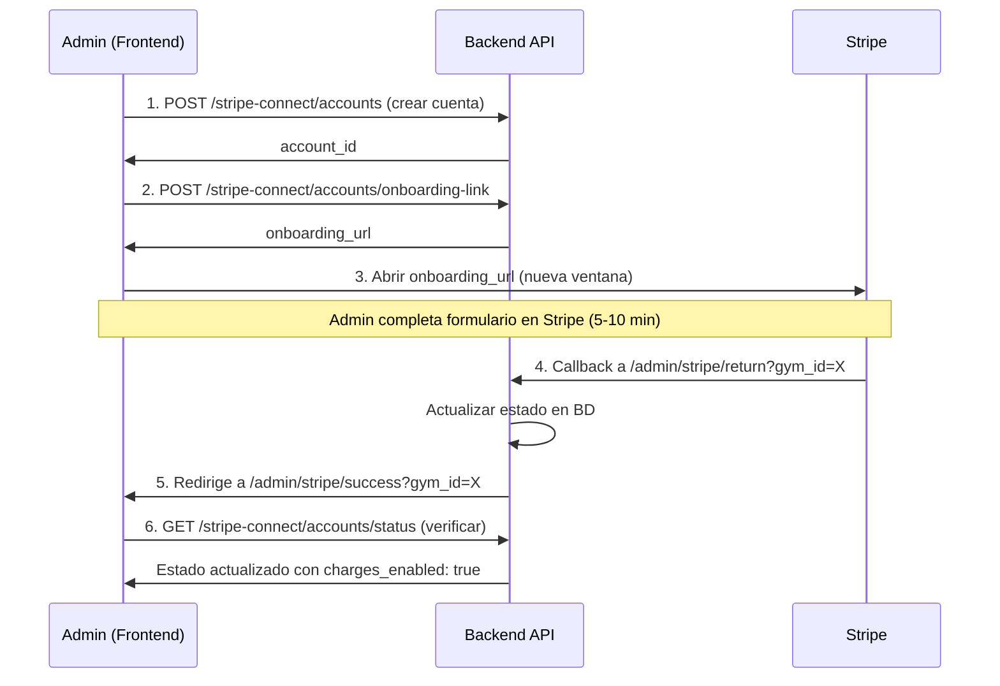

# Guía de Integración Frontend - Stripe Connect Onboarding

## 📋 Tabla de Contenidos
1. [Resumen del Flujo](#resumen-del-flujo)
2. [Configuración Inicial](#configuración-inicial)
3. [Paso a Paso de Implementación](#paso-a-paso-de-implementación)
4. [Endpoints de API](#endpoints-de-api)
5. [Ejemplos de Código](#ejemplos-de-código)
6. [Manejo de Errores](#manejo-de-errores)
7. [Testing](#testing)

---

## Resumen del Flujo

### 🎯 Flujo Completo del Onboarding



---

## Configuración Inicial

### Variables de Entorno Requeridas

```bash
# En tu .env del frontend
REACT_APP_API_URL=https://gymapi-eh6m.onrender.com/api/v1
# o
NEXT_PUBLIC_API_URL=https://gymapi-eh6m.onrender.com/api/v1
```

### Configurar FRONTEND_URL en el Backend

**IMPORTANTE**: Asegúrate de que el backend tenga tu `FRONTEND_URL` configurado:

```bash
# En .env del backend
FRONTEND_URL=https://tu-app.com
# o para desarrollo local
FRONTEND_URL=http://localhost:3000
```

Si no está configurado, los usuarios serán redirigidos a una página HTML estática del backend.

---

## Paso a Paso de Implementación

### 1️⃣ Crear Página de Configuración de Stripe

**Ubicación sugerida**: `/admin/stripe-setup` o `/settings/payments`

**Componentes necesarios**:
- Botón "Conectar Stripe"
- Indicador de estado (conectado/desconectado)
- Mensaje de error si aplica

```tsx
// StripeSetupPage.tsx
import { useState, useEffect } from 'react';

export default function StripeSetupPage() {
  const [status, setStatus] = useState('loading'); // loading | not_configured | onboarding | connected
  const [accountInfo, setAccountInfo] = useState(null);

  useEffect(() => {
    checkStripeStatus();
  }, []);

  // Implementación más adelante...
}
```

### 2️⃣ Verificar Estado Actual de Stripe

Primero verifica si el gym ya tiene Stripe configurado:

```typescript
async function checkStripeStatus() {
  try {
    // Intentar obtener estado actual
    const response = await fetch('/api/v1/stripe-connect/accounts/status', {
      headers: {
        'Authorization': `Bearer ${token}`,
        'x-gym-id': gymId.toString()
      }
    });

    if (response.status === 404) {
      // No tiene cuenta todavía
      setStatus('not_configured');
      return;
    }

    const data = await response.json();

    if (data.onboarding_completed && data.charges_enabled) {
      setStatus('connected');
      setAccountInfo(data);
    } else {
      setStatus('onboarding');
      setAccountInfo(data);
    }

  } catch (error) {
    console.error('Error verificando estado:', error);
    setStatus('not_configured');
  }
}
```

### 3️⃣ Crear Cuenta de Stripe (Si No Existe)

Si `status === 'not_configured'`, crea una cuenta:

```typescript
async function createStripeAccount() {
  try {
    setLoading(true);

    const response = await fetch('/api/v1/stripe-connect/accounts', {
      method: 'POST',
      headers: {
        'Authorization': `Bearer ${token}`,
        'x-gym-id': gymId.toString(),
        'Content-Type': 'application/json'
      },
      body: JSON.stringify({
        country: 'US', // o el país del gym
        account_type: 'standard' // recomendado
      })
    });

    if (!response.ok) {
      throw new Error('Error creando cuenta de Stripe');
    }

    const data = await response.json();
    console.log('Cuenta creada:', data.account_id);

    // Ahora obtener link de onboarding
    await getOnboardingLink();

  } catch (error) {
    console.error('Error:', error);
    alert('Error al crear cuenta de Stripe');
  } finally {
    setLoading(false);
  }
}
```

### 4️⃣ Obtener Link de Onboarding

```typescript
async function getOnboardingLink() {
  try {
    setLoading(true);

    const response = await fetch('/api/v1/stripe-connect/accounts/onboarding-link', {
      method: 'POST',
      headers: {
        'Authorization': `Bearer ${token}`,
        'x-gym-id': gymId.toString()
      }
    });

    if (!response.ok) {
      throw new Error('Error obteniendo link de onboarding');
    }

    const data = await response.json();

    // Abrir en nueva ventana/pestaña
    const stripeWindow = window.open(
      data.url,
      'stripe-onboarding',
      'width=800,height=900,scrollbars=yes'
    );

    // Iniciar polling para detectar cuando regrese
    startPollingForCompletion(stripeWindow);

  } catch (error) {
    console.error('Error:', error);
    alert('Error al iniciar configuración de Stripe');
  } finally {
    setLoading(false);
  }
}
```

### 5️⃣ Detectar Cuando el Usuario Completa el Onboarding

**Opción A: Polling (Recomendado)**

```typescript
function startPollingForCompletion(stripeWindow: Window | null) {
  setStatus('onboarding');

  const pollInterval = setInterval(async () => {
    // Si la ventana se cerró, verificar estado
    if (stripeWindow && stripeWindow.closed) {
      clearInterval(pollInterval);
      await checkStripeStatus();
      return;
    }

    // Verificar estado cada 5 segundos
    try {
      const response = await fetch('/api/v1/stripe-connect/accounts/status', {
        headers: {
          'Authorization': `Bearer ${token}`,
          'x-gym-id': gymId.toString()
        }
      });

      if (response.ok) {
        const data = await response.json();

        // Si el onboarding está completo, detener polling
        if (data.onboarding_completed && data.charges_enabled) {
          clearInterval(pollInterval);
          setStatus('connected');
          setAccountInfo(data);

          // Cerrar ventana de Stripe si sigue abierta
          if (stripeWindow && !stripeWindow.closed) {
            stripeWindow.close();
          }

          // Mostrar notificación de éxito
          showSuccessNotification('¡Stripe configurado exitosamente!');
        }
      }
    } catch (error) {
      console.error('Error en polling:', error);
    }
  }, 5000); // Verificar cada 5 segundos

  // Cleanup: detener polling después de 30 minutos
  setTimeout(() => {
    clearInterval(pollInterval);
  }, 30 * 60 * 1000);
}
```

**Opción B: Página de Retorno (Alternativa)**

Si prefieres no usar polling, crea una página de retorno:

```tsx
// pages/admin/stripe/success.tsx
import { useEffect } from 'react';
import { useRouter } from 'next/router';

export default function StripeOnboardingSuccess() {
  const router = useRouter();
  const { gym_id } = router.query;

  useEffect(() => {
    // Verificar estado actualizado
    async function verifyAndRedirect() {
      try {
        const response = await fetch('/api/v1/stripe-connect/accounts/status', {
          headers: {
            'Authorization': `Bearer ${token}`,
            'x-gym-id': gym_id as string
          }
        });

        const data = await response.json();

        // Mostrar mensaje de éxito
        alert('¡Stripe configurado exitosamente!');

        // Redirigir a settings o dashboard
        setTimeout(() => {
          router.push('/admin/settings');
        }, 2000);

      } catch (error) {
        console.error('Error:', error);
        router.push('/admin/settings');
      }
    }

    if (gym_id) {
      verifyAndRedirect();
    }
  }, [gym_id]);

  return (
    <div className="flex items-center justify-center min-h-screen">
      <div className="text-center">
        <div className="animate-spin rounded-full h-16 w-16 border-b-2 border-purple-600 mx-auto mb-4"></div>
        <h2 className="text-xl font-semibold">Finalizando configuración...</h2>
        <p className="text-gray-600 mt-2">Serás redirigido en un momento</p>
      </div>
    </div>
  );
}
```

### 6️⃣ Mostrar Estado de Stripe en UI

```tsx
function StripeStatusIndicator({ accountInfo, status }) {
  if (status === 'loading') {
    return <div>Cargando...</div>;
  }

  if (status === 'not_configured') {
    return (
      <div className="border-2 border-dashed border-gray-300 rounded-lg p-6">
        <h3 className="text-lg font-semibold mb-2">Stripe no configurado</h3>
        <p className="text-gray-600 mb-4">
          Conecta Stripe para aceptar pagos de eventos y membresías.
        </p>
        <button
          onClick={createStripeAccount}
          className="bg-purple-600 text-white px-6 py-2 rounded-lg"
        >
          Conectar Stripe
        </button>
      </div>
    );
  }

  if (status === 'onboarding') {
    return (
      <div className="bg-yellow-50 border border-yellow-200 rounded-lg p-6">
        <h3 className="text-lg font-semibold mb-2">⏳ Configuración pendiente</h3>
        <p className="text-gray-600 mb-4">
          Completa la configuración de Stripe para empezar a aceptar pagos.
        </p>
        <button
          onClick={getOnboardingLink}
          className="bg-yellow-600 text-white px-6 py-2 rounded-lg"
        >
          Continuar configuración
        </button>
      </div>
    );
  }

  if (status === 'connected') {
    return (
      <div className="bg-green-50 border border-green-200 rounded-lg p-6">
        <h3 className="text-lg font-semibold mb-2 flex items-center">
          ✅ Stripe configurado
        </h3>
        <div className="space-y-2 text-sm">
          <div className="flex justify-between">
            <span className="text-gray-600">ID de cuenta:</span>
            <span className="font-mono">{accountInfo.account_id}</span>
          </div>
          <div className="flex justify-between">
            <span className="text-gray-600">Tipo:</span>
            <span className="capitalize">{accountInfo.account_type}</span>
          </div>
          <div className="flex justify-between">
            <span className="text-gray-600">Cargos:</span>
            <span className={accountInfo.charges_enabled ? 'text-green-600' : 'text-red-600'}>
              {accountInfo.charges_enabled ? 'Habilitados ✓' : 'Deshabilitados'}
            </span>
          </div>
          <div className="flex justify-between">
            <span className="text-gray-600">Retiros:</span>
            <span className={accountInfo.payouts_enabled ? 'text-green-600' : 'text-red-600'}>
              {accountInfo.payouts_enabled ? 'Habilitados ✓' : 'Deshabilitados'}
            </span>
          </div>
        </div>

        <button
          onClick={() => window.open('https://dashboard.stripe.com', '_blank')}
          className="mt-4 text-purple-600 hover:text-purple-800 text-sm font-medium"
        >
          Abrir Dashboard de Stripe →
        </button>
      </div>
    );
  }
}
```

---

## Endpoints de API

### 🔹 GET `/api/v1/stripe-connect/accounts/status`
Obtener estado actual de la cuenta de Stripe.

**Headers requeridos**:
```
Authorization: Bearer {token}
x-gym-id: {gym_id}
```

**Response exitoso (200)**:
```json
{
  "account_id": "acct_1SiPILBXxTrYKecy",
  "account_type": "standard",
  "country": "US",
  "currency": "usd",
  "onboarding_completed": true,
  "charges_enabled": true,
  "payouts_enabled": true,
  "details_submitted": true,
  "is_active": true,
  "created_at": "2024-12-25T10:30:00Z",
  "updated_at": "2024-12-25T11:00:00Z"
}
```

**Response sin cuenta (404)**:
```json
{
  "detail": "El gimnasio no tiene cuenta de Stripe configurada"
}
```

---

### 🔹 POST `/api/v1/stripe-connect/accounts`
Crear nueva cuenta de Stripe Connect.

**Headers requeridos**:
```
Authorization: Bearer {token}
x-gym-id: {gym_id}
Content-Type: application/json
```

**Body**:
```json
{
  "country": "US",
  "account_type": "standard"
}
```

**Response (201)**:
```json
{
  "account_id": "acct_1SiPILBXxTrYKecy",
  "account_type": "standard",
  "country": "US",
  "created_at": "2024-12-25T10:30:00Z",
  "message": "Cuenta de Stripe creada exitosamente"
}
```

---

### 🔹 POST `/api/v1/stripe-connect/accounts/onboarding-link`
Obtener link de onboarding de Stripe.

**Headers requeridos**:
```
Authorization: Bearer {token}
x-gym-id: {gym_id}
```

**Response (200)**:
```json
{
  "url": "https://connect.stripe.com/setup/s/acct_xxx/xxxxx",
  "expires_at": "2024-12-25T11:30:00Z"
}
```

**IMPORTANTE**: El link expira en **1 hora**. Abrirlo inmediatamente.

---

### 🔹 GET `/api/v1/stripe-connect/accounts/connection-status`
Verificar si la cuenta sigue conectada (importante para Standard Accounts).

**Headers requeridos**:
```
Authorization: Bearer {token}
x-gym-id: {gym_id}
```

**Response cuenta conectada (200)**:
```json
{
  "connected": true,
  "account_id": "acct_xxx",
  "account_type": "standard",
  "charges_enabled": true,
  "payouts_enabled": true,
  "can_disconnect": true,
  "direct_dashboard_access": true,
  "message": "Cuenta conectada y funcionando",
  "onboarding_completed": true
}
```

**Response cuenta desconectada (200)**:
```json
{
  "connected": false,
  "account_id": "acct_xxx",
  "account_type": "standard",
  "message": "Cuenta standard desconectada",
  "action_required": "Esta cuenta Standard fue desconectada y NO puede ser reconectada...",
  "can_reconnect": false
}
```

---

## Ejemplos de Código

### React Hook Completo

```typescript
// hooks/useStripeConnect.ts
import { useState, useEffect, useCallback } from 'react';

interface StripeAccount {
  account_id: string;
  account_type: string;
  onboarding_completed: boolean;
  charges_enabled: boolean;
  payouts_enabled: boolean;
}

type Status = 'loading' | 'not_configured' | 'onboarding' | 'connected' | 'error';

export function useStripeConnect(gymId: number, token: string) {
  const [status, setStatus] = useState<Status>('loading');
  const [accountInfo, setAccountInfo] = useState<StripeAccount | null>(null);
  const [error, setError] = useState<string | null>(null);
  const [isProcessing, setIsProcessing] = useState(false);

  const apiUrl = process.env.REACT_APP_API_URL || 'http://localhost:8000/api/v1';

  const checkStatus = useCallback(async () => {
    try {
      const response = await fetch(`${apiUrl}/stripe-connect/accounts/status`, {
        headers: {
          'Authorization': `Bearer ${token}`,
          'x-gym-id': gymId.toString()
        }
      });

      if (response.status === 404) {
        setStatus('not_configured');
        return;
      }

      if (!response.ok) {
        throw new Error('Error verificando estado');
      }

      const data = await response.json();
      setAccountInfo(data);

      if (data.onboarding_completed && data.charges_enabled) {
        setStatus('connected');
      } else {
        setStatus('onboarding');
      }
    } catch (err) {
      console.error('Error:', err);
      setStatus('error');
      setError(err.message);
    }
  }, [gymId, token, apiUrl]);

  const createAccount = useCallback(async () => {
    setIsProcessing(true);
    setError(null);

    try {
      const response = await fetch(`${apiUrl}/stripe-connect/accounts`, {
        method: 'POST',
        headers: {
          'Authorization': `Bearer ${token}`,
          'x-gym-id': gymId.toString(),
          'Content-Type': 'application/json'
        },
        body: JSON.stringify({
          country: 'US',
          account_type: 'standard'
        })
      });

      if (!response.ok) {
        throw new Error('Error creando cuenta');
      }

      await startOnboarding();
    } catch (err) {
      console.error('Error:', err);
      setError(err.message);
    } finally {
      setIsProcessing(false);
    }
  }, [gymId, token, apiUrl]);

  const startOnboarding = useCallback(async () => {
    setIsProcessing(true);
    setError(null);

    try {
      const response = await fetch(`${apiUrl}/stripe-connect/accounts/onboarding-link`, {
        method: 'POST',
        headers: {
          'Authorization': `Bearer ${token}`,
          'x-gym-id': gymId.toString()
        }
      });

      if (!response.ok) {
        throw new Error('Error obteniendo link de onboarding');
      }

      const data = await response.json();

      // Abrir ventana de Stripe
      const stripeWindow = window.open(
        data.url,
        'stripe-onboarding',
        'width=800,height=900,scrollbars=yes'
      );

      setStatus('onboarding');

      // Iniciar polling
      const pollInterval = setInterval(async () => {
        if (stripeWindow && stripeWindow.closed) {
          clearInterval(pollInterval);
          await checkStatus();
          return;
        }

        await checkStatus();

        if (status === 'connected') {
          clearInterval(pollInterval);
          if (stripeWindow && !stripeWindow.closed) {
            stripeWindow.close();
          }
        }
      }, 5000);

      // Cleanup después de 30 minutos
      setTimeout(() => clearInterval(pollInterval), 30 * 60 * 1000);

    } catch (err) {
      console.error('Error:', err);
      setError(err.message);
    } finally {
      setIsProcessing(false);
    }
  }, [gymId, token, apiUrl, checkStatus, status]);

  useEffect(() => {
    checkStatus();
  }, [checkStatus]);

  return {
    status,
    accountInfo,
    error,
    isProcessing,
    createAccount,
    startOnboarding,
    refreshStatus: checkStatus
  };
}
```

### Componente React Completo

```tsx
// components/StripeConnectSetup.tsx
import { useStripeConnect } from '../hooks/useStripeConnect';

interface Props {
  gymId: number;
  token: string;
}

export default function StripeConnectSetup({ gymId, token }: Props) {
  const {
    status,
    accountInfo,
    error,
    isProcessing,
    createAccount,
    startOnboarding,
    refreshStatus
  } = useStripeConnect(gymId, token);

  if (status === 'loading') {
    return (
      <div className="animate-pulse">
        <div className="h-32 bg-gray-200 rounded"></div>
      </div>
    );
  }

  if (error) {
    return (
      <div className="bg-red-50 border border-red-200 rounded-lg p-6">
        <h3 className="text-red-800 font-semibold mb-2">Error</h3>
        <p className="text-red-600">{error}</p>
        <button
          onClick={refreshStatus}
          className="mt-4 text-red-600 hover:text-red-800 text-sm"
        >
          Intentar de nuevo
        </button>
      </div>
    );
  }

  if (status === 'not_configured') {
    return (
      <div className="border-2 border-dashed border-gray-300 rounded-lg p-8 text-center">
        <div className="mb-4">
          <svg className="w-16 h-16 mx-auto text-gray-400" fill="none" stroke="currentColor" viewBox="0 0 24 24">
            <path strokeLinecap="round" strokeLinejoin="round" strokeWidth={2} d="M3 10h18M7 15h1m4 0h1m-7 4h12a3 3 0 003-3V8a3 3 0 00-3-3H6a3 3 0 00-3 3v8a3 3 0 003 3z" />
          </svg>
        </div>
        <h3 className="text-xl font-semibold mb-2">Configura los pagos</h3>
        <p className="text-gray-600 mb-6 max-w-md mx-auto">
          Conecta tu cuenta de Stripe para empezar a aceptar pagos de eventos y membresías.
        </p>
        <button
          onClick={createAccount}
          disabled={isProcessing}
          className="bg-gradient-to-r from-purple-600 to-indigo-600 text-white px-8 py-3 rounded-lg font-semibold hover:from-purple-700 hover:to-indigo-700 disabled:opacity-50 disabled:cursor-not-allowed transition-all"
        >
          {isProcessing ? 'Configurando...' : 'Conectar Stripe'}
        </button>
      </div>
    );
  }

  if (status === 'onboarding') {
    return (
      <div className="bg-yellow-50 border-2 border-yellow-200 rounded-lg p-8">
        <div className="flex items-start">
          <div className="flex-shrink-0">
            <svg className="w-12 h-12 text-yellow-600" fill="none" stroke="currentColor" viewBox="0 0 24 24">
              <path strokeLinecap="round" strokeLinejoin="round" strokeWidth={2} d="M12 8v4l3 3m6-3a9 9 0 11-18 0 9 9 0 0118 0z" />
            </svg>
          </div>
          <div className="ml-4 flex-1">
            <h3 className="text-lg font-semibold text-yellow-900 mb-2">
              Configuración pendiente
            </h3>
            <p className="text-yellow-800 mb-4">
              Completa el proceso de verificación en Stripe para poder aceptar pagos.
            </p>
            {accountInfo && (
              <div className="bg-white rounded p-4 mb-4 text-sm space-y-2">
                <div className="flex justify-between">
                  <span className="text-gray-600">ID de cuenta:</span>
                  <span className="font-mono text-sm">{accountInfo.account_id}</span>
                </div>
                <div className="flex justify-between">
                  <span className="text-gray-600">Cargos:</span>
                  <span className={accountInfo.charges_enabled ? 'text-green-600' : 'text-red-600'}>
                    {accountInfo.charges_enabled ? '✓ Habilitados' : '✗ Pendientes'}
                  </span>
                </div>
              </div>
            )}
            <button
              onClick={startOnboarding}
              disabled={isProcessing}
              className="bg-yellow-600 text-white px-6 py-2 rounded-lg font-semibold hover:bg-yellow-700 disabled:opacity-50 transition-all"
            >
              {isProcessing ? 'Abriendo...' : 'Continuar configuración'}
            </button>
          </div>
        </div>
      </div>
    );
  }

  if (status === 'connected' && accountInfo) {
    return (
      <div className="bg-green-50 border-2 border-green-200 rounded-lg p-8">
        <div className="flex items-start">
          <div className="flex-shrink-0">
            <svg className="w-12 h-12 text-green-600" fill="none" stroke="currentColor" viewBox="0 0 24 24">
              <path strokeLinecap="round" strokeLinejoin="round" strokeWidth={2} d="M9 12l2 2 4-4m6 2a9 9 0 11-18 0 9 9 0 0118 0z" />
            </svg>
          </div>
          <div className="ml-4 flex-1">
            <h3 className="text-lg font-semibold text-green-900 mb-2">
              ✓ Stripe configurado correctamente
            </h3>
            <p className="text-green-800 mb-4">
              Tu cuenta está lista para procesar pagos.
            </p>
            <div className="bg-white rounded-lg p-4 space-y-3 text-sm">
              <div className="flex justify-between items-center">
                <span className="text-gray-600">ID de cuenta:</span>
                <span className="font-mono text-sm">{accountInfo.account_id}</span>
              </div>
              <div className="flex justify-between items-center">
                <span className="text-gray-600">Tipo:</span>
                <span className="capitalize">{accountInfo.account_type}</span>
              </div>
              <div className="flex justify-between items-center">
                <span className="text-gray-600">Estado de cargos:</span>
                <span className="flex items-center text-green-600">
                  <svg className="w-4 h-4 mr-1" fill="currentColor" viewBox="0 0 20 20">
                    <path fillRule="evenodd" d="M10 18a8 8 0 100-16 8 8 0 000 16zm3.707-9.293a1 1 0 00-1.414-1.414L9 10.586 7.707 9.293a1 1 0 00-1.414 1.414l2 2a1 1 0 001.414 0l4-4z" clipRule="evenodd" />
                  </svg>
                  Habilitado
                </span>
              </div>
              <div className="flex justify-between items-center">
                <span className="text-gray-600">Estado de retiros:</span>
                <span className="flex items-center text-green-600">
                  <svg className="w-4 h-4 mr-1" fill="currentColor" viewBox="0 0 20 20">
                    <path fillRule="evenodd" d="M10 18a8 8 0 100-16 8 8 0 000 16zm3.707-9.293a1 1 0 00-1.414-1.414L9 10.586 7.707 9.293a1 1 0 00-1.414 1.414l2 2a1 1 0 001.414 0l4-4z" clipRule="evenodd" />
                  </svg>
                  Habilitado
                </span>
              </div>
            </div>
            <div className="mt-4 flex gap-3">
              <button
                onClick={() => window.open('https://dashboard.stripe.com', '_blank')}
                className="text-green-700 hover:text-green-900 font-medium text-sm flex items-center"
              >
                Abrir Dashboard de Stripe
                <svg className="w-4 h-4 ml-1" fill="none" stroke="currentColor" viewBox="0 0 24 24">
                  <path strokeLinecap="round" strokeLinejoin="round" strokeWidth={2} d="M10 6H6a2 2 0 00-2 2v10a2 2 0 002 2h10a2 2 0 002-2v-4M14 4h6m0 0v6m0-6L10 14" />
                </svg>
              </button>
              <button
                onClick={refreshStatus}
                className="text-green-700 hover:text-green-900 font-medium text-sm"
              >
                Actualizar estado
              </button>
            </div>
          </div>
        </div>
      </div>
    );
  }

  return null;
}
```

---

## Manejo de Errores

### Errores Comunes

#### 1. Link de onboarding expirado
```typescript
// El link expira en 1 hora
if (error.includes('expired')) {
  // Solicitar nuevo link
  await getOnboardingLink();
}
```

#### 2. Usuario cierra ventana sin completar
```typescript
// El polling detectará esto automáticamente
// El estado seguirá siendo 'onboarding'
// Permitir que el usuario reabra el link
```

#### 3. Cuenta desconectada (Standard Accounts)
```typescript
const response = await fetch('/api/v1/stripe-connect/accounts/connection-status', {
  headers: {
    'Authorization': `Bearer ${token}`,
    'x-gym-id': gymId.toString()
  }
});

const data = await response.json();

if (!data.connected && data.account_type === 'standard') {
  // Standard account desconectada - NO se puede reconectar
  alert(data.action_required);
  // Mostrar opción para crear nueva cuenta
}
```

#### 4. Rate limiting
```typescript
if (response.status === 429) {
  alert('Demasiadas solicitudes. Por favor, espera un momento.');
  // Esperar 1 minuto antes de permitir reintentar
  setTimeout(() => setCanRetry(true), 60000);
}
```

---

## Testing

### Checklist de Testing

- [ ] **Flujo completo nuevo**:
  1. Gym sin Stripe
  2. Crear cuenta
  3. Completar onboarding
  4. Verificar estado actualizado
  5. Intentar crear evento de pago

- [ ] **Link expirado**:
  1. Obtener link
  2. Esperar 1+ hora
  3. Intentar usar link
  4. Debería mostrar página de sesión expirada
  5. Solicitar nuevo link funciona

- [ ] **Usuario abandona**:
  1. Abrir link de onboarding
  2. Cerrar ventana sin completar
  3. Estado sigue siendo 'onboarding'
  4. Puede reabrir link

- [ ] **Cuenta ya existente**:
  1. Gym con Stripe completo
  2. Página muestra estado conectado
  3. No permite crear cuenta duplicada

- [ ] **Polling**:
  1. Completar onboarding
  2. Verificar que polling detecta cambio
  3. UI se actualiza automáticamente
  4. Ventana de Stripe se cierra sola

### Datos de Prueba de Stripe

Usar estos datos en el formulario de Stripe (modo test):

**Para cuentas Standard**:
- **SSN**: 000-00-0000
- **Routing number**: 110000000
- **Account number**: 000123456789
- **Fecha de nacimiento**: 01/01/1990
- **Dirección**: Cualquier dirección válida en US

---

## Preguntas Frecuentes

### ¿Por qué usar Standard Accounts?

**Ventajas**:
- ✅ Dashboard propio en stripe.com
- ✅ Independencia de la plataforma
- ✅ Control total de su cuenta
- ✅ Pueden desconectarse cuando quieran

**Desventaja**:
- ⚠️ Si se desconectan, NO se pueden reconectar (deben crear nueva cuenta)

### ¿Cuánto tarda el onboarding?

- **Mínimo**: 5-10 minutos
- **Verificación completa**: Puede tardar hasta 24-48 horas para activar payouts

### ¿Qué pasa si el usuario no completa el formulario?

- El estado se quedará en `onboarding_completed: false`
- No podrán procesar pagos hasta completarlo
- Pueden reabrir el link y continuar donde se quedaron

### ¿Se puede usar en desarrollo local?

Sí, pero necesitas:
1. Configurar `FRONTEND_URL=http://localhost:3000` en el backend
2. Usar ngrok o similar para webhook en producción
3. Modo de prueba de Stripe

---

## Checklist de Implementación

### Backend (Ya completado ✅)
- [x] Endpoint `/admin/stripe/return` creado
- [x] Endpoint `/admin/stripe/reauth` creado
- [x] URL de retorno incluye `gym_id`
- [x] Estado se actualiza automáticamente al retornar

### Frontend (A implementar)
- [ ] Crear página de configuración de Stripe
- [ ] Implementar verificación de estado inicial
- [ ] Implementar creación de cuenta
- [ ] Implementar obtención de link de onboarding
- [ ] Implementar polling o página de retorno
- [ ] Mostrar UI de estado (no configurado/onboarding/conectado)
- [ ] Manejar errores y casos edge
- [ ] Testing del flujo completo

---

## Contacto de Soporte

Si tienes dudas durante la implementación:
1. Revisa los logs del backend en tiempo real
2. Verifica que `FRONTEND_URL` esté configurado
3. Usa el endpoint `/accounts/status` para debuggear
4. Comprueba que los headers (`x-gym-id`, `Authorization`) se envían correctamente

**Endpoints útiles para debugging**:
- `GET /api/v1/stripe-connect/accounts/status` - Estado detallado
- `GET /api/v1/stripe-connect/accounts/connection-status` - Verificar conexión
- `GET /api/v1/stripe-connect/dashboard` - Info general de Stripe

---

Última actualización: 26 de Diciembre, 2024
