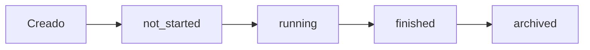

# 🔄 Flujo Completo del Sistema Híbrido de Planes Nutricionales

## 📋 **Resumen del Sistema**

El sistema híbrido maneja **3 tipos de planes** con flujos diferentes:

- **🟢 TEMPLATE**: Planes flexibles que usuarios pueden empezar cuando quieran
- **🔴 LIVE**: Planes sincronizados que empiezan en fechas específicas
- **📦 ARCHIVED**: Planes live terminados, convertidos automáticamente a templates

---

## 🎯 **Flujo 1: Planes TEMPLATE (Comportamiento Original)**

### 📅 **Paso 1: Creador crea un plan template**
```http
POST /api/v1/nutrition/plans
Content-Type: application/json

{
  "title": "Plan de Pérdida de Peso - 30 días",
  "description": "Plan flexible para perder peso gradualmente",
  "goal": "weight_loss",
  "difficulty_level": "beginner",
  "duration_days": 30,
  "estimated_budget": "medium",
  "dietary_restrictions": ["vegetarian"],
  "plan_type": "template"  // ✨ NUEVO: Especifica tipo template
}
```

**Respuesta:**
```json
{
  "id": 123,
  "title": "Plan de Pérdida de Peso - 30 días",
  "plan_type": "template",
  "is_live_active": false,
  "live_participants_count": 0,
  "status": "not_started",
  "created_by": 456,
  "created_by_name": "Nutricionista María"
}
```

### 📅 **Paso 2: Usuario descubre el plan**
```http
GET /api/v1/nutrition/plans?plan_type=template
```

**Respuesta:**
```json
{
  "plans": [
    {
      "id": 123,
      "title": "Plan de Pérdida de Peso - 30 días",
      "plan_type": "template",
      "status": "not_started",
      "is_following": false,
      "live_participants_count": 0,
      "created_by_name": "Nutricionista María"
    }
  ]
}
```

### 📅 **Paso 3: Usuario sigue el plan**
```http
POST /api/v1/nutrition/plans/123/follow
```

**Respuesta:**
```json
{
  "message": "Plan seguido exitosamente",
  "follower": {
    "user_id": 789,
    "nutrition_plan_id": 123,
    "start_date": "2024-01-15T10:00:00Z",  // ✨ Empieza AHORA
    "is_active": true,
    "current_day": 1
  }
}
```

### 📅 **Paso 4: Usuario ve su plan de hoy**
```http
GET /api/v1/nutrition/today
```

**Respuesta:**
```json
{
  "date": "2024-01-15",
  "plan": {
    "id": 123,
    "title": "Plan de Pérdida de Peso - 30 días",
    "plan_type": "template"
  },
  "current_day": 1,  // ✨ Día basado en cuándo empezó el usuario
  "status": "running",
  "meals": [
    {
      "id": 1001,
      "meal_name": "Desayuno Proteico",
      "meal_type": "breakfast",
      "calories": 350
    }
  ],
  "completion_percentage": 0
}
```

---

## 🔴 **Flujo 2: Planes LIVE (Nuevo Comportamiento)**

### 📅 **Paso 1: Creador crea un plan live**
```http
POST /api/v1/nutrition/plans
Content-Type: application/json

{
  "title": "Challenge Enero 2024 - Detox",
  "description": "Challenge grupal que empieza el 1 de febrero",
  "goal": "healthy_eating",
  "difficulty_level": "intermediate",
  "duration_days": 21,
  "estimated_budget": "medium",
  "plan_type": "live",  // ✨ NUEVO: Tipo live
  "live_start_date": "2024-02-01T06:00:00Z"  // ✨ NUEVO: Fecha específica
}
```

**Respuesta:**
```json
{
  "id": 456,
  "title": "Challenge Enero 2024 - Detox",
  "plan_type": "live",
  "live_start_date": "2024-02-01T06:00:00Z",
  "live_end_date": "2024-02-21T23:59:59Z",
  "is_live_active": true,
  "live_participants_count": 0,
  "status": "not_started",
  "days_until_start": 17,
  "created_by_name": "Coach Ana"
}
```

### 📅 **Paso 2: Usuarios descubren el plan live**
```http
GET /api/v1/nutrition/plans?plan_type=live&status=not_started
```

**Respuesta:**
```json
{
  "plans": [
    {
      "id": 456,
      "title": "Challenge Enero 2024 - Detox",
      "plan_type": "live",
      "live_start_date": "2024-02-01T06:00:00Z",
      "status": "not_started",
      "days_until_start": 17,
      "live_participants_count": 0,
      "is_following": false
    }
  ]
}
```

### 📅 **Paso 3: Usuario se une al plan live**
```http
POST /api/v1/nutrition/plans/456/follow
```

**Respuesta:**
```json
{
  "message": "Te has unido al challenge live",
  "follower": {
    "user_id": 789,
    "nutrition_plan_id": 456,
    "start_date": "2024-02-01T06:00:00Z",  // ✨ Empieza en fecha del plan
    "is_active": false,  // ✨ Inactivo hasta que empiece
    "current_day": 0
  }
}
```

### 📅 **Paso 4: Sistema actualiza contadores automáticamente**
```http
# El sistema actualiza automáticamente cuando alguien se une
PUT /api/v1/nutrition/plans/456/live-status
Content-Type: application/json

{
  "is_live_active": true,
  "live_participants_count": 1  // ✨ Incrementa automáticamente
}
```

### 📅 **Paso 5: Usuario ve estado antes de empezar**
```http
GET /api/v1/nutrition/today
```

**Respuesta (antes de empezar):**
```json
{
  "date": "2024-01-25",
  "plan": {
    "id": 456,
    "title": "Challenge Enero 2024 - Detox",
    "plan_type": "live"
  },
  "current_day": 0,
  "status": "not_started",
  "days_until_start": 7,
  "meals": []
}
```

### 📅 **Paso 6: Plan live empieza automáticamente**
```http
# El 1 de febrero a las 6:00 AM, el sistema actualiza automáticamente
GET /api/v1/nutrition/today
```

**Respuesta (día 1 del live):**
```json
{
  "date": "2024-02-01",
  "plan": {
    "id": 456,
    "title": "Challenge Enero 2024 - Detox",
    "plan_type": "live"
  },
  "current_day": 1,  // ✨ Día calculado por fecha global
  "status": "running",
  "meals": [
    {
      "id": 2001,
      "meal_name": "Batido Detox Verde",
      "meal_type": "breakfast",
      "calories": 220
    }
  ],
  "completion_percentage": 0
}
```

### 📅 **Paso 7: Todos los usuarios están sincronizados**
```http
# Usuario A ve el mismo día que Usuario B
GET /api/v1/nutrition/today
# Ambos están en Día 1 simultáneamente
```

### 📅 **Paso 8: Plan live termina automáticamente**
```http
# El 21 de febrero, el sistema marca el plan como terminado
GET /api/v1/nutrition/plans/456/status
```

**Respuesta:**
```json
{
  "plan_id": 456,
  "plan_type": "live",
  "current_day": 21,
  "status": "finished",
  "is_live_active": false,
  "live_participants_count": 145,
  "is_following": true
}
```

---

## 📦 **Flujo 3: Archivado Automático (Nuevo)**

### 📅 **Paso 1: Sistema detecta plan live terminado**
```http
# El sistema ejecuta automáticamente cada día:
GET /api/v1/nutrition/plans?plan_type=live&status=finished
```

### 📅 **Paso 2: Sistema archiva automáticamente**
```http
# Sistema ejecuta automáticamente:
POST /api/v1/nutrition/plans/456/archive
Content-Type: application/json

{
  "create_template_version": true,
  "template_title": "Challenge Detox - Probado por 145 usuarios"
}
```

**Respuesta:**
```json
{
  "message": "Plan archivado exitosamente",
  "original_plan": {
    "id": 456,
    "plan_type": "live",
    "status": "archived",
    "archived_at": "2024-02-22T00:00:00Z"
  },
  "template_version": {
    "id": 789,
    "title": "Challenge Detox - Probado por 145 usuarios",
    "plan_type": "archived",
    "original_live_plan_id": 456,
    "original_participants_count": 145
  }
}
```

### 📅 **Paso 3: Plan archivado disponible para nuevos usuarios**
```http
GET /api/v1/nutrition/plans?plan_type=archived
```

**Respuesta:**
```json
{
  "plans": [
    {
      "id": 789,
      "title": "Challenge Detox - Probado por 145 usuarios",
      "plan_type": "archived",
      "original_participants_count": 145,
      "archived_at": "2024-02-22T00:00:00Z",
      "is_following": false
    }
  ]
}
```

### 📅 **Paso 4: Nuevo usuario puede empezar plan archivado**
```http
POST /api/v1/nutrition/plans/789/follow
```

**Respuesta:**
```json
{
  "message": "Plan archivado seguido exitosamente",
  "follower": {
    "user_id": 999,
    "nutrition_plan_id": 789,
    "start_date": "2024-02-25T10:00:00Z",  // ✨ Empieza cuando quiere
    "is_active": true,
    "current_day": 1
  }
}
```

---

## 🎨 **Flujo 4: Dashboard Híbrido**

### 📅 **Usuario ve dashboard categorizado**
```http
GET /api/v1/nutrition/dashboard
```

**Respuesta:**
```json
{
  "today_plan": {
    "date": "2024-01-25",
    "plan": {
      "id": 456,
      "title": "Challenge Enero 2024 - Detox",
      "plan_type": "live"
    },
    "current_day": 0,
    "status": "not_started",
    "days_until_start": 7,
    "meals": []
  },
  "live_plans": [
    {
      "id": 456,
      "title": "Challenge Enero 2024 - Detox",
      "plan_type": "live",
      "status": "not_started",
      "days_until_start": 7,
      "live_participants_count": 23,
      "is_following": true
    }
  ],
  "template_plans": [
    {
      "id": 123,
      "title": "Plan de Pérdida de Peso - 30 días",
      "plan_type": "template",
      "status": "running",
      "current_day": 15,
      "is_following": true
    }
  ],
  "available_plans": [
    {
      "id": 789,
      "title": "Challenge Detox - Probado por 145 usuarios",
      "plan_type": "archived",
      "original_participants_count": 145,
      "is_following": false
    }
  ]
}
```

---

## 🔄 **Flujo 5: Cálculo Inteligente de Días**

### 📅 **Template Plan (Basado en usuario)**
```http
GET /api/v1/nutrition/today
```

**Lógica del Backend:**
```python
# Para planes template
user_follower = get_user_follower(user_id, plan_id)
days_since_start = (datetime.now() - user_follower.start_date).days
current_day = min(days_since_start + 1, plan.duration_days)
```

### 📅 **Live Plan (Basado en fecha global)**
```http
GET /api/v1/nutrition/today
```

**Lógica del Backend:**
```python
# Para planes live
if plan.plan_type == 'live':
    if datetime.now() < plan.live_start_date:
        current_day = 0
        status = 'not_started'
    else:
        days_since_live_start = (datetime.now() - plan.live_start_date).days
        current_day = min(days_since_live_start + 1, plan.duration_days)
        status = 'running' if current_day <= plan.duration_days else 'finished'
```

---

## 🎯 **Flujo 6: Estados y Transiciones**

### 📊 **Estados de un Plan Live**


### 📅 **Transiciones Automáticas**
```python
# El sistema ejecuta esto automáticamente cada día
def update_live_plans_status():
    live_plans = get_live_plans()
    
    for plan in live_plans:
        if plan.status == 'not_started' and datetime.now() >= plan.live_start_date:
            plan.status = 'running'
            
        elif plan.status == 'running' and datetime.now() >= plan.live_end_date:
            plan.status = 'finished'
            
        elif plan.status == 'finished' and not plan.archived_at:
            archive_plan_automatically(plan)
```

---

## 🌐 **Flujo 7: Endpoints de Monitoreo**

### 📊 **Estado en Tiempo Real**
```http
GET /api/v1/nutrition/plans/456/status
```

**Respuesta:**
```json
{
  "plan_id": 456,
  "plan_type": "live",
  "current_day": 5,
  "status": "running",
  "is_live_active": true,
  "live_participants_count": 87,
  "is_following": true
}
```

### 📊 **Listado Híbrido Categorizado**
```http
GET /api/v1/nutrition/plans/hybrid?page=1&per_page=10
```

**Respuesta:**
```json
{
  "live_plans": [
    {
      "id": 456,
      "title": "Challenge Enero 2024 - Detox",
      "status": "running",
      "current_day": 5,
      "live_participants_count": 87
    }
  ],
  "template_plans": [
    {
      "id": 123,
      "title": "Plan de Pérdida de Peso",
      "status": "running",
      "current_day": 15
    }
  ],
  "archived_plans": [
    {
      "id": 789,
      "title": "Challenge Detox - Probado por 145 usuarios",
      "original_participants_count": 145
    }
  ]
}
```

---

## 🚀 **Flujo 8: Experiencia del Usuario Final**

### 📱 **Día Típico de un Usuario**

#### **Mañana (8:00 AM)**
```http
GET /api/v1/nutrition/today
```

**Usuario ve:**
- Plan live: "Challenge Detox - Día 5"
- 3 comidas programadas para hoy
- 25% de progreso completado
- "87 personas haciendo lo mismo que tú"

#### **Después del Desayuno (9:30 AM)**
```http
POST /api/v1/nutrition/meals/2001/complete
```

**Usuario completa desayuno:**
- Progreso actualizado a 33%
- Siguiente comida desbloqueada
- Puntos de gamificación ganados

#### **Tarde (6:00 PM)**
```http
GET /api/v1/nutrition/dashboard
```

**Usuario ve dashboard:**
- Plan live actual en progreso
- Planes template disponibles
- Planes archivados recomendados
- Estadísticas de la semana

---

## 🎯 **Flujo 9: Diferencias Clave**

### 📊 **Comparación de Comportamientos**

| Aspecto | Template | Live | Archived |
|---------|----------|------|----------|
| **Inicio** | Cuando quiere el usuario | Fecha específica | Cuando quiere el usuario |
| **Cálculo de Día** | Desde que empezó usuario | Desde fecha global | Desde que empezó usuario |
| **Sincronización** | Individual | Grupal | Individual |
| **Participantes** | No visible | Contador en tiempo real | Histórico |
| **Flexibilidad** | Total | Ninguna | Total |

### 📅 **Ejemplo Práctico de Sincronización**

**Plan Template:**
- Usuario A empieza el 1 de enero → Día 1
- Usuario B empieza el 15 de enero → Día 1
- El 20 de enero: A está en Día 20, B está en Día 6

**Plan Live:**
- Plan empieza el 1 de febrero
- Usuario A se une el 25 de enero
- Usuario B se une el 30 de enero
- El 5 de febrero: Ambos están en Día 5

---

## 🔄 **Flujo 10: Casos Edge y Manejo de Errores**

### 🚨 **Usuario se une a plan live después de empezar**
```http
POST /api/v1/nutrition/plans/456/follow
# Plan live empezó hace 5 días
```

**Respuesta:**
```json
{
  "message": "Te has unido al challenge en progreso",
  "follower": {
    "user_id": 999,
    "nutrition_plan_id": 456,
    "start_date": "2024-02-01T06:00:00Z",  // Fecha original del plan
    "is_active": true,
    "current_day": 6,  // Día actual del plan
    "joined_late": true,
    "days_missed": 5
  }
}
```

### 🚨 **Plan live terminado**
```http
POST /api/v1/nutrition/plans/456/follow
# Plan live ya terminó
```

**Respuesta:**
```json
{
  "error": "Este plan live ya terminó",
  "suggestion": {
    "message": "Puedes seguir la versión archivada",
    "archived_plan_id": 789,
    "archived_plan_title": "Challenge Detox - Probado por 145 usuarios"
  }
}
```

---

## 🎉 **Resumen del Flujo Completo**

### 🔄 **Ciclo de Vida Completo**
1. **Creación** → Creador define tipo (template/live)
2. **Descubrimiento** → Usuarios encuentran planes
3. **Seguimiento** → Usuarios se unen con lógica apropiada
4. **Ejecución** → Sistema calcula días según tipo
5. **Sincronización** → Live = grupal, Template = individual
6. **Finalización** → Planes live terminan automáticamente
7. **Archivado** → Conversión automática a template reutilizable

### 🎯 **Beneficios del Sistema Híbrido**
- **Flexibilidad**: Usuarios eligen cuándo empezar (template)
- **Comunidad**: Challenges grupales sincronizados (live)
- **Reutilización**: Planes exitosos se convierten en templates (archived)
- **Escalabilidad**: Sistema maneja miles de usuarios simultáneamente

**🚀 El sistema híbrido combina lo mejor de ambos mundos: la flexibilidad individual y la motivación grupal.** 