# 🔄 Manejo de URLs de Redirección - Stripe Onboarding

## 📋 Resumen

Después de completar el onboarding en Stripe, el usuario es redirigido de vuelta a tu aplicación. Tienes **2 opciones** para manejar esto:

1. **Opción A (Recomendada)**: Crear tu propia página de éxito en el frontend
2. **Opción B (Por defecto)**: Usar la página HTML del backend

---

## 🎯 Opción A: Página Propia en Frontend (RECOMENDADA)

### Cómo Funciona

```
Usuario completa Stripe → Stripe redirige → Backend actualiza BD →
Frontend recibe usuario → Frontend muestra página de éxito
```

### 1. Configurar FRONTEND_URL en el Backend

**CRÍTICO**: El backend debe saber dónde está tu frontend.

```bash
# En .env del backend
FRONTEND_URL=https://tu-app.com
# o para desarrollo
FRONTEND_URL=http://localhost:3000
```

Si esto está configurado, el backend **automáticamente redirigirá** al frontend después de actualizar el estado.

### 2. Crear Ruta en el Frontend

Necesitas crear esta ruta en tu aplicación:

```
/admin/stripe/success
```

**Next.js**:
```
pages/admin/stripe/success.tsx
```

**React Router**:
```tsx
<Route path="/admin/stripe/success" element={<StripeSuccess />} />
```

**Vue Router**:
```javascript
{
  path: '/admin/stripe/success',
  component: StripeSuccess
}
```

### 3. Implementar Componente de Éxito

#### Next.js Example

```tsx
// pages/admin/stripe/success.tsx
import { useEffect, useState } from 'react';
import { useRouter } from 'next/router';

export default function StripeOnboardingSuccess() {
  const router = useRouter();
  const { gym_id } = router.query;
  const [status, setStatus] = useState<'loading' | 'success' | 'error'>('loading');
  const [accountInfo, setAccountInfo] = useState(null);

  useEffect(() => {
    if (!gym_id) return;

    verifyStripeSetup();
  }, [gym_id]);

  async function verifyStripeSetup() {
    try {
      // Obtener token de auth (ajusta según tu implementación)
      const token = localStorage.getItem('auth_token');

      // Verificar que el estado se actualizó correctamente
      const response = await fetch(
        `${process.env.NEXT_PUBLIC_API_URL}/stripe-connect/accounts/status`,
        {
          headers: {
            'Authorization': `Bearer ${token}`,
            'x-gym-id': gym_id as string
          }
        }
      );

      if (!response.ok) {
        throw new Error('Error verificando estado');
      }

      const data = await response.json();
      setAccountInfo(data);

      // Verificar que todo está habilitado
      if (data.charges_enabled && data.payouts_enabled) {
        setStatus('success');
      } else {
        // Está creado pero no completo
        setStatus('error');
      }

    } catch (error) {
      console.error('Error:', error);
      setStatus('error');
    }
  }

  function redirectToDashboard() {
    router.push('/admin/settings');
  }

  if (status === 'loading') {
    return (
      <div className="min-h-screen flex items-center justify-center bg-gradient-to-br from-purple-600 to-indigo-700">
        <div className="bg-white rounded-2xl shadow-2xl p-8 max-w-md w-full text-center">
          <div className="animate-spin rounded-full h-16 w-16 border-b-4 border-purple-600 mx-auto mb-4"></div>
          <h2 className="text-2xl font-bold text-gray-800 mb-2">
            Verificando configuración...
          </h2>
          <p className="text-gray-600">
            Estamos confirmando tu cuenta de Stripe
          </p>
        </div>
      </div>
    );
  }

  if (status === 'error') {
    return (
      <div className="min-h-screen flex items-center justify-center bg-gradient-to-br from-red-600 to-pink-700">
        <div className="bg-white rounded-2xl shadow-2xl p-8 max-w-md w-full text-center">
          <div className="w-16 h-16 bg-red-100 rounded-full flex items-center justify-center mx-auto mb-4">
            <svg className="w-8 h-8 text-red-600" fill="none" stroke="currentColor" viewBox="0 0 24 24">
              <path strokeLinecap="round" strokeLinejoin="round" strokeWidth={2} d="M6 18L18 6M6 6l12 12" />
            </svg>
          </div>
          <h2 className="text-2xl font-bold text-gray-800 mb-2">
            Configuración Incompleta
          </h2>
          <p className="text-gray-600 mb-6">
            La cuenta de Stripe fue creada pero la configuración no está completa.
          </p>
          <button
            onClick={redirectToDashboard}
            className="bg-red-600 text-white px-6 py-3 rounded-lg font-semibold hover:bg-red-700 w-full"
          >
            Volver a Configuración
          </button>
        </div>
      </div>
    );
  }

  // status === 'success'
  return (
    <div className="min-h-screen flex items-center justify-center bg-gradient-to-br from-green-600 to-teal-700">
      <div className="bg-white rounded-2xl shadow-2xl p-8 max-w-md w-full">
        {/* Icono de éxito con animación */}
        <div className="relative">
          <div className="w-20 h-20 bg-green-100 rounded-full flex items-center justify-center mx-auto mb-6 animate-scale-in">
            <svg className="w-10 h-10 text-green-600" fill="none" stroke="currentColor" viewBox="0 0 24 24">
              <path strokeLinecap="round" strokeLinejoin="round" strokeWidth={3} d="M5 13l4 4L19 7" />
            </svg>
          </div>
          {/* Confetti animation (opcional) */}
          <div className="absolute inset-0 pointer-events-none">
            <div className="confetti"></div>
          </div>
        </div>

        {/* Título */}
        <h1 className="text-3xl font-bold text-gray-800 text-center mb-2">
          ¡Configuración Exitosa!
        </h1>
        <p className="text-gray-600 text-center mb-6">
          Tu cuenta de Stripe está lista para procesar pagos
        </p>

        {/* Información de la cuenta */}
        {accountInfo && (
          <div className="bg-gray-50 rounded-xl p-4 mb-6 space-y-3">
            <div className="flex justify-between items-center">
              <span className="text-sm text-gray-600">ID de Cuenta</span>
              <span className="text-sm font-mono font-medium text-gray-800">
                {accountInfo.account_id}
              </span>
            </div>
            <div className="flex justify-between items-center">
              <span className="text-sm text-gray-600">Tipo</span>
              <span className="text-sm font-medium text-gray-800 capitalize">
                {accountInfo.account_type}
              </span>
            </div>
            <div className="flex justify-between items-center">
              <span className="text-sm text-gray-600">Estado de Cargos</span>
              <span className="flex items-center text-sm font-medium text-green-600">
                <svg className="w-4 h-4 mr-1" fill="currentColor" viewBox="0 0 20 20">
                  <path fillRule="evenodd" d="M10 18a8 8 0 100-16 8 8 0 000 16zm3.707-9.293a1 1 0 00-1.414-1.414L9 10.586 7.707 9.293a1 1 0 00-1.414 1.414l2 2a1 1 0 001.414 0l4-4z" clipRule="evenodd" />
                </svg>
                Habilitado
              </span>
            </div>
            <div className="flex justify-between items-center">
              <span className="text-sm text-gray-600">Estado de Retiros</span>
              <span className="flex items-center text-sm font-medium text-green-600">
                <svg className="w-4 h-4 mr-1" fill="currentColor" viewBox="0 0 20 20">
                  <path fillRule="evenodd" d="M10 18a8 8 0 100-16 8 8 0 000 16zm3.707-9.293a1 1 0 00-1.414-1.414L9 10.586 7.707 9.293a1 1 0 00-1.414 1.414l2 2a1 1 0 001.414 0l4-4z" clipRule="evenodd" />
                </svg>
                Habilitado
              </span>
            </div>
          </div>
        )}

        {/* Features habilitados */}
        <div className="bg-blue-50 border border-blue-200 rounded-xl p-4 mb-6">
          <h3 className="text-sm font-semibold text-blue-900 mb-2">
            Ahora puedes:
          </h3>
          <ul className="space-y-2 text-sm text-blue-800">
            <li className="flex items-start">
              <svg className="w-5 h-5 text-blue-600 mr-2 flex-shrink-0" fill="currentColor" viewBox="0 0 20 20">
                <path fillRule="evenodd" d="M10 18a8 8 0 100-16 8 8 0 000 16zm3.707-9.293a1 1 0 00-1.414-1.414L9 10.586 7.707 9.293a1 1 0 00-1.414 1.414l2 2a1 1 0 001.414 0l4-4z" clipRule="evenodd" />
              </svg>
              Crear eventos de pago
            </li>
            <li className="flex items-start">
              <svg className="w-5 h-5 text-blue-600 mr-2 flex-shrink-0" fill="currentColor" viewBox="0 0 20 20">
                <path fillRule="evenodd" d="M10 18a8 8 0 100-16 8 8 0 000 16zm3.707-9.293a1 1 0 00-1.414-1.414L9 10.586 7.707 9.293a1 1 0 00-1.414 1.414l2 2a1 1 0 001.414 0l4-4z" clipRule="evenodd" />
              </svg>
              Procesar pagos de membresías
            </li>
            <li className="flex items-start">
              <svg className="w-5 h-5 text-blue-600 mr-2 flex-shrink-0" fill="currentColor" viewBox="0 0 20 20">
                <path fillRule="evenodd" d="M10 18a8 8 0 100-16 8 8 0 000 16zm3.707-9.293a1 1 0 00-1.414-1.414L9 10.586 7.707 9.293a1 1 0 00-1.414 1.414l2 2a1 1 0 001.414 0l4-4z" clipRule="evenodd" />
              </svg>
              Recibir pagos directamente en tu cuenta
            </li>
          </ul>
        </div>

        {/* Botones de acción */}
        <div className="space-y-3">
          <button
            onClick={redirectToDashboard}
            className="w-full bg-gradient-to-r from-green-600 to-teal-600 text-white px-6 py-3 rounded-lg font-semibold hover:from-green-700 hover:to-teal-700 transition-all shadow-lg hover:shadow-xl"
          >
            Ir al Panel de Control
          </button>
          <button
            onClick={() => window.open('https://dashboard.stripe.com', '_blank')}
            className="w-full bg-white border-2 border-gray-300 text-gray-700 px-6 py-3 rounded-lg font-semibold hover:bg-gray-50 transition-all flex items-center justify-center"
          >
            Abrir Dashboard de Stripe
            <svg className="w-4 h-4 ml-2" fill="none" stroke="currentColor" viewBox="0 0 24 24">
              <path strokeLinecap="round" strokeLinejoin="round" strokeWidth={2} d="M10 6H6a2 2 0 00-2 2v10a2 2 0 002 2h10a2 2 0 002-2v-4M14 4h6m0 0v6m0-6L10 14" />
            </svg>
          </button>
        </div>
      </div>

      <style jsx>{`
        @keyframes scale-in {
          from {
            transform: scale(0);
            opacity: 0;
          }
          to {
            transform: scale(1);
            opacity: 1;
          }
        }
        .animate-scale-in {
          animation: scale-in 0.5s ease-out;
        }
      `}</style>
    </div>
  );
}
```

#### React Router Example

```tsx
// components/StripeSuccess.tsx
import { useEffect, useState } from 'react';
import { useNavigate, useSearchParams } from 'react-router-dom';

export default function StripeSuccess() {
  const [searchParams] = useSearchParams();
  const navigate = useNavigate();
  const gym_id = searchParams.get('gym_id');
  const [status, setStatus] = useState('loading');

  useEffect(() => {
    if (!gym_id) {
      navigate('/admin/settings');
      return;
    }

    verifySetup();
  }, [gym_id]);

  async function verifySetup() {
    // ... mismo código de verificación que arriba
  }

  // ... mismo JSX que arriba
}
```

### 4. Añadir Estilos (Opcional)

Si quieres animaciones de confetti o efectos especiales:

```tsx
// Puedes usar una librería como react-confetti
import Confetti from 'react-confetti';

export default function StripeSuccess() {
  const [showConfetti, setShowConfetti] = useState(true);

  useEffect(() => {
    // Detener confetti después de 5 segundos
    setTimeout(() => setShowConfetti(false), 5000);
  }, []);

  return (
    <div>
      {showConfetti && (
        <Confetti
          width={window.innerWidth}
          height={window.innerHeight}
          recycle={false}
          numberOfPieces={500}
        />
      )}
      {/* ... resto del componente */}
    </div>
  );
}
```

---

## 🔧 Opción B: Usar Página del Backend (Por Defecto)

### Cómo Funciona

Si **NO** configuras `FRONTEND_URL`, el backend mostrará su propia página HTML de éxito.

```
Usuario completa Stripe → Backend actualiza BD →
Backend muestra página HTML → Usuario ve página estática
```

### Cuándo Usar Esta Opción

✅ **Usar si**:
- Estás en desarrollo y no quieres crear la página todavía
- No tienes frontend (solo API)
- Quieres probar rápido

❌ **NO usar si**:
- Tienes una aplicación web completa
- Quieres mantener el branding consistente
- Necesitas tracking/analytics en la página de éxito

### Cómo Se Ve

El backend muestra una página HTML moderna con:
- ✅ Icono de éxito animado
- 📊 Estado de la cuenta (cargos, retiros, etc.)
- 🔗 Botón para ir al dashboard de API
- 🎨 Diseño responsive con gradientes

**URL de la página**:
```
https://gymapi-eh6m.onrender.com/api/v1/admin/stripe/return?gym_id=4
```

---

## 🔀 Flujo Técnico Detallado

### Con FRONTEND_URL Configurado

```mermaid
sequenceDiagram
    participant U as Usuario
    participant S as Stripe
    participant B as Backend
    participant F as Frontend

    U->>S: Completa formulario
    S->>B: GET /admin/stripe/return?gym_id=4
    B->>B: Actualiza estado en BD
    B->>F: 303 Redirect a /admin/stripe/success?gym_id=4
    F->>F: Muestra página de éxito
    F->>B: GET /stripe-connect/accounts/status
    B->>F: { charges_enabled: true, ... }
    F->>U: Muestra info actualizada
```



### Sin FRONTEND_URL (Por Defecto)

```mermaid
sequenceDiagram
    participant U as Usuario
    participant S as Stripe
    participant B as Backend

    U->>S: Completa formulario
    S->>B: GET /admin/stripe/return?gym_id=4
    B->>B: Actualiza estado en BD
    B->>U: 200 HTML Page (página de éxito)
    U->>U: Ve página estática del backend
```



---

## 🧪 Testing

### Probar Flujo Completo

```bash
# 1. Configurar FRONTEND_URL
echo "FRONTEND_URL=http://localhost:3000" >> .env

# 2. Reiniciar backend
python app_wrapper.py

# 3. Crear cuenta y obtener link
curl -X POST "http://localhost:8000/api/v1/stripe-connect/accounts" \
  -H "Authorization: Bearer $TOKEN" \
  -H "x-gym-id: 4" \
  -d '{"country":"US","account_type":"standard"}'

curl -X POST "http://localhost:8000/api/v1/stripe-connect/accounts/onboarding-link" \
  -H "Authorization: Bearer $TOKEN" \
  -H "x-gym-id: 4"

# 4. Abrir el link en navegador
# 5. Completar con datos de prueba
# 6. Deberías ser redirigido a: http://localhost:3000/admin/stripe/success?gym_id=4
```

### Simular Redirección

Si quieres probar tu página sin completar el onboarding:

```typescript
// En tu componente de desarrollo
useEffect(() => {
  if (process.env.NODE_ENV === 'development') {
    // Simular datos de cuenta
    setAccountInfo({
      account_id: 'acct_test',
      account_type: 'standard',
      charges_enabled: true,
      payouts_enabled: true,
      onboarding_completed: true
    });
    setStatus('success');
  }
}, []);
```

---

## 📝 Checklist de Implementación

### Backend
- [x] Endpoint `/admin/stripe/return` creado ✅
- [ ] Variable `FRONTEND_URL` configurada en `.env`
- [ ] Backend reiniciado después de configurar `FRONTEND_URL`

### Frontend
- [ ] Ruta `/admin/stripe/success` creada
- [ ] Componente `StripeSuccess` implementado
- [ ] Verificación de estado al cargar la página
- [ ] Manejo de casos de error
- [ ] Redirección al dashboard después de 3-5 segundos (opcional)
- [ ] Animaciones/confetti (opcional)
- [ ] Testing con datos de prueba de Stripe

---

## ⚠️ Casos Edge

### 1. Usuario llega sin gym_id

```tsx
useEffect(() => {
  if (!gym_id) {
    // Redirigir a settings
    router.push('/admin/settings');
    return;
  }
}, [gym_id]);
```

### 2. Error al verificar estado

```tsx
try {
  // ... verificar estado
} catch (error) {
  console.error('Error:', error);
  // Mostrar mensaje de error pero aún así permitir continuar
  setStatus('error');
  // Opcional: redirigir después de unos segundos
  setTimeout(() => router.push('/admin/settings'), 5000);
}
```

### 3. Usuario refresca la página

```tsx
// El componente debería funcionar igual
// Ya que obtiene el gym_id de la URL
// y verifica el estado nuevamente
```

### 4. Usuario llega antes de que el backend actualice

```tsx
// Poco probable, pero por si acaso:
async function verifySetup() {
  let attempts = 0;
  const maxAttempts = 3;

  while (attempts < maxAttempts) {
    try {
      const response = await fetch('/stripe-connect/accounts/status');
      const data = await response.json();

      if (data.charges_enabled) {
        setStatus('success');
        return;
      }

      // Esperar 2 segundos antes de reintentar
      await new Promise(resolve => setTimeout(resolve, 2000));
      attempts++;
    } catch (error) {
      attempts++;
    }
  }

  // Después de 3 intentos, mostrar error
  setStatus('error');
}
```

---

## 🎨 Personalización

### Cambiar Mensajes

```tsx
const messages = {
  title: '¡Felicitaciones! 🎉',
  subtitle: 'Tu cuenta de Stripe está lista',
  features: [
    'Acepta pagos de eventos',
    'Procesa membresías',
    'Recibe pagos directos'
  ],
  cta: 'Empezar a cobrar'
};
```

### Cambiar Colores

```tsx
// Gradiente personalizado
className="bg-gradient-to-br from-blue-600 to-purple-700"

// Colores del botón
className="bg-blue-600 hover:bg-blue-700"
```

### Agregar Analytics

```tsx
useEffect(() => {
  if (status === 'success') {
    // Google Analytics
    window.gtag?.('event', 'stripe_onboarding_completed', {
      gym_id: gym_id
    });

    // Mixpanel
    window.mixpanel?.track('Stripe Onboarding Completed', {
      gym_id: gym_id,
      account_type: accountInfo?.account_type
    });
  }
}, [status]);
```

---

## 🚨 Troubleshooting

### "No me redirige al frontend"

**Solución**:
1. Verificar que `FRONTEND_URL` esté configurado en `.env` del backend
2. Reiniciar el backend: `python app_wrapper.py`
3. Verificar logs del backend: debería decir `"Usando FRONTEND_URL directamente"`

```bash
# Verificar variable
grep FRONTEND_URL /path/to/backend/.env

# Debería mostrar:
# FRONTEND_URL=https://tu-app.com
```

### "Muestra página HTML del backend en lugar del frontend"

**Causa**: `FRONTEND_URL` no está configurado o está vacío.

**Solución**:
```bash
# En .env del backend
FRONTEND_URL=https://tu-app.com
# NO uses comillas, NO agregues barra al final
```

### "Error 404 en /admin/stripe/success"

**Causa**: La ruta no existe en el frontend.

**Solución**: Crear la ruta como se muestra en los ejemplos arriba.

### "No muestra info de la cuenta"

**Causa**: Error al llamar a `/stripe-connect/accounts/status`.

**Solución**: Verificar que el token de auth sea válido y que `x-gym-id` se envíe en headers.

---

## 📊 Comparación de Opciones

| Característica | Con FRONTEND_URL | Sin FRONTEND_URL |
|----------------|------------------|------------------|
| **Branding** | ✅ Tu diseño | ⚠️ Genérico |
| **Analytics** | ✅ Sí | ❌ No |
| **Personalización** | ✅ Total | ❌ Limitada |
| **Tiempo de setup** | ⏱️ 1-2 horas | ⚡ 0 minutos |
| **Mantenimiento** | 🔧 Tú | ✅ Backend |
| **Mejor para** | 🎯 Producción | 🧪 Testing |

---

## 💡 Recomendación Final

### Para Producción
✅ **Usar Opción A** (página propia en frontend):
- Mejor experiencia de usuario
- Branding consistente
- Permite tracking y analytics
- Más profesional

### Para Desarrollo/Testing
✅ **Usar Opción B** (página del backend):
- Más rápido para probar
- No requiere implementación
- Suficiente para validar el flujo

---

## 📞 Próximos Pasos

1. **Decidir qué opción usar** (A o B)
2. Si eliges A:
   - Configurar `FRONTEND_URL` en backend
   - Crear ruta `/admin/stripe/success`
   - Implementar componente
   - Probar flujo completo
3. Si eliges B:
   - Ya está funcionando, nada que hacer ✅

---

Última actualización: 26 Diciembre 2024
