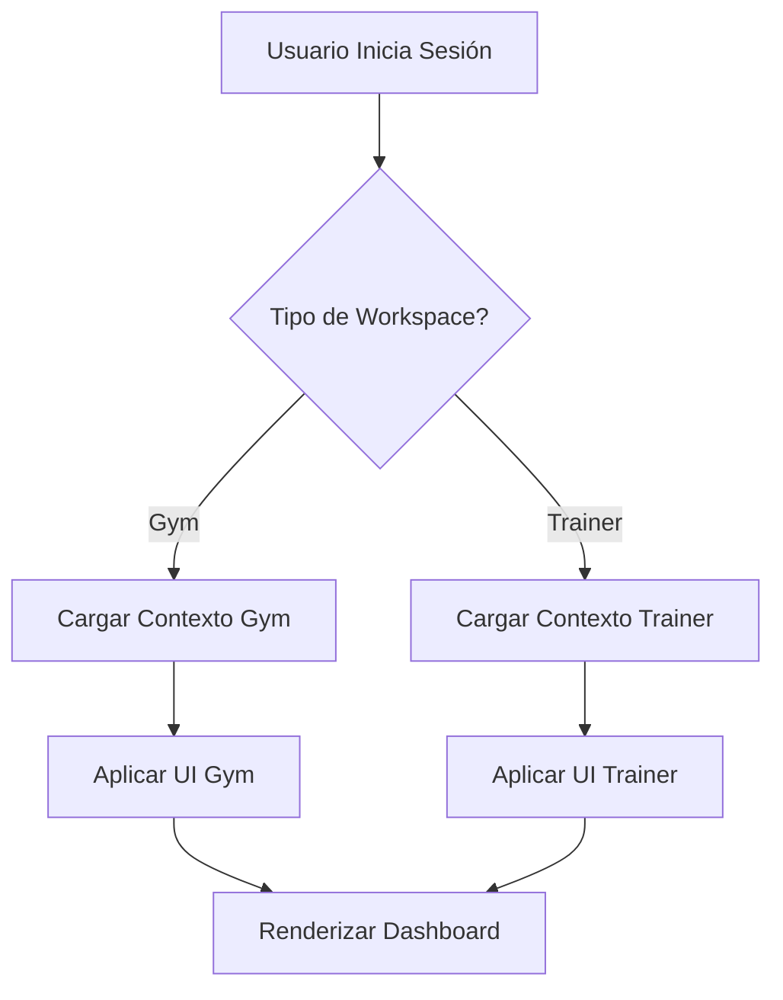

# 🎨 Guía de Integración Frontend - Sistema de Entrenadores Personales

**Versión**: 1.0.0
**Última actualización**: 2024-01-24
**Audiencia**: Desarrolladores Frontend

---

## 📑 Tabla de Contenidos

1. [Introducción](#introducción)
2. [Arquitectura de la Integración](#arquitectura-de-la-integración)
3. [Flujo de Registro](#flujo-de-registro)
4. [Sistema de UI Adaptativa](#sistema-de-ui-adaptativa)
5. [Ejemplos por Framework](#ejemplos-por-framework)
6. [Mejores Prácticas](#mejores-prácticas)
7. [Troubleshooting](#troubleshooting)

---

## 🎯 Introducción

Esta guía explica cómo integrar el sistema de entrenadores personales en aplicaciones frontend. El sistema permite que la misma aplicación sirva tanto a **gimnasios tradicionales** como a **entrenadores personales individuales** mediante UI adaptativa basada en contexto.

### Conceptos Clave

- **Workspace**: Cada gimnasio o entrenador tiene su propio workspace aislado
- **Contexto**: Información del workspace que determina cómo se comporta la UI
- **Terminología**: Palabras que cambian según el tipo ("clientes" vs "miembros")
- **Features**: Funcionalidades que se muestran/ocultan según el tipo
- **Branding**: Colores y estilos personalizados por workspace

---

## 🏗️ Arquitectura de la Integración

### Flujo General



### Capas de Adaptación

1. **Capa de Datos**: Endpoints diferentes según tipo
2. **Capa de Lógica**: Reglas de negocio adaptadas
3. **Capa de UI**: Componentes que se muestran/ocultan
4. **Capa de Presentación**: Textos y estilos dinámicos

---

## 📝 Flujo de Registro

### Paso 1: Formulario de Registro

```typescript
// interfaces/TrainerRegistration.ts
export interface TrainerRegistrationForm {
  // Campos básicos
  email: string;
  firstName: string;
  lastName: string;
  phone?: string;

  // Campos profesionales
  specialties: string[];
  certifications: {
    name: string;
    year?: number;
    institution?: string;
    credential_id?: string;
  }[];

  // Configuración
  timezone: string;
  maxClients: number;
  bio?: string;
}
```

### Paso 2: Validación en Tiempo Real

#### React Example

```typescript
import { useState, useEffect } from 'react';
import { debounce } from 'lodash';

function EmailInput() {
  const [email, setEmail] = useState('');
  const [isAvailable, setIsAvailable] = useState<boolean | null>(null);
  const [isChecking, setIsChecking] = useState(false);

  // Debounced email check
  const checkEmail = debounce(async (email: string) => {
    if (!email || !email.includes('@')) return;

    setIsChecking(true);
    try {
      const response = await fetch(
        `${API_URL}/auth/trainer/check-email/${encodeURIComponent(email)}`
      );
      const data = await response.json();
      setIsAvailable(data.available);
    } catch (error) {
      console.error('Error checking email:', error);
    } finally {
      setIsChecking(false);
    }
  }, 500);

  useEffect(() => {
    checkEmail(email);
  }, [email]);

  return (
    <div className="form-group">
      <label htmlFor="email">Email</label>
      <input
        type="email"
        id="email"
        value={email}
        onChange={(e) => setEmail(e.target.value)}
        className={
          isAvailable === null ? '' :
          isAvailable ? 'is-valid' : 'is-invalid'
        }
      />
      {isChecking && <span className="spinner">Verificando...</span>}
      {isAvailable === true && (
        <div className="valid-feedback">✓ Email disponible</div>
      )}
      {isAvailable === false && (
        <div className="invalid-feedback">✗ Email ya registrado</div>
      )}
    </div>
  );
}
```

### Paso 3: Envío del Formulario

```typescript
// services/trainerService.ts
import axios from 'axios';

export class TrainerService {
  private baseURL: string;

  constructor(baseURL: string = 'http://localhost:8000/api/v1') {
    this.baseURL = baseURL;
  }

  async registerTrainer(data: TrainerRegistrationForm) {
    try {
      const response = await axios.post(
        `${this.baseURL}/auth/register-trainer`,
        {
          email: data.email,
          first_name: data.firstName,
          last_name: data.lastName,
          phone: data.phone,
          specialties: data.specialties,
          certifications: data.certifications,
          timezone: data.timezone || Intl.DateTimeFormat().resolvedOptions().timeZone,
          max_clients: data.maxClients || 30,
          bio: data.bio
        },
        {
          headers: {
            'Content-Type': 'application/json'
          }
        }
      );

      return {
        success: true,
        data: response.data
      };

    } catch (error: any) {
      if (error.response?.status === 429) {
        throw new Error('Demasiados intentos. Por favor espera una hora.');
      }

      if (error.response?.status === 400) {
        const detail = error.response.data.detail;
        if (detail.error_code === 'WORKSPACE_EXISTS') {
          throw new Error('Ya existe una cuenta con este email');
        }
      }

      throw new Error(error.response?.data?.detail?.message || 'Error al registrar');
    }
  }

  async checkEmailAvailability(email: string) {
    const response = await axios.get(
      `${this.baseURL}/auth/trainer/check-email/${encodeURIComponent(email)}`
    );
    return response.data;
  }

  async validateSubdomain(subdomain: string) {
    const response = await axios.get(
      `${this.baseURL}/auth/trainer/validate-subdomain/${subdomain}`
    );
    return response.data;
  }
}
```

### Paso 4: Manejo del Resultado

```typescript
// components/RegistrationForm.tsx
import { useState } from 'react';
import { useNavigate } from 'react-router-dom';
import { TrainerService } from '../services/trainerService';

function RegistrationForm() {
  const navigate = useNavigate();
  const [formData, setFormData] = useState<TrainerRegistrationForm>({
    email: '',
    firstName: '',
    lastName: '',
    specialties: [],
    certifications: [],
    timezone: Intl.DateTimeFormat().resolvedOptions().timeZone,
    maxClients: 30
  });
  const [isSubmitting, setIsSubmitting] = useState(false);
  const [error, setError] = useState<string | null>(null);

  const handleSubmit = async (e: React.FormEvent) => {
    e.preventDefault();
    setIsSubmitting(true);
    setError(null);

    try {
      const service = new TrainerService();
      const result = await service.registerTrainer(formData);

      // Guardar datos en localStorage
      localStorage.setItem('gym_id', result.data.workspace.id);
      localStorage.setItem('user_id', result.data.user.id);
      localStorage.setItem('workspace_type', 'personal_trainer');

      // Redirigir a Stripe si es necesario
      if (result.data.stripe_onboarding_url) {
        window.location.href = result.data.stripe_onboarding_url;
      } else {
        // Redirigir al dashboard
        navigate('/dashboard');
      }

    } catch (err: any) {
      setError(err.message);
    } finally {
      setIsSubmitting(false);
    }
  };

  return (
    <form onSubmit={handleSubmit}>
      {/* Campos del formulario */}
      {error && (
        <div className="alert alert-danger">{error}</div>
      )}
      <button
        type="submit"
        disabled={isSubmitting}
        className="btn btn-primary"
      >
        {isSubmitting ? 'Registrando...' : 'Crear Cuenta'}
      </button>
    </form>
  );
}
```

---

## 🎨 Sistema de UI Adaptativa

### Paso 1: Cargar Contexto del Workspace

```typescript
// services/contextService.ts
export interface WorkspaceContext {
  workspace: {
    id: number;
    name: string;
    type: 'gym' | 'personal_trainer';
    is_personal_trainer: boolean;
    display_name: string;
    entity_label: string;
  };
  terminology: Record<string, string>;
  features: Record<string, boolean>;
  navigation: MenuItem[];
  quick_actions: QuickAction[];
  branding: BrandingConfig;
  user_context: UserContext;
}

export class ContextService {
  async loadWorkspaceContext(token: string, gymId: number): Promise<WorkspaceContext> {
    const response = await fetch(
      `${API_URL}/context/workspace`,
      {
        headers: {
          'Authorization': `Bearer ${token}`,
          'X-Gym-ID': gymId.toString()
        }
      }
    );

    if (!response.ok) {
      throw new Error('Error loading workspace context');
    }

    return await response.json();
  }
}
```

### Paso 2: Crear Context Provider (React)

```typescript
// contexts/WorkspaceContext.tsx
import React, { createContext, useContext, useEffect, useState } from 'react';
import { ContextService, WorkspaceContext } from '../services/contextService';

interface WorkspaceContextProps {
  context: WorkspaceContext | null;
  isLoading: boolean;
  error: string | null;
  reload: () => Promise<void>;
}

const WorkspaceContextContext = createContext<WorkspaceContextProps>({
  context: null,
  isLoading: true,
  error: null,
  reload: async () => {}
});

export const useWorkspace = () => useContext(WorkspaceContextContext);

export function WorkspaceProvider({ children }: { children: React.ReactNode }) {
  const [context, setContext] = useState<WorkspaceContext | null>(null);
  const [isLoading, setIsLoading] = useState(true);
  const [error, setError] = useState<string | null>(null);

  const loadContext = async () => {
    try {
      setIsLoading(true);
      setError(null);

      const token = localStorage.getItem('auth_token');
      const gymId = parseInt(localStorage.getItem('gym_id') || '0');

      if (!token || !gymId) {
        throw new Error('No authenticated');
      }

      const service = new ContextService();
      const data = await service.loadWorkspaceContext(token, gymId);
      setContext(data);

    } catch (err: any) {
      setError(err.message);
    } finally {
      setIsLoading(false);
    }
  };

  useEffect(() => {
    loadContext();
  }, []);

  return (
    <WorkspaceContextContext.Provider
      value={{
        context,
        isLoading,
        error,
        reload: loadContext
      }}
    >
      {children}
    </WorkspaceContextContext.Provider>
  );
}
```

### Paso 3: Aplicar Terminología Dinámica

```typescript
// hooks/useTerminology.ts
import { useWorkspace } from '../contexts/WorkspaceContext';

export function useTerminology() {
  const { context } = useWorkspace();

  const t = (key: string, fallback?: string): string => {
    return context?.terminology[key] || fallback || key;
  };

  return { t };
}

// Uso en componentes
function MembersList() {
  const { t } = useTerminology();

  return (
    <div>
      <h1>{t('members', 'Miembros')}</h1>
      {/* "Clientes" para trainers, "Miembros" para gyms */}
      <button>Agregar {t('member', 'Miembro')}</button>
    </div>
  );
}
```

### Paso 4: Features Condicionales

```typescript
// hooks/useFeatures.ts
import { useWorkspace } from '../contexts/WorkspaceContext';

export function useFeatures() {
  const { context } = useWorkspace();

  const hasFeature = (feature: string): boolean => {
    return context?.features[feature] === true;
  };

  return { hasFeature };
}

// Uso en componentes
function Dashboard() {
  const { hasFeature } = useFeatures();

  return (
    <div className="dashboard">
      {hasFeature('show_appointments') && (
        <AppointmentsWidget />
      )}

      {hasFeature('show_class_schedule') && (
        <ClassScheduleWidget />
      )}

      {!hasFeature('show_equipment_management') && null}

      {hasFeature('show_client_progress') && (
        <ClientProgressWidget />
      )}
    </div>
  );
}
```

### Paso 5: Aplicar Branding Dinámico

```typescript
// hooks/useBranding.ts
import { useEffect } from 'react';
import { useWorkspace } from '../contexts/WorkspaceContext';

export function useBranding() {
  const { context } = useWorkspace();

  useEffect(() => {
    if (!context?.branding) return;

    const { primary_color, secondary_color, accent_color } = context.branding;

    // Aplicar CSS variables
    document.documentElement.style.setProperty('--color-primary', primary_color);
    document.documentElement.style.setProperty('--color-secondary', secondary_color);
    document.documentElement.style.setProperty('--color-accent', accent_color);

    // Actualizar título
    document.title = context.branding.app_title;

  }, [context]);

  return { branding: context?.branding };
}

// Uso en App principal
function App() {
  useBranding();

  return (
    <WorkspaceProvider>
      <Router />
    </WorkspaceProvider>
  );
}
```

### Paso 6: Navegación Adaptativa

```typescript
// components/Navigation.tsx
import { useWorkspace } from '../contexts/WorkspaceContext';
import { Link } from 'react-router-dom';

function Navigation() {
  const { context } = useWorkspace();

  if (!context) return <div>Cargando...</div>;

  return (
    <nav className="sidebar">
      {context.navigation.map(item => (
        <Link
          key={item.id}
          to={item.path}
          className="nav-item"
        >
          <i className={`icon-${item.icon}`} />
          <span>{item.label}</span>
        </Link>
      ))}
    </nav>
  );
}
```

---

## 🚀 Ejemplos por Framework

### React + TypeScript (Completo)

```typescript
// App.tsx
import { BrowserRouter, Routes, Route, Navigate } from 'react-router-dom';
import { WorkspaceProvider } from './contexts/WorkspaceContext';
import { AuthProvider } from './contexts/AuthContext';
import { Dashboard } from './pages/Dashboard';
import { Clients } from './pages/Clients';
import { Appointments } from './pages/Appointments';
import { TrainerRegistration } from './pages/TrainerRegistration';
import { ProtectedRoute } from './components/ProtectedRoute';

function App() {
  return (
    <BrowserRouter>
      <AuthProvider>
        <WorkspaceProvider>
          <Routes>
            <Route path="/register" element={<TrainerRegistration />} />
            <Route path="/" element={
              <ProtectedRoute>
                <Dashboard />
              </ProtectedRoute>
            } />
            <Route path="/clients" element={
              <ProtectedRoute>
                <Clients />
              </ProtectedRoute>
            } />
            <Route path="/appointments" element={
              <ProtectedRoute>
                <Appointments />
              </ProtectedRoute>
            } />
          </Routes>
        </WorkspaceProvider>
      </AuthProvider>
    </BrowserRouter>
  );
}

export default App;
```

### Vue 3 + Composition API

```typescript
// composables/useWorkspace.ts
import { ref, onMounted } from 'vue';
import { ContextService } from '../services/contextService';

export function useWorkspace() {
  const context = ref(null);
  const isLoading = ref(true);
  const error = ref(null);

  const loadContext = async () => {
    try {
      isLoading.value = true;
      const token = localStorage.getItem('auth_token');
      const gymId = parseInt(localStorage.getItem('gym_id') || '0');

      const service = new ContextService();
      context.value = await service.loadWorkspaceContext(token, gymId);
    } catch (err) {
      error.value = err.message;
    } finally {
      isLoading.value = false;
    }
  };

  onMounted(() => {
    loadContext();
  });

  return {
    context,
    isLoading,
    error,
    reload: loadContext
  };
}

// Uso en componente
<template>
  <div v-if="!isLoading && context">
    <h1>{{ context.terminology.members }}</h1>

    <div v-if="context.features.show_appointments">
      <AppointmentsWidget />
    </div>
  </div>
</template>

<script setup lang="ts">
import { useWorkspace } from '@/composables/useWorkspace';

const { context, isLoading } = useWorkspace();
</script>
```

### Flutter (Mobile)

```dart
// services/trainer_service.dart
import 'dart:convert';
import 'package:http/http.dart' as http;

class TrainerService {
  final String baseUrl;

  TrainerService({this.baseUrl = 'http://localhost:8000/api/v1'});

  Future<Map<String, dynamic>> registerTrainer(Map<String, dynamic> data) async {
    final response = await http.post(
      Uri.parse('$baseUrl/auth/register-trainer'),
      headers: {'Content-Type': 'application/json'},
      body: json.encode({
        'email': data['email'],
        'first_name': data['firstName'],
        'last_name': data['lastName'],
        'phone': data['phone'],
        'specialties': data['specialties'],
        'certifications': data['certifications'],
        'timezone': data['timezone'],
        'max_clients': data['maxClients'] ?? 30,
        'bio': data['bio'],
      }),
    );

    if (response.statusCode == 201) {
      return json.decode(response.body);
    } else if (response.statusCode == 429) {
      throw Exception('Demasiados intentos. Espera una hora.');
    } else {
      throw Exception('Error al registrar: ${response.body}');
    }
  }

  Future<Map<String, dynamic>> getWorkspaceContext(String token, int gymId) async {
    final response = await http.get(
      Uri.parse('$baseUrl/context/workspace'),
      headers: {
        'Authorization': 'Bearer $token',
        'X-Gym-ID': gymId.toString(),
      },
    );

    if (response.statusCode == 200) {
      return json.decode(response.body);
    } else {
      throw Exception('Error loading context');
    }
  }
}

// providers/workspace_provider.dart
import 'package:flutter/material.dart';
import '../services/trainer_service.dart';

class WorkspaceProvider extends ChangeNotifier {
  Map<String, dynamic>? _context;
  bool _isLoading = true;
  String? _error;

  Map<String, dynamic>? get context => _context;
  bool get isLoading => _isLoading;
  String? get error => _error;

  Future<void> loadContext(String token, int gymId) async {
    try {
      _isLoading = true;
      _error = null;
      notifyListeners();

      final service = TrainerService();
      _context = await service.getWorkspaceContext(token, gymId);
    } catch (e) {
      _error = e.toString();
    } finally {
      _isLoading = false;
      notifyListeners();
    }
  }

  String getTerminology(String key, {String fallback = ''}) {
    return _context?['terminology']?[key] ?? fallback;
  }

  bool hasFeature(String feature) {
    return _context?['features']?[feature] == true;
  }
}

// Uso en widgets
class MembersPage extends StatelessWidget {
  @override
  Widget build(BuildContext context) {
    return Consumer<WorkspaceProvider>(
      builder: (context, workspace, child) {
        if (workspace.isLoading) {
          return CircularProgressIndicator();
        }

        return Scaffold(
          appBar: AppBar(
            title: Text(workspace.getTerminology('members', fallback: 'Miembros')),
          ),
          body: Column(
            children: [
              // Contenido adaptado
            ],
          ),
        );
      },
    );
  }
}
```

---

## ✅ Mejores Prácticas

### 1. Manejo de Errores

```typescript
// utils/errorHandler.ts
export class APIError extends Error {
  constructor(
    message: string,
    public statusCode: number,
    public errorCode?: string,
    public details?: any
  ) {
    super(message);
    this.name = 'APIError';
  }
}

export function handleAPIError(error: any): never {
  if (error.response) {
    const status = error.response.status;
    const detail = error.response.data.detail;

    if (status === 429) {
      throw new APIError(
        'Demasiados intentos. Por favor espera antes de reintentar.',
        429
      );
    }

    if (status === 400 && detail.error_code === 'WORKSPACE_EXISTS') {
      throw new APIError(
        'Ya existe una cuenta con este email',
        400,
        'WORKSPACE_EXISTS',
        detail.details
      );
    }

    throw new APIError(
      detail.message || 'Error en la petición',
      status,
      detail.error_code,
      detail.details
    );
  }

  throw new APIError('Error de red', 0);
}
```

### 2. Cache del Contexto

```typescript
// services/cacheService.ts
interface CacheItem<T> {
  data: T;
  timestamp: number;
  ttl: number;
}

export class CacheService {
  private cache: Map<string, CacheItem<any>> = new Map();

  set<T>(key: string, data: T, ttl: number = 300000) {
    this.cache.set(key, {
      data,
      timestamp: Date.now(),
      ttl
    });
  }

  get<T>(key: string): T | null {
    const item = this.cache.get(key);
    if (!item) return null;

    const isExpired = Date.now() - item.timestamp > item.ttl;
    if (isExpired) {
      this.cache.delete(key);
      return null;
    }

    return item.data as T;
  }

  clear() {
    this.cache.clear();
  }
}

// Uso con contexto
export class ContextService {
  private cache = new CacheService();

  async loadWorkspaceContext(token: string, gymId: number): Promise<WorkspaceContext> {
    const cacheKey = `context:${gymId}`;

    // Intentar desde cache (5 minutos)
    const cached = this.cache.get<WorkspaceContext>(cacheKey);
    if (cached) return cached;

    // Cargar desde API
    const response = await fetch(/* ... */);
    const data = await response.json();

    // Guardar en cache
    this.cache.set(cacheKey, data, 300000); // 5 minutos

    return data;
  }
}
```

### 3. Rate Limiting en Frontend

```typescript
// utils/rateLimiter.ts
export class RateLimiter {
  private requests: Map<string, number[]> = new Map();

  canMakeRequest(key: string, limit: number, windowMs: number): boolean {
    const now = Date.now();
    const requests = this.requests.get(key) || [];

    // Filtrar requests dentro de la ventana
    const recent = requests.filter(timestamp => now - timestamp < windowMs);

    if (recent.length >= limit) {
      return false;
    }

    // Agregar nuevo request
    recent.push(now);
    this.requests.set(key, recent);

    return true;
  }

  getRetryAfter(key: string, limit: number, windowMs: number): number {
    const requests = this.requests.get(key) || [];
    if (requests.length === 0) return 0;

    const oldest = requests[0];
    const elapsed = Date.now() - oldest;
    return Math.max(0, windowMs - elapsed);
  }
}

// Uso
const limiter = new RateLimiter();

async function registerTrainer(data: any) {
  const key = 'register-trainer';

  if (!limiter.canMakeRequest(key, 5, 3600000)) { // 5 por hora
    const retryAfter = limiter.getRetryAfter(key, 5, 3600000);
    throw new Error(`Espera ${Math.ceil(retryAfter / 60000)} minutos antes de reintentar`);
  }

  return await api.registerTrainer(data);
}
```

### 4. Validación de Formularios

```typescript
// utils/validators.ts
export const validators = {
  email: (value: string): string | null => {
    if (!value) return 'Email es requerido';
    if (!/^[^\s@]+@[^\s@]+\.[^\s@]+$/.test(value)) {
      return 'Email inválido';
    }
    return null;
  },

  phone: (value: string): string | null => {
    if (!value) return null; // Opcional
    const clean = value.replace(/[\s-]/g, '');
    if (!/^\+?[1-9]\d{1,14}$/.test(clean)) {
      return 'Formato de teléfono inválido. Usa formato internacional: +525512345678';
    }
    return null;
  },

  name: (value: string): string | null => {
    if (!value) return 'Este campo es requerido';
    if (value.length < 2) return 'Mínimo 2 caracteres';
    if (value.length > 50) return 'Máximo 50 caracteres';
    return null;
  },

  specialties: (value: string[]): string | null => {
    if (!value || value.length === 0) return 'Agrega al menos una especialidad';
    if (value.length > 10) return 'Máximo 10 especialidades';
    for (const s of value) {
      if (s.length < 2 || s.length > 50) {
        return 'Cada especialidad debe tener entre 2 y 50 caracteres';
      }
    }
    return null;
  }
};

// Uso en formulario
function useFormValidation(formData: any) {
  const errors: Record<string, string> = {};

  errors.email = validators.email(formData.email) || '';
  errors.phone = validators.phone(formData.phone) || '';
  errors.firstName = validators.name(formData.firstName) || '';
  errors.lastName = validators.name(formData.lastName) || '';
  errors.specialties = validators.specialties(formData.specialties) || '';

  const isValid = Object.values(errors).every(e => !e);

  return { errors, isValid };
}
```

### 5. Logging y Analytics

```typescript
// services/analyticsService.ts
export class AnalyticsService {
  trackEvent(eventName: string, properties?: Record<string, any>) {
    // Enviar a tu servicio de analytics (Google Analytics, Mixpanel, etc.)
    console.log('[Analytics]', eventName, properties);

    // Ejemplo con Google Analytics
    if (typeof gtag !== 'undefined') {
      gtag('event', eventName, properties);
    }
  }

  trackRegistrationStart() {
    this.trackEvent('trainer_registration_start');
  }

  trackRegistrationComplete(workspaceId: number) {
    this.trackEvent('trainer_registration_complete', {
      workspace_id: workspaceId
    });
  }

  trackContextLoaded(workspaceType: string) {
    this.trackEvent('workspace_context_loaded', {
      workspace_type: workspaceType
    });
  }

  trackFeatureUsage(feature: string) {
    this.trackEvent('feature_used', {
      feature_name: feature
    });
  }
}

// Uso en componentes
const analytics = new AnalyticsService();

function RegistrationForm() {
  useEffect(() => {
    analytics.trackRegistrationStart();
  }, []);

  const handleSubmit = async (data: any) => {
    const result = await registerTrainer(data);
    analytics.trackRegistrationComplete(result.workspace.id);
  };
}
```

---

## 🐛 Troubleshooting

### Problema: Contexto no carga después del login

**Síntomas**: La aplicación muestra spinner infinito

**Causas**:
1. Token expirado o inválido
2. `gym_id` no está en localStorage
3. Headers no se envían correctamente

**Solución**:
```typescript
// Verificar token y gym_id antes de cargar
function useAuth() {
  const checkAuth = () => {
    const token = localStorage.getItem('auth_token');
    const gymId = localStorage.getItem('gym_id');

    if (!token || !gymId) {
      console.error('Missing auth credentials');
      window.location.href = '/login';
      return false;
    }

    // Verificar expiración de token
    try {
      const payload = JSON.parse(atob(token.split('.')[1]));
      const isExpired = payload.exp * 1000 < Date.now();

      if (isExpired) {
        console.error('Token expired');
        localStorage.clear();
        window.location.href = '/login';
        return false;
      }
    } catch (e) {
      console.error('Invalid token format');
      return false;
    }

    return true;
  };

  return { checkAuth };
}
```

### Problema: UI no se adapta según el tipo

**Síntomas**: Entrenadores ven opciones de gimnasio

**Causas**:
1. Contexto no se aplicó correctamente
2. Features no se verifican
3. Cache antiguo

**Solución**:
```typescript
// Verificar que el contexto se use en todos los componentes
function FeatureGuard({ feature, children }: { feature: string, children: React.ReactNode }) {
  const { hasFeature } = useFeatures();

  if (!hasFeature(feature)) {
    return null;
  }

  return <>{children}</>;
}

// Uso
<FeatureGuard feature="show_equipment_management">
  <EquipmentSection />
</FeatureGuard>

// Limpiar cache al cambiar de workspace
function onWorkspaceChange(newGymId: number) {
  localStorage.setItem('gym_id', newGymId.toString());

  // Limpiar cache
  const cache = new CacheService();
  cache.clear();

  // Recargar contexto
  window.location.reload();
}
```

### Problema: Rate limiting en desarrollo

**Síntomas**: Error 429 después de pocos intentos

**Causas**:
1. Múltiples refreshes durante desarrollo
2. Tests automáticos

**Solución**:
```typescript
// En desarrollo, usar modo mock
const isDevelopment = process.env.NODE_ENV === 'development';

class TrainerService {
  async registerTrainer(data: any) {
    if (isDevelopment && USE_MOCK) {
      // Simular respuesta exitosa
      await new Promise(resolve => setTimeout(resolve, 1000));
      return {
        success: true,
        workspace: {
          id: Math.floor(Math.random() * 1000),
          name: `Entrenamiento Personal ${data.firstName} ${data.lastName}`,
          type: 'personal_trainer',
          // ...
        },
        // ...
      };
    }

    // Llamada real
    return await this.api.post('/auth/register-trainer', data);
  }
}
```

---

## 📚 Recursos Adicionales

### Plantillas de Código

Repositorio con ejemplos completos:
```
/examples
  /react-trainer-app       - App completa React + TypeScript
  /vue-trainer-app         - App completa Vue 3
  /flutter-trainer-app     - App móvil Flutter
  /components              - Componentes reutilizables
  /hooks                   - Custom hooks
  /services                - Servicios API
```

### Checklist de Integración

- [ ] Implementar formulario de registro con validación en tiempo real
- [ ] Agregar manejo de errores con mensajes amigables
- [ ] Implementar sistema de cache para el contexto
- [ ] Crear componentes adaptativos basados en features
- [ ] Aplicar terminología dinámica en toda la UI
- [ ] Configurar branding dinámico con CSS variables
- [ ] Implementar rate limiting en frontend
- [ ] Agregar analytics para tracking de eventos
- [ ] Probar flujo completo: registro → login → dashboard
- [ ] Verificar UI adaptativa en ambos tipos (gym y trainer)

### Links Útiles

- [API Documentation](./TRAINER_API_DOCUMENTATION.md)
- [Implementation Summary](../IMPLEMENTATION_SUMMARY.md)
- [Swagger UI](http://localhost:8000/api/v1/docs)

---

**Última actualización**: 2024-01-24
**Versión**: 1.0.0
**Autor**: Claude Code
