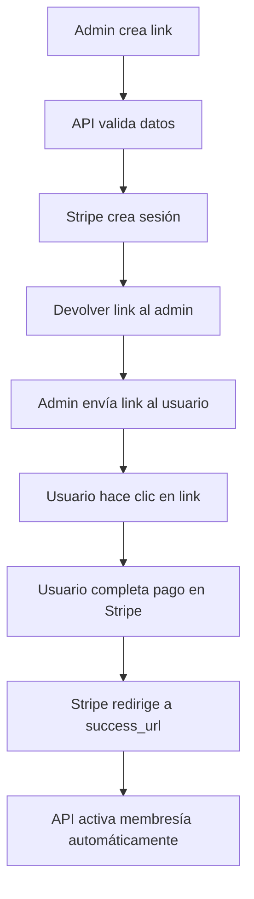

# 🔗 Guía de Links de Pago Administrativos

## 📋 Resumen

El endpoint administrativo de links de pago permite a los administradores de gimnasios crear links de pago personalizados para usuarios específicos. Esta funcionalidad es especialmente útil para:

- **Ventas directas**: Crear links personalizados durante llamadas telefónicas
- **Usuarios con dificultades**: Ayudar a usuarios que tienen problemas con el proceso de pago
- **Ofertas especiales**: Crear links con condiciones específicas
- **Nuevos miembros**: Generar links para usuarios que aún no están registrados en el gimnasio

---

## 🚀 Endpoint Principal

### `POST /api/v1/memberships/admin/create-payment-link`

**Descripción**: Crear link de pago administrativo para un usuario específico

**Autenticación**: Requerida (Solo administradores)

**Rate Limit**: 10 requests por minuto

---

## 📥 Request

### Headers Requeridos
```http
Authorization: Bearer <admin-token>
X-Gym-ID: <gym-id>
Content-Type: application/json
```

### Request Body
```json
{
  "user_id": 123,
  "plan_id": 456,
  "success_url": "https://mi-gym.com/success",
  "cancel_url": "https://mi-gym.com/cancel",
  "notes": "Pago de membresía mensual - contacto telefónico",
  "expires_in_hours": 24
}
```

### Parámetros

| Campo | Tipo | Requerido | Descripción |
|-------|------|-----------|-------------|
| `user_id` | integer | ✅ | ID del usuario que debe pagar (debe existir en el sistema) |
| `plan_id` | integer | ✅ | ID del plan de membresía (debe pertenecer al gimnasio) |
| `success_url` | string | ❌ | URL personalizada de éxito (opcional) |
| `cancel_url` | string | ❌ | URL personalizada de cancelación (opcional) |
| `notes` | string | ❌ | Notas adicionales sobre el pago (máx. 500 caracteres) |
| `expires_in_hours` | integer | ❌ | Horas hasta que expire el link (1-168, default: 24) |

---

## 📤 Response

### Respuesta Exitosa (200)
```json
{
  "checkout_url": "https://checkout.stripe.com/c/pay/cs_test_...",
  "session_id": "cs_test_a1B2c3D4...",
  "plan_name": "Plan Premium Mensual",
  "price_amount": 29.99,
  "currency": "EUR",
  "user_email": "usuario@email.com",
  "user_name": "Juan Pérez",
  "expires_at": "2024-01-16T14:30:00Z",
  "notes": "Pago de membresía mensual - contacto telefónico",
  "created_by_admin": "admin@gimnasio.com"
}
```

### Campos de Respuesta

| Campo | Descripción |
|-------|-------------|
| `checkout_url` | URL de Stripe para que el usuario complete el pago |
| `session_id` | ID de sesión de Stripe para tracking |
| `plan_name` | Nombre del plan de membresía |
| `price_amount` | Precio en la unidad principal de la moneda |
| `currency` | Código de moneda (EUR, USD, etc.) |
| `user_email` | Email del usuario destinatario |
| `user_name` | Nombre completo del usuario |
| `expires_at` | Fecha y hora de expiración del link |
| `notes` | Notas adicionales proporcionadas |
| `created_by_admin` | Email del administrador que creó el link |

---

## ❌ Errores Posibles

### 400 - Bad Request
```json
{
  "detail": "El plan 'Plan Premium' está temporalmente desactivado."
}
```

### 403 - Forbidden
```json
{
  "detail": "El plan 'Plan Premium' no está disponible en este gimnasio."
}
```

### 404 - Not Found
```json
{
  "detail": "El usuario con ID 123 no existe."
}
```

### 503 - Service Unavailable
```json
{
  "detail": "El plan 'Plan Premium' no está configurado para pagos. Contacta al administrador del gimnasio."
}
```

---

## 🧪 Ejemplos de Uso

### Ejemplo 1: Link Estándar
```bash
curl -X POST "http://localhost:8000/api/v1/memberships/admin/create-payment-link" \
  -H "Authorization: Bearer <admin-token>" \
  -H "X-Gym-ID: 1" \
  -H "Content-Type: application/json" \
  -d '{
    "user_id": 123,
    "plan_id": 456,
    "notes": "Pago de membresía mensual - contacto telefónico"
  }'
```

### Ejemplo 2: Link Urgente (2 horas)
```bash
curl -X POST "http://localhost:8000/api/v1/memberships/admin/create-payment-link" \
  -H "Authorization: Bearer <admin-token>" \
  -H "X-Gym-ID: 1" \
  -H "Content-Type: application/json" \
  -d '{
    "user_id": 124,
    "plan_id": 457,
    "notes": "Oferta especial válida solo hoy",
    "expires_in_hours": 2,
    "success_url": "https://mi-gym.com/success-urgente"
  }'
```

### Ejemplo 3: Link para Nuevo Usuario (3 días)
```bash
curl -X POST "http://localhost:8000/api/v1/memberships/admin/create-payment-link" \
  -H "Authorization: Bearer <admin-token>" \
  -H "X-Gym-ID: 1" \
  -H "Content-Type: application/json" \
  -d '{
    "user_id": 125,
    "plan_id": 458,
    "expires_in_hours": 72,
    "notes": "Nuevo miembro - tiempo para decidir"
  }'
```

---

## 🔄 Flujo Completo



---

## 🎯 Casos de Uso

### 1. **Venta Telefónica**
```json
{
  "user_id": 123,
  "plan_id": 456,
  "notes": "Venta telefónica - cliente llamó interesado en plan premium",
  "expires_in_hours": 24
}
```

### 2. **Usuario con Problemas Técnicos**
```json
{
  "user_id": 124,
  "plan_id": 457,
  "notes": "Usuario reportó problemas con el checkout - link de respaldo",
  "expires_in_hours": 48
}
```

### 3. **Oferta Especial**
```json
{
  "user_id": 125,
  "plan_id": 458,
  "notes": "Oferta especial 20% descuento - válida hasta medianoche",
  "expires_in_hours": 6,
  "success_url": "https://mi-gym.com/oferta-especial/success"
}
```

### 4. **Cliente VIP**
```json
{
  "user_id": 126,
  "plan_id": 459,
  "notes": "Cliente VIP - atención personalizada y seguimiento",
  "expires_in_hours": 72,
  "success_url": "https://mi-gym.com/vip/success",
  "cancel_url": "https://mi-gym.com/vip/cancel"
}
```

---

## 🛡️ Seguridad y Validaciones

### Validaciones Automáticas
- ✅ **Usuario existe**: Verifica que el user_id existe en la base de datos
- ✅ **Plan válido**: Confirma que el plan pertenece al gimnasio actual
- ✅ **Plan activo**: Solo permite crear links para planes activos
- ✅ **Configuración Stripe**: Verifica que el plan tiene precio configurado
- ✅ **Expiración válida**: Límite entre 1 y 168 horas (1 semana)
- ✅ **Rate limiting**: Máximo 10 links por minuto por administrador

### Metadatos de Stripe
Cada sesión incluye metadatos completos para tracking:
```json
{
  "user_id": "123",
  "user_email": "usuario@email.com",
  "user_name": "Juan Pérez",
  "gym_id": "1",
  "gym_name": "Gimnasio Central",
  "plan_id": "456",
  "plan_name": "Plan Premium",
  "created_by_admin": "admin@gimnasio.com",
  "is_admin_generated": "true",
  "admin_notes": "Pago telefónico",
  "expires_at": "2024-01-16T14:30:00Z"
}
```

---

## 📊 Monitoreo y Logs

### Logs Generados
```
✅ Link de pago administrativo creado por admin@gimnasio.com para usuario usuario@email.com
📥 Solicitud ADMIN de link de pago - Plan ID: 456, Usuario: 123, Admin: admin@gimnasio.com
🔍 Creando checkout session ADMIN - User: 123, Gym: 1, Plan: 456
```

### Métricas Importantes
- **Links creados por administrador**
- **Tasa de conversión de links administrativos**
- **Tiempo promedio entre creación y pago**
- **Links expirados sin uso**

---

## 🔧 Herramientas de Testing

### Script de Pruebas
```bash
# Ejecutar script interactivo
python scripts/test_admin_payment_links.py
```

### Opciones del Script
1. **Probar escenarios predefinidos**: Crea múltiples links de ejemplo
2. **Crear link interactivamente**: Guía paso a paso
3. **Listar usuarios**: Ver usuarios disponibles en un gimnasio
4. **Listar planes**: Ver planes disponibles en un gimnasio

---

## 🚨 Consideraciones Importantes

### ⚠️ Limitaciones
- Los links expiran automáticamente (máximo 7 días)
- Solo administradores pueden crear links
- El usuario debe existir en el sistema
- El plan debe estar configurado con Stripe

### 💡 Mejores Prácticas
- **Usar notas descriptivas** para tracking interno
- **Configurar URLs personalizadas** para mejor experiencia
- **Establecer expiración apropiada** según el contexto
- **Monitorear links no utilizados** para seguimiento

### 🔄 Integración con Webhooks
Los pagos realizados a través de links administrativos se procesan igual que los pagos normales:
- Activación automática de membresía
- Webhooks de Stripe funcionan normalmente
- Metadatos adicionales para identificar origen administrativo

---

## 📞 Soporte

Para problemas con links administrativos:
1. Verificar logs del servidor
2. Comprobar configuración de Stripe
3. Validar permisos del administrador
4. Revisar estado del plan de membresía

**Documentación relacionada**:
- [Stripe Integration Guide](stripe_multi_tenant_guide.md)
- [API Permissions](api_permissions.md)
- [Environment Variables](environment_variables.md) 