# Flujos del Sistema de Chat y Argumentos Requeridos

## 📊 Introducción

Esta documentación explica **paso a paso** todos los flujos del sistema de chat y **exactamente qué argumentos** pasar en cada endpoint. Incluye ejemplos completos con todas las validaciones necesarias.

---

## 🔑 Configuración Base - Headers Obligatorios

**TODOS** los endpoints requieren estos headers:

```http
Authorization: Bearer <jwt_token_del_usuario>
X-Gym-ID: <id_del_gimnasio>
Content-Type: application/json
```

### Ejemplo en diferentes tecnologías:

**Swift/iOS:**
```swift
var request = URLRequest(url: url)
request.setValue("Bearer \(userToken)", forHTTPHeaderField: "Authorization")
request.setValue("\(gymId)", forHTTPHeaderField: "X-Gym-ID") 
request.setValue("application/json", forHTTPHeaderField: "Content-Type")
```

**JavaScript/React:**
```javascript
const headers = {
    'Authorization': `Bearer ${userToken}`,
    'X-Gym-ID': gymId.toString(),
    'Content-Type': 'application/json'
};
```

**cURL:**
```bash
curl -H "Authorization: Bearer eyJhbGc..." \
     -H "X-Gym-ID: 123" \
     -H "Content-Type: application/json"
```

---

## 🚀 Flujo 1: Inicializar Sistema de Chat

### Paso 1: Obtener Token de Stream
**Endpoint:** `GET /api/v1/chat/token`

**Headers requeridos:**
- `Authorization: Bearer <jwt_token>`
- `X-Gym-ID: <gym_id>`

**Sin argumentos en body**

**Respuesta exitosa (200):**
```json
{
    "token": "eyJhbGciOiJIUzI1NiIsInR5cCI6IkpXVCJ9...",
    "api_key": "your_stream_api_key",
    "internal_user_id": 123
}
```

**Errores posibles:**
- `401` - Token JWT inválido o expirado
- `403` - Usuario no tiene acceso a este gimnasio
- `400` - Header X-Gym-ID faltante o inválido

### Implementación Completa:

```swift
func initializeChatSystem(gymId: Int) async throws -> StreamTokenResponse {
    let url = URL(string: "\(baseURL)/api/v1/chat/token")!
    var request = URLRequest(url: url)
    
    // Headers obligatorios
    request.setValue("Bearer \(jwtToken)", forHTTPHeaderField: "Authorization")
    request.setValue("\(gymId)", forHTTPHeaderField: "X-Gym-ID")
    
    let (data, response) = try await URLSession.shared.data(for: request)
    
    guard let httpResponse = response as? HTTPURLResponse else {
        throw ChatError.invalidResponse
    }
    
    switch httpResponse.statusCode {
    case 200:
        return try JSONDecoder().decode(StreamTokenResponse.self, from: data)
    case 401:
        throw ChatError.unauthorized
    case 403:
        throw ChatError.gymAccessDenied
    case 400:
        throw ChatError.invalidGymId
    default:
        throw ChatError.unknown(httpResponse.statusCode)
    }
}
```

---

## 💬 Flujo 2: Chat Directo (1 a 1)

### Obtener o Crear Chat Directo
**Endpoint:** `GET /api/v1/chat/rooms/direct/{user_id}`

**Argumentos de URL:**
- `user_id` (int): ID interno del otro usuario (NO auth0_id)

**Headers requeridos:**
- `Authorization: Bearer <jwt_token>`
- `X-Gym-ID: <gym_id>`

**Sin body**

**Ejemplo de URL completa:**
```
GET /api/v1/chat/rooms/direct/456
```

**Respuesta exitosa (200):**
```json
{
    "id": 789,
    "stream_channel_id": "gym_123_direct_456_789",
    "stream_channel_type": "messaging",
    "name": null,
    "gym_id": 123,
    "event_id": null,
    "is_direct": true,
    "status": "ACTIVE",
    "created_at": "2024-01-15T10:30:00Z",
    "updated_at": "2024-01-15T10:30:00Z"
}
```

### Implementación Swift:

```swift
func getDirectChat(withUserId userId: Int, gymId: Int) async throws -> ChatRoom {
    let url = URL(string: "\(baseURL)/api/v1/chat/rooms/direct/\(userId)")!
    var request = URLRequest(url: url)
    
    // Headers obligatorios
    request.setValue("Bearer \(jwtToken)", forHTTPHeaderField: "Authorization")
    request.setValue("\(gymId)", forHTTPHeaderField: "X-Gym-ID")
    
    let (data, response) = try await URLSession.shared.data(for: request)
    
    guard let httpResponse = response as? HTTPURLResponse,
          httpResponse.statusCode == 200 else {
        throw ChatError.failedToCreateDirectChat
    }
    
    return try JSONDecoder().decode(ChatRoom.self, from: data)
}
```

**Validaciones importantes:**
- `user_id` debe ser un usuario válido del mismo gimnasio
- No puedes crear chat directo contigo mismo
- Si el chat ya existe, devuelve el existente

---

## 👥 Flujo 3: Chat Grupal

### Crear Chat Grupal
**Endpoint:** `POST /api/v1/chat/rooms`

**Headers requeridos:**
- `Authorization: Bearer <jwt_token>`
- `X-Gym-ID: <gym_id>`
- `Content-Type: application/json`

**Body (JSON):**
```json
{
    "name": "Grupo de Entrenamientos",
    "member_ids": [123, 456, 789],
    "is_direct": false,
    "event_id": null
}
```

**Argumentos del body:**
- `name` (string, opcional): Nombre del grupo
- `member_ids` (array de int, **obligatorio**): Lista de IDs internos de usuarios
- `is_direct` (boolean, opcional): Siempre false para grupos (default: false)  
- `event_id` (int, opcional): null para grupos normales

**Permisos requeridos:**
- Usuario debe ser `trainer` o `admin` del gimnasio

### Implementación Swift:

```swift
struct CreateGroupChatRequest: Codable {
    let name: String?
    let memberIds: [Int]
    let isDirect: Bool = false
    let eventId: Int? = nil
    
    enum CodingKeys: String, CodingKey {
        case name
        case memberIds = "member_ids"
        case isDirect = "is_direct"
        case eventId = "event_id"
    }
}

func createGroupChat(name: String?, memberIds: [Int], gymId: Int) async throws -> ChatRoom {
    let url = URL(string: "\(baseURL)/api/v1/chat/rooms")!
    var request = URLRequest(url: url)
    request.httpMethod = "POST"
    
    // Headers obligatorios
    request.setValue("Bearer \(jwtToken)", forHTTPHeaderField: "Authorization")
    request.setValue("\(gymId)", forHTTPHeaderField: "X-Gym-ID")
    request.setValue("application/json", forHTTPHeaderField: "Content-Type")
    
    // Body
    let requestBody = CreateGroupChatRequest(name: name, memberIds: memberIds)
    request.httpBody = try JSONEncoder().encode(requestBody)
    
    let (data, response) = try await URLSession.shared.data(for: request)
    
    guard let httpResponse = response as? HTTPURLResponse else {
        throw ChatError.invalidResponse
    }
    
    switch httpResponse.statusCode {
    case 201:
        return try JSONDecoder().decode(ChatRoom.self, from: data)
    case 403:
        throw ChatError.insufficientPermissions // No eres trainer/admin
    case 400:
        throw ChatError.invalidMemberIds // Algunos user_ids no válidos
    default:
        throw ChatError.unknown(httpResponse.statusCode)
    }
}
```

**Validaciones importantes:**
- Mínimo 2 miembros (además del creador)
- Todos los `member_ids` deben ser usuarios válidos del gimnasio
- Solo trainers/admins pueden crear grupos

---

## 📅 Flujo 4: Chat de Evento

### Obtener Chat de Evento
**Endpoint:** `GET /api/v1/chat/rooms/event/{event_id}`

**Argumentos de URL:**
- `event_id` (int): ID del evento

**Headers requeridos:**
- `Authorization: Bearer <jwt_token>`
- `X-Gym-ID: <gym_id>`

**Sin body**

**Respuesta exitosa (200):**
```json
{
    "id": 456,
    "stream_channel_id": "gym_123_event_789",
    "stream_channel_type": "messaging",
    "name": "Chat: Clase de Yoga Matutina",
    "gym_id": 123,
    "event_id": 789,
    "is_direct": false,
    "status": "ACTIVE",
    "created_at": "2024-01-15T08:00:00Z",
    "updated_at": "2024-01-15T10:30:00Z"
}
```

### Implementación Swift:

```swift
func getEventChat(eventId: Int, gymId: Int) async throws -> ChatRoom {
    let url = URL(string: "\(baseURL)/api/v1/chat/rooms/event/\(eventId)")!
    var request = URLRequest(url: url)
    
    // Headers obligatorios  
    request.setValue("Bearer \(jwtToken)", forHTTPHeaderField: "Authorization")
    request.setValue("\(gymId)", forHTTPHeaderField: "X-Gym-ID")
    
    let (data, response) = try await URLSession.shared.data(for: request)
    
    guard let httpResponse = response as? HTTPURLResponse else {
        throw ChatError.invalidResponse
    }
    
    switch httpResponse.statusCode {
    case 200:
        return try JSONDecoder().decode(ChatRoom.self, from: data)
    case 404:
        throw ChatError.eventNotFound
    case 403:
        throw ChatError.notEnrolledInEvent // No estás inscrito al evento
    default:
        throw ChatError.unknown(httpResponse.statusCode)
    }
}
```

**Validaciones importantes:**
- Solo usuarios inscritos al evento pueden acceder
- El evento debe existir y pertenecer al gimnasio
- El chat se cierra automáticamente 2 horas después del evento

---

## 🏢 Flujo 5: Canal General del Gimnasio

### Obtener Info del Canal General
**Endpoint:** `GET /api/v1/chat/general-channel/info`

**Sin argumentos adicionales**

**Headers requeridos:**
- `Authorization: Bearer <jwt_token>`
- `X-Gym-ID: <gym_id>`

### Unirse al Canal General
**Endpoint:** `POST /api/v1/chat/general-channel/join`

**Sin body**

### Implementación Swift:

```swift
// Obtener info del canal general
func getGeneralChannelInfo(gymId: Int) async throws -> ChatRoom {
    let url = URL(string: "\(baseURL)/api/v1/chat/general-channel/info")!
    var request = URLRequest(url: url)
    
    request.setValue("Bearer \(jwtToken)", forHTTPHeaderField: "Authorization")
    request.setValue("\(gymId)", forHTTPHeaderField: "X-Gym-ID")
    
    let (data, _) = try await URLSession.shared.data(for: request)
    return try JSONDecoder().decode(ChatRoom.self, from: data)
}

// Unirse al canal general
func joinGeneralChannel(gymId: Int) async throws -> ChatRoom {
    let url = URL(string: "\(baseURL)/api/v1/chat/general-channel/join")!
    var request = URLRequest(url: url)
    request.httpMethod = "POST"
    
    request.setValue("Bearer \(jwtToken)", forHTTPHeaderField: "Authorization")
    request.setValue("\(gymId)", forHTTPHeaderField: "X-Gym-ID")
    
    let (data, _) = try await URLSession.shared.data(for: request)
    return try JSONDecoder().decode(ChatRoom.self, from: data)
}
```

---

## 👤 Flujo 6: Gestión de Miembros

### Agregar Miembro a Sala
**Endpoint:** `POST /api/v1/chat/rooms/{room_id}/members/{user_id}`

**Argumentos de URL:**
- `room_id` (int): ID de la sala de chat
- `user_id` (int): ID interno del usuario a agregar

**Headers requeridos:**
- `Authorization: Bearer <jwt_token>`
- `X-Gym-ID: <gym_id>`

**Sin body**

### Remover Miembro de Sala
**Endpoint:** `DELETE /api/v1/chat/rooms/{room_id}/members/{user_id}`

**Mismos argumentos que agregar**

### Implementación Swift:

```swift
// Agregar miembro
func addMember(userId: Int, toRoom roomId: Int, gymId: Int) async throws {
    let url = URL(string: "\(baseURL)/api/v1/chat/rooms/\(roomId)/members/\(userId)")!
    var request = URLRequest(url: url)
    request.httpMethod = "POST"
    
    request.setValue("Bearer \(jwtToken)", forHTTPHeaderField: "Authorization")
    request.setValue("\(gymId)", forHTTPHeaderField: "X-Gym-ID")
    
    let (_, response) = try await URLSession.shared.data(for: request)
    
    guard let httpResponse = response as? HTTPURLResponse else {
        throw ChatError.invalidResponse
    }
    
    switch httpResponse.statusCode {
    case 200, 201:
        return // Éxito
    case 403:
        throw ChatError.insufficientPermissions
    case 404:
        throw ChatError.roomOrUserNotFound
    case 409:
        throw ChatError.memberAlreadyExists
    default:
        throw ChatError.unknown(httpResponse.statusCode)
    }
}

// Remover miembro
func removeMember(userId: Int, fromRoom roomId: Int, gymId: Int) async throws {
    let url = URL(string: "\(baseURL)/api/v1/chat/rooms/\(roomId)/members/\(userId)")!
    var request = URLRequest(url: url)
    request.httpMethod = "DELETE"
    
    request.setValue("Bearer \(jwtToken)", forHTTPHeaderField: "Authorization")
    request.setValue("\(gymId)", forHTTPHeaderField: "X-Gym-ID")
    
    let (_, response) = try await URLSession.shared.data(for: request)
    
    guard let httpResponse = response as? HTTPURLResponse,
          httpResponse.statusCode == 200 else {
        throw ChatError.failedToRemoveMember
    }
}
```

**Permisos para gestión de miembros:**
- **Salas grupales**: Solo creador, trainers o admins
- **Canal general**: Solo admins del gimnasio
- **Chats directos**: No se pueden gestionar miembros
- **Chats de evento**: Solo trainer del evento o admins

---

## 📋 Flujo 7: Listar Salas del Usuario

### Mis Salas del Gimnasio Actual
**Endpoint:** `GET /api/v1/chat/my-rooms`

**Sin argumentos adicionales**

### Todas mis Salas (Multi-Gimnasio)
**Endpoint:** `GET /api/v1/chat/user-rooms`

**Sin argumentos adicionales**

### Implementación Swift:

```swift
// Salas del gimnasio actual
func getMyRooms(gymId: Int) async throws -> [ChatRoom] {
    let url = URL(string: "\(baseURL)/api/v1/chat/my-rooms")!
    var request = URLRequest(url: url)
    
    request.setValue("Bearer \(jwtToken)", forHTTPHeaderField: "Authorization")
    request.setValue("\(gymId)", forHTTPHeaderField: "X-Gym-ID")
    
    let (data, _) = try await URLSession.shared.data(for: request)
    return try JSONDecoder().decode([ChatRoom].self, from: data)
}

// Todas las salas (multi-gimnasio)
func getAllUserRooms() async throws -> [ChatRoom] {
    let url = URL(string: "\(baseURL)/api/v1/chat/user-rooms")!
    var request = URLRequest(url: url)
    
    request.setValue("Bearer \(jwtToken)", forHTTPHeaderField: "Authorization")
    // NO incluir X-Gym-ID para este endpoint
    
    let (data, _) = try await URLSession.shared.data(for: request)
    return try JSONDecoder().decode([ChatRoom].self, from: data)
}
```

---

## 🔄 Flujos Completos de Casos de Uso

### Caso 1: Usuario Inicia la App y Quiere Ver sus Chats

```mermaid
sequenceDiagram
    participant App as App iOS
    participant API as GymApi
    participant Stream as Stream Chat
    participant DB as Database

    App->>API: 1. GET /chat/token (gym_id: 123)
    API->>DB: Validar usuario en gym 123
    API->>Stream: Generar token para user_456
    Stream-->>API: Token JWT Stream
    API-->>App: {token, api_key, internal_user_id}
    
    App->>Stream: 2. Conectar con Stream SDK
    Stream-->>App: Conexión establecida
    
    App->>API: 3. GET /chat/my-rooms
    API->>DB: Buscar salas del usuario en gym 123
    API-->>App: Lista de ChatRoom[]
    
    App->>App: 4. Mostrar lista de chats
```



**Implementación paso a paso:**

```swift
class ChatInitService {
    func initializeUserChats(gymId: Int) async throws -> [ChatRoom] {
        // Paso 1: Obtener token de Stream
        let tokenResponse = try await getStreamToken(gymId: gymId)
        
        // Paso 2: Conectar a Stream
        try await connectToStream(with: tokenResponse)
        
        // Paso 3: Obtener mis salas
        let rooms = try await getMyRooms(gymId: gymId)
        
        return rooms
    }
    
    private func connectToStream(with tokenResponse: StreamTokenResponse) async throws {
        let config = ChatClientConfig(apiKey: .init(tokenResponse.apiKey))
        let client = ChatClient(config: config)
        
        let streamUserId = "user_\(tokenResponse.internalUserId)"
        
        return try await withCheckedThrowingContinuation { continuation in
            client.connectUser(
                userInfo: .init(id: streamUserId),
                token: .init(rawValue: tokenResponse.token)
            ) { error in
                if let error = error {
                    continuation.resume(throwing: error)
                } else {
                    continuation.resume()
                }
            }
        }
    }
}
```

### Caso 2: Usuario Quiere Chatear con Otro Usuario

```mermaid
sequenceDiagram
    participant App as App iOS
    participant API as GymApi
    participant Stream as Stream Chat
    participant DB as Database

    App->>API: 1. GET /chat/rooms/direct/789
    API->>DB: Buscar chat directo entre user_456 y user_789
    
    alt Chat no existe
        API->>Stream: Crear canal gym_123_direct_456_789
        Stream-->>API: Canal creado
        API->>DB: Guardar ChatRoom en BD
    else Chat existe
        API->>DB: Obtener ChatRoom existente
    end
    
    API-->>App: ChatRoom con stream_channel_id
    App->>Stream: Conectar al canal específico
    Stream-->>App: Canal listo para mensajes
```



**Implementación:**

```swift
func startDirectChat(withUserId otherUserId: Int, gymId: Int) async throws -> String {
    // Paso 1: Obtener o crear chat directo
    let chatRoom = try await getDirectChat(withUserId: otherUserId, gymId: gymId)
    
    // Paso 2: Conectar al canal en Stream
    let channelId = ChannelId(type: .messaging, id: chatRoom.streamChannelId)
    let channelController = ChatClient.shared.channelController(for: channelId)
    
    // Paso 3: Retornar ID del canal para la UI
    return chatRoom.streamChannelId
}
```

### Caso 3: Trainer Crea Grupo para Clase

```mermaid
sequenceDiagram
    participant App as App iOS (Trainer)
    participant API as GymApi  
    participant Stream as Stream Chat
    participant DB as Database
    participant Push as OneSignal

    App->>API: 1. POST /chat/rooms {name, member_ids}
    API->>API: Validar permisos de trainer
    API->>DB: Validar que todos member_ids están en gym
    
    API->>Stream: 2. Crear canal grupal
    Stream-->>API: Canal creado con ID
    
    API->>DB: 3. Guardar ChatRoom y ChatMembers
    API->>Stream: 4. Agregar miembros al canal
    
    API->>Push: 5. Enviar notificación a miembros
    Push-->>App: Notificación "Te agregaron a grupo X"
    
    API-->>App: ChatRoom creado exitosamente
```



**Implementación completa:**

```swift
func createTrainingGroup(
    name: String, 
    memberIds: [Int], 
    gymId: Int
) async throws -> ChatRoom {
    
    // Validar que tengo permisos de trainer
    guard await hasTrainerPermissions(gymId: gymId) else {
        throw ChatError.insufficientPermissions
    }
    
    // Crear el grupo
    let chatRoom = try await createGroupChat(
        name: name, 
        memberIds: memberIds, 
        gymId: gymId
    )
    
    // Opcional: Enviar mensaje de bienvenida
    try await sendWelcomeMessage(to: chatRoom.streamChannelId)
    
    return chatRoom
}

private func sendWelcomeMessage(to channelId: String) async throws {
    let channelController = ChatClient.shared.channelController(
        for: ChannelId(type: .messaging, id: channelId)
    )
    
    try await channelController.createNewMessage(
        text: "¡Bienvenidos al grupo! 💪"
    )
}
```

---

## ⚠️ Validaciones y Errores Importantes

### Validaciones de Argumentos

1. **IDs de Usuario:**
   ```swift
   // ✅ Correcto - usar ID interno
   let userId = 123
   
   // ❌ Incorrecto - NO usar auth0_id
   let userId = "auth0|64a1b2c3d4e5f6789"
   ```

2. **Headers obligatorios:**
   ```swift
   // ✅ Siempre incluir ambos
   request.setValue("Bearer \(token)", forHTTPHeaderField: "Authorization")
   request.setValue("\(gymId)", forHTTPHeaderField: "X-Gym-ID")
   ```

3. **Gym ID correcto:**
   ```swift
   // ✅ Usar el gym activo del usuario
   let gymId = UserSession.currentGymId
   
   // ❌ NO hardcodear o usar gym incorrecto
   let gymId = 1 // Esto puede dar error 403
   ```

### Códigos de Error Comunes

| Código | Significado | Solución |
|--------|-------------|----------|
| `400` | Argumentos inválidos | Verificar formato de IDs y body JSON |
| `401` | Token JWT inválido | Renovar autenticación |
| `403` | Sin permisos o gym incorrecto | Verificar membresía y permisos |
| `404` | Recurso no encontrado | Verificar que IDs existen |
| `409` | Conflicto (ej: miembro ya existe) | Manejar estado duplicado |
| `429` | Rate limit excedido | Implementar retry con backoff |

---

## 🎯 Mejores Prácticas

### 1. Orden de Ejecución
```swift
// ✅ Orden correcto
async func setupChat() {
    1. await authenticateWithAPI()
    2. await getStreamToken()  
    3. await connectToStream()
    4. await loadUserRooms()
    5. await setupPushNotifications()
}
```

### 2. Cache de Tokens
```swift
class TokenCache {
    private var cachedToken: (token: StreamTokenResponse, expiry: Date)?
    
    func getValidToken(gymId: Int) async throws -> StreamTokenResponse {
        // Verificar cache primero
        if let cached = cachedToken, cached.expiry > Date() {
            return cached.token
        }
        
        // Solicitar nuevo token
        let newToken = try await apiService.getStreamToken(gymId: gymId)
        cachedToken = (newToken, Date().addingTimeInterval(300)) // 5 min cache
        return newToken
    }
}
```

### 3. Reconexión Automática
```swift
class ChatConnectionManager {
    func handleConnectionLost() {
        // Esperar antes de reconectar
        DispatchQueue.main.asyncAfter(deadline: .now() + 2.0) {
            Task {
                try await self.reconnectChat()
            }
        }
    }
}
```

---

## ✅ Checklist de Implementación

### Antes de cada llamada a la API:
- [ ] Token JWT válido y no expirado
- [ ] Header `X-Gym-ID` con el gym correcto
- [ ] Validar que el usuario tiene membresía activa
- [ ] Usar IDs internos (no auth0_ids)

### Para cada tipo de chat:
- [ ] **Chat directo**: Validar que el otro usuario existe y está en el gym
- [ ] **Chat grupal**: Verificar permisos de trainer/admin  
- [ ] **Chat evento**: Confirmar inscripción al evento
- [ ] **Canal general**: Verificar membresía activa al gym

### Manejo de errores:
- [ ] Implementar retry para errores 5xx
- [ ] Cache de tokens para evitar rate limiting
- [ ] Mensajes de error comprensibles para el usuario
- [ ] Logging para debugging

---

## 🚀 Flujo Completo de Ejemplo

Aquí tienes un flujo completo real de implementación:

```swift
class CompleteChatFlow {
    let apiService: APIService
    let chatManager: ChatManager
    
    // Flujo completo: Usuario quiere chatear con otro miembro
    func startChatWithUser(otherUserId: Int, currentGymId: Int) async throws -> String {
        
        // 1. Verificar autenticación
        guard apiService.isAuthenticated else {
            throw ChatError.notAuthenticated
        }
        
        // 2. Obtener token de Stream (con cache)
        let tokenResponse = try await apiService.getStreamToken(gymId: currentGymId)
        
        // 3. Conectar a Stream si no está conectado
        if !chatManager.isConnected {
            try await chatManager.connect(with: tokenResponse)
        }
        
        // 4. Obtener o crear chat directo
        let chatRoom = try await apiService.getDirectChat(
            withUserId: otherUserId, 
            gymId: currentGymId
        )
        
        // 5. Preparar canal de Stream
        let channelId = ChannelId(type: .messaging, id: chatRoom.streamChannelId)
        let controller = ChatClient.shared.channelController(for: channelId)
        
        // 6. Cargar mensajes recientes
        try await controller.loadPreviousMessages(limit: 25)
        
        // 7. Retornar ID del canal para la UI
        return chatRoom.streamChannelId
    }
}
```

Esta documentación cubre **todos los flujos posibles** con **argumentos exactos** y **validaciones necesarias**. ¡Está lista para implementar! 🎉