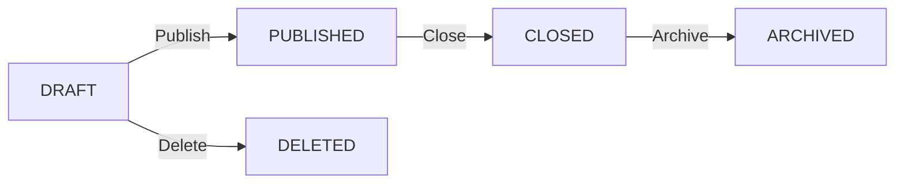

# 📋 Sistema de Encuestas - Documentación Completa

## Índice
1. [Introducción](#introducción)
2. [Arquitectura](#arquitectura)
3. [Modelos de Datos](#modelos-de-datos)
4. [API Endpoints](#api-endpoints)
5. [Tipos de Preguntas](#tipos-de-preguntas)
6. [Flujo de Trabajo](#flujo-de-trabajo)
7. [Estadísticas y Analytics](#estadísticas-y-analytics)
8. [Exportación de Datos](#exportación-de-datos)
9. [Plantillas](#plantillas)
10. [Seguridad y Permisos](#seguridad-y-permisos)

## Introducción

El sistema de encuestas permite a los gimnasios crear, distribuir y analizar cuestionarios para obtener feedback de sus miembros. Es completamente multi-tenant, con aislamiento total de datos por gimnasio.

### Características Principales
- ✅ 13 tipos de preguntas diferentes
- ✅ Encuestas anónimas o identificadas
- ✅ Control de fechas de inicio/fin
- ✅ Estadísticas automáticas
- ✅ Exportación a CSV/Excel
- ✅ Sistema de plantillas
- ✅ Notificaciones automáticas
- ✅ Multi-idioma ready

## Arquitectura

### Stack Tecnológico
- **Backend**: FastAPI + SQLAlchemy
- **Base de Datos**: PostgreSQL con ENUM types
- **Cache**: Redis para optimización
- **Exportación**: Pandas + OpenPyXL
- **Validación**: Pydantic v2

### Estructura de Archivos
```
app/
├── models/survey.py          # Modelos SQLAlchemy (6 tablas)
├── schemas/survey.py         # Schemas Pydantic para validación
├── repositories/survey.py    # Capa de datos con cache
├── services/survey.py        # Lógica de negocio y estadísticas
├── api/v1/endpoints/surveys.py # 20+ endpoints REST
└── migrations/               # Migraciones Alembic

scripts/
└── migrate_survey_system.py # Script de migración manual
```

## Modelos de Datos

### Tablas Principales

#### 1. `surveys` - Encuestas principales
```sql
- id: Integer (PK)
- gym_id: Integer (FK → gyms)
- creator_id: Integer (FK → user)
- title: String(200)
- description: Text
- status: ENUM('DRAFT', 'PUBLISHED', 'CLOSED', 'ARCHIVED')
- start_date: DateTime (opcional)
- end_date: DateTime (opcional)
- is_anonymous: Boolean
- allow_multiple: Boolean
- randomize_questions: Boolean
- show_progress: Boolean
- thank_you_message: Text
- tags: JSON
- target_audience: String(100)
```

#### 2. `survey_questions` - Preguntas
```sql
- id: Integer (PK)
- survey_id: Integer (FK → surveys)
- question_text: Text
- question_type: ENUM (13 tipos)
- is_required: Boolean
- order: Integer
- help_text: Text
- min_value/max_value: Float
- regex_validation: String(500)
- depends_on_question_id: Integer (condicional)
```

#### 3. `question_choices` - Opciones de respuesta
```sql
- id: Integer (PK)
- question_id: Integer (FK → survey_questions)
- choice_text: String(500)
- choice_value: String(100)
- order: Integer
- next_question_id: Integer (branching logic)
```

#### 4. `survey_responses` - Respuestas de usuarios
```sql
- id: Integer (PK)
- survey_id: Integer (FK → surveys)
- user_id: Integer (FK → user, nullable)
- gym_id: Integer (FK → gyms)
- started_at: DateTime
- completed_at: DateTime
- is_complete: Boolean
- ip_address: String(45)
- user_agent: String(500)
- event_id: Integer (FK → events, opcional)
```

#### 5. `survey_answers` - Respuestas individuales
```sql
- id: Integer (PK)
- response_id: Integer (FK → survey_responses)
- question_id: Integer (FK → survey_questions)
- text_answer: Text
- choice_id: Integer (FK → question_choices)
- choice_ids: JSON (para checkbox)
- number_answer: Float
- date_answer: DateTime
- boolean_answer: Boolean
- other_text: Text
```

#### 6. `survey_templates` - Plantillas reutilizables
```sql
- id: Integer (PK)
- gym_id: Integer (FK → gyms, nullable)
- name: String(200)
- description: Text
- category: String(100)
- template_data: JSON
- is_public: Boolean
- usage_count: Integer
```

## API Endpoints

### Endpoints Públicos (Miembros)

#### `GET /api/v1/surveys/available`
Obtiene encuestas disponibles para responder
```json
Response: [
  {
    "id": 1,
    "title": "Satisfacción Mensual",
    "description": "...",
    "questions_count": 10,
    "estimated_time": 5,
    "end_date": "2025-08-31T23:59:59Z"
  }
]
```

#### `POST /api/v1/surveys/responses`
Envía respuesta a una encuesta
```json
Request: {
  "survey_id": 1,
  "answers": [
    {
      "question_id": 1,
      "text_answer": "Excelente servicio"
    },
    {
      "question_id": 2,
      "number_answer": 9
    }
  ]
}
```

#### `GET /api/v1/surveys/my-responses`
Obtiene las respuestas propias del usuario

### Endpoints Administrativos

#### `POST /api/v1/surveys/`
Crea nueva encuesta (solo admin/trainer)

#### `PUT /api/v1/surveys/{id}`
Actualiza encuesta existente

#### `POST /api/v1/surveys/{id}/publish`
Publica encuesta (la hace disponible)

#### `POST /api/v1/surveys/{id}/close`
Cierra encuesta (no acepta más respuestas)

#### `GET /api/v1/surveys/{id}/statistics`
Obtiene estadísticas detalladas

#### `GET /api/v1/surveys/{id}/export`
Exporta resultados (CSV/Excel)

#### `DELETE /api/v1/surveys/{id}`
Elimina encuesta (solo si no tiene respuestas)

### Endpoints de Plantillas

#### `GET /api/v1/surveys/templates`
Lista plantillas disponibles

#### `POST /api/v1/surveys/templates/{id}/use`
Crea encuesta desde plantilla

## Tipos de Preguntas

### 1. TEXT - Respuesta corta
```json
{
  "question_type": "TEXT",
  "max_length": 100,
  "placeholder": "Tu respuesta aquí"
}
```

### 2. TEXTAREA - Respuesta larga
```json
{
  "question_type": "TEXTAREA",
  "max_length": 500,
  "min_length": 10
}
```

### 3. RADIO - Selección única
```json
{
  "question_type": "RADIO",
  "choices": [
    {"choice_text": "Opción 1", "choice_value": "opt1"},
    {"choice_text": "Opción 2", "choice_value": "opt2"}
  ]
}
```

### 4. CHECKBOX - Selección múltiple
```json
{
  "question_type": "CHECKBOX",
  "choices": [...],
  "min_selections": 1,
  "max_selections": 3
}
```

### 5. SELECT - Dropdown
```json
{
  "question_type": "SELECT",
  "choices": [...],
  "allow_other": true
}
```

### 6. SCALE - Escala numérica
```json
{
  "question_type": "SCALE",
  "min_value": 1,
  "max_value": 5,
  "step": 1,
  "labels": {
    "1": "Muy malo",
    "5": "Excelente"
  }
}
```

### 7. DATE - Selector de fecha
```json
{
  "question_type": "DATE",
  "min_date": "2024-01-01",
  "max_date": "2025-12-31"
}
```

### 8. TIME - Selector de hora
```json
{
  "question_type": "TIME",
  "format": "HH:mm"
}
```

### 9. NUMBER - Entrada numérica
```json
{
  "question_type": "NUMBER",
  "min_value": 0,
  "max_value": 100,
  "decimal_places": 2
}
```

### 10. EMAIL - Correo electrónico
```json
{
  "question_type": "EMAIL",
  "validate_domain": true
}
```

### 11. PHONE - Teléfono
```json
{
  "question_type": "PHONE",
  "country_code": "+1",
  "format": "international"
}
```

### 12. YES_NO - Pregunta binaria
```json
{
  "question_type": "YES_NO",
  "yes_label": "Sí",
  "no_label": "No"
}
```

### 13. NPS - Net Promoter Score
```json
{
  "question_type": "NPS",
  "min_value": 0,
  "max_value": 10,
  "detractor_threshold": 6,
  "promoter_threshold": 9
}
```

## Flujo de Trabajo

### 1. Ciclo de Vida de una Encuesta



### 2. Proceso de Respuesta

1. Usuario accede a `/surveys/available`
2. Selecciona encuesta para responder
3. Sistema verifica:
   - Encuesta está PUBLISHED
   - Dentro de fechas válidas
   - Usuario no ha respondido (si no permite múltiples)
4. Usuario completa preguntas
5. Sistema valida respuestas
6. Guarda respuesta con timestamp
7. Actualiza estadísticas en cache
8. Envía notificación de confirmación

### 3. Lógica Condicional

Las preguntas pueden depender de respuestas anteriores:

```json
{
  "question_text": "¿Usas entrenador personal?",
  "question_type": "YES_NO",
  "id": 1
},
{
  "question_text": "¿Cómo calificarías a tu entrenador?",
  "question_type": "SCALE",
  "depends_on_question_id": 1,
  "depends_on_answer": {"boolean_answer": true}
}
```

## Estadísticas y Analytics

### Métricas Automáticas

#### Para la encuesta completa:
- Total de respuestas
- Respuestas completas vs incompletas
- Tasa de completación
- Tiempo promedio de respuesta
- Distribución por fechas
- Demografía de respondientes

#### Por pregunta:
- **TEXT/TEXTAREA**: Word cloud, términos frecuentes
- **RADIO/CHECKBOX**: Distribución porcentual
- **SCALE/NPS**: Promedio, mediana, desviación estándar
- **NUMBER**: Min, max, promedio, percentiles
- **YES_NO**: Ratio Sí/No
- **NPS específico**: 
  - % Promotores (9-10)
  - % Neutros (7-8)
  - % Detractores (0-6)
  - NPS Score = %Promotores - %Detractores

### Ejemplo de Response de Estadísticas

```json
{
  "survey_id": 1,
  "total_responses": 150,
  "complete_responses": 142,
  "incomplete_responses": 8,
  "completion_rate": 94.67,
  "average_completion_time": 312,  // segundos
  "last_response_date": "2025-08-24T15:30:00Z",
  "question_statistics": [
    {
      "question_id": 1,
      "question_text": "Satisfacción general",
      "question_type": "SCALE",
      "response_count": 142,
      "statistics": {
        "average": 4.2,
        "median": 4,
        "mode": 5,
        "std_dev": 0.8,
        "distribution": {
          "1": 5,
          "2": 8,
          "3": 22,
          "4": 45,
          "5": 62
        }
      }
    },
    {
      "question_id": 2,
      "question_text": "¿Recomendarías el gimnasio?",
      "question_type": "NPS",
      "response_count": 142,
      "statistics": {
        "nps_score": 42,
        "promoters": 78,
        "passives": 35,
        "detractors": 29,
        "average": 7.8
      }
    }
  ]
}
```

## Exportación de Datos

### Formatos Soportados

#### CSV
- Una fila por respuesta
- Columnas: metadata + una por pregunta
- Encoding UTF-8
- Separador: coma

#### Excel
- **Hoja 1**: Respuestas detalladas
- **Hoja 2**: Estadísticas resumidas
- **Hoja 3**: Gráficos automáticos
- Formato condicional para visualización

### Ejemplo de Uso

```python
# Endpoint
GET /api/v1/surveys/1/export?format=excel

# Response Headers
Content-Type: application/vnd.openxmlformats-officedocument.spreadsheetml.sheet
Content-Disposition: attachment; filename="survey_1_results_2025-08-24.xlsx"
```

## Plantillas

### Plantillas Predefinidas

#### 1. Satisfacción del Cliente
- 8 preguntas estándar
- NPS incluido
- Escala de satisfacción
- Preguntas abiertas de mejora

#### 2. Feedback Post-Evento
- 5 preguntas rápidas
- Calificación del evento
- Intención de asistir nuevamente
- Sugerencias

#### 3. Evaluación de Entrenador
- 10 preguntas específicas
- Evaluación por competencias
- Escala de recomendación
- Feedback confidencial

### Crear Plantilla Personalizada

```json
POST /api/v1/surveys/templates
{
  "name": "Mi Plantilla Custom",
  "description": "Plantilla para X propósito",
  "category": "custom",
  "is_public": false,
  "template_data": {
    "description": "...",
    "instructions": "...",
    "questions": [...]
  }
}
```

## Seguridad y Permisos

### Matriz de Permisos

| Acción | Member | Trainer | Admin | Super Admin |
|--------|--------|---------|-------|-------------|
| Ver encuestas disponibles | ✅ | ✅ | ✅ | ✅ |
| Responder encuestas | ✅ | ✅ | ✅ | ✅ |
| Ver propias respuestas | ✅ | ✅ | ✅ | ✅ |
| Crear encuestas | ❌ | ✅* | ✅ | ✅ |
| Ver todas las respuestas | ❌ | ❌ | ✅ | ✅ |
| Ver estadísticas | ❌ | ✅* | ✅ | ✅ |
| Exportar datos | ❌ | ❌ | ✅ | ✅ |
| Eliminar encuestas | ❌ | ❌ | ✅ | ✅ |

*Trainer: solo sus propias encuestas

### Consideraciones de Privacidad

1. **Encuestas Anónimas**: No se registra user_id
2. **GDPR Compliance**: Derecho al olvido implementado
3. **Encriptación**: Respuestas sensibles encriptadas en DB
4. **Audit Trail**: Log de todas las acciones administrativas
5. **Rate Limiting**: Prevención de spam en respuestas

## Mejores Prácticas

### Para Crear Encuestas Efectivas

1. **Mantén las encuestas cortas** (< 10 minutos)
2. **Usa preguntas requeridas con moderación**
3. **Incluye barra de progreso** para encuestas largas
4. **Agrupa preguntas por categoría**
5. **Usa lógica condicional** para personalizar flujo
6. **Prueba la encuesta** antes de publicar
7. **Define fechas límite claras**
8. **Ofrece incentivos** para participación

### Para Análisis de Resultados

1. **Espera muestra significativa** (n > 30)
2. **Considera sesgo de respuesta**
3. **Compara con períodos anteriores**
4. **Segmenta por demografía**
5. **Actúa sobre el feedback** recibido
6. **Comunica cambios** basados en resultados

## Troubleshooting

### Problemas Comunes

#### "No se puede publicar la encuesta"
- Verificar que tiene al menos 1 pregunta
- Verificar fechas válidas si están configuradas
- Verificar permisos del usuario

#### "Exportación falla"
- Verificar que pandas está instalado
- Verificar límite de memoria para encuestas grandes
- Usar paginación para > 10,000 respuestas

#### "Estadísticas no se actualizan"
- Verificar conexión a Redis
- Limpiar cache manualmente
- Verificar logs de background tasks

## Roadmap Futuro

- [ ] Integración con WhatsApp/SMS para envío
- [ ] Análisis de sentimiento con IA
- [ ] Plantillas por industria
- [ ] A/B testing de preguntas
- [ ] Integración con CRM
- [ ] Dashboard visual de estadísticas
- [ ] Programación recurrente de encuestas
- [ ] Firma digital para consentimientos

## Conclusión

El sistema de encuestas proporciona una solución completa y flexible para la recolección y análisis de feedback. Su arquitectura multi-tenant y características avanzadas lo hacen ideal para organizaciones que necesitan insights profundos de sus usuarios.

---
*Última actualización: Agosto 2025*
*Versión: 1.0.0*