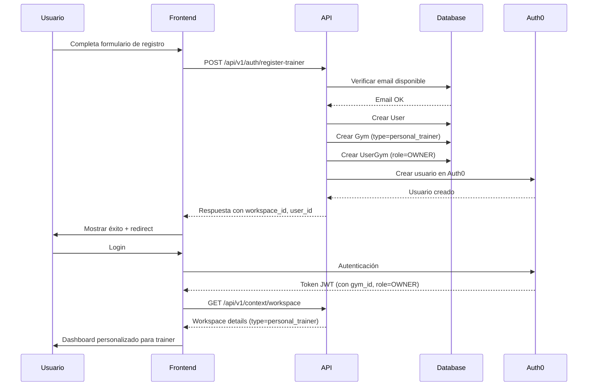

# Trainers vs Gyms: Guía Completa

## 📋 Tabla de Contenidos

1. [Introducción](#introducción)
2. [Conceptos Fundamentales](#conceptos-fundamentales)
3. [Diferencias Clave](#diferencias-clave)
4. [Creación de Trainers](#creación-de-trainers)
5. [Flujos de Usuario](#flujos-de-usuario)
6. [Terminología Dinámica](#terminología-dinámica)
7. [Features Condicionales](#features-condicionales)
8. [Consideraciones Técnicas](#consideraciones-técnicas)
9. [Casos de Uso](#casos-de-uso)

---

## Introducción

GymAPI soporta dos tipos de workspaces distintos, cada uno diseñado para diferentes modelos de negocio en la industria del fitness:

| Tipo | Descripción | Uso Principal |
|------|-------------|---------------|
| **Gym** | Gimnasio tradicional | Instalaciones físicas con múltiples entrenadores y servicios |
| **Personal Trainer** | Entrenador personal | Profesionales independientes que trabajan 1-a-1 con clientes |

---

## Conceptos Fundamentales

### 🏢 Gimnasio (Gym)

Un **gimnasio** representa una instalación física con:
- Múltiples entrenadores en el staff
- Clases grupales programadas
- Instalaciones compartidas (equipos, salas, etc.)
- Gestión de membresías
- Modelo B2C tradicional

**Ejemplo:** Un CrossFit box, un estudio de yoga, un gimnasio de cadena.

### 👤 Entrenador Personal (Personal Trainer)

Un **entrenador personal** representa a un profesional independiente con:
- Trabajo 1-a-1 con clientes
- Sesiones personalizadas
- Sin instalación física fija (puede trabajar en varios lugares)
- Gestión directa de su cartera de clientes
- Modelo freelance

**Ejemplo:** Un coach de fitness independiente, un nutricionista deportivo, un entrenador de running.

---

## Diferencias Clave

### 1. Estructura Organizacional

#### Gimnasio
```
Gimnasio
├── Owner/Admin (gestión)
├── Trainers (staff)
│   ├── Trainer A
│   ├── Trainer B
│   └── Trainer C
└── Members (clientes)
    ├── 100+ miembros
    └── Asignados a diferentes trainers
```

#### Personal Trainer
```
Entrenador Personal
├── Owner (el trainer es dueño)
└── Clients (clientes directos)
    ├── Cliente 1
    ├── Cliente 2
    └── ... (hasta max_clients)
```

### 2. Modelo de Base de Datos

#### Campo `type` en tabla `gyms`

```sql
-- Gimnasio tradicional
INSERT INTO gyms (name, subdomain, type)
VALUES ('CrossFit Downtown', 'crossfit-downtown', 'gym');

-- Entrenador personal
INSERT INTO gyms (name, subdomain, type)
VALUES ('Entrenamiento Personal - Juan Pérez', 'juan-perez-training', 'personal_trainer');
```

#### Campos Exclusivos de Trainers

| Campo | Tipo | Descripción |
|-------|------|-------------|
| `trainer_specialties` | JSON | Lista de especialidades: `["CrossFit", "Nutrición"]` |
| `trainer_certifications` | JSON | Certificaciones: `[{"name": "NASM-CPT", "year": 2020}]` |
| `max_clients` | INTEGER | Límite de clientes activos (ej: 30) |

### 3. Terminología Adaptativa

El sistema adapta la terminología según el tipo de workspace:

| Concepto | Gimnasio | Trainer |
|----------|----------|---------|
| Usuarios | **Miembros** (Members) | **Clientes** (Clients) |
| Lugar | **Gimnasio** | **Espacio de Trabajo** (Workspace) |
| Relación | Membresía | Relación Entrenador-Cliente |
| Onboarding | Inscripción | Contratación de Servicios |

**Ejemplo en UI:**

```typescript
// Gimnasio
"Agregar nuevo miembro"
"Lista de miembros activos"
"Membresía vencida"

// Trainer
"Agregar nuevo cliente"
"Lista de clientes activos"
"Contrato vencido"
```

### 4. Features Condicionales

Ciertas funcionalidades están disponibles solo para gimnasios:

| Feature | Gym | Trainer | Razón |
|---------|-----|---------|-------|
| Clases Grupales | ✅ | ❌ | Trainers trabajan 1-a-1 |
| Horarios de Instalaciones | ✅ | ❌ | No tienen instalación fija |
| Gestión de Staff | ✅ | ❌ | Solo 1 persona (el trainer) |
| Eventos Masivos | ✅ | ⚠️ Limitado | Pueden hacer eventos pequeños |
| Planes Nutricionales | ✅ | ✅ | Ambos pueden ofrecer |
| Seguimiento Individual | ✅ | ✅ | Ambos lo necesitan |

---

## Creación de Trainers

### Flujo de Registro Completo



### Endpoint de Registro

**Request:**
```http
POST /api/v1/auth/register-trainer
Content-Type: application/json

{
  "email": "juan.perez@email.com",
  "firstName": "Juan",
  "lastName": "Pérez",
  "phone": "+525512345678",
  "password": "SecurePass123!",
  "specialties": ["CrossFit", "Nutrición Deportiva", "Entrenamiento Funcional"],
  "bio": "Coach certificado con 10 años de experiencia...",
  "maxClients": 30,
  "certifications": [
    {
      "name": "NASM-CPT",
      "year": 2020,
      "institution": "National Academy of Sports Medicine"
    }
  ],
  "timezone": "America/Mexico_City"
}
```

**Response:**
```json
{
  "success": true,
  "message": "Trainer registrado exitosamente",
  "data": {
    "user_id": 123,
    "workspace_id": 456,
    "subdomain": "juan-perez-training",
    "email": "juan.perez@email.com",
    "workspace_type": "personal_trainer",
    "workspace_url": "https://juan-perez-training.gymapi.com",
    "auth0_user_id": "auth0|507f1f77bcf86cd799439011",
    "next_steps": {
      "verify_email": true,
      "complete_profile": false,
      "setup_payment": true
    }
  }
}
```

### Métodos de Creación

#### 1. Registro Público (Recomendado)

Usuario se auto-registra a través del endpoint público:

```bash
curl -X POST https://api.gymapi.com/api/v1/auth/register-trainer \
  -H "Content-Type: application/json" \
  -d '{
    "email": "trainer@example.com",
    "firstName": "María",
    "lastName": "García",
    "password": "SecurePass123!",
    "specialties": ["Yoga", "Pilates"]
  }'
```

**Ventajas:**
- ✅ No requiere autenticación previa
- ✅ Validación en tiempo real (email, subdomain)
- ✅ Creación atómica (user + workspace + Auth0)
- ✅ Experiencia de usuario fluida

#### 2. Script CLI (Para Testing/Admin)

Administradores pueden crear trainers vía script:

```bash
python scripts/setup_trainer.py \
  --email trainer@example.com \
  --first-name María \
  --last-name García \
  --specialties "Yoga,Pilates,Meditación" \
  --max-clients 25 \
  --timezone "America/Mexico_City"
```

**Ventajas:**
- ✅ Útil para desarrollo/testing
- ✅ Creación batch de múltiples trainers
- ✅ No requiere frontend

#### 3. Migración de Datos Existentes

Convertir un gym existente a trainer workspace:

```python
from app.models.gym import Gym, GymType
from app.db.session import SessionLocal

db = SessionLocal()

# Encontrar gimnasio
gym = db.query(Gym).filter(Gym.id == 123).first()

# Convertir a personal_trainer
gym.type = GymType.personal_trainer
gym.trainer_specialties = ["Fuerza", "Hipertrofia"]
gym.max_clients = 30

db.commit()
```

---

## Flujos de Usuario

### Flujo 1: Trainer se Registra

```
1. Trainer visita página de registro
   └─> https://app.gymapi.com/register/trainer

2. Completa formulario con:
   ├─ Datos personales (nombre, email, teléfono)
   ├─ Especialidades (mínimo 1)
   ├─ Biografía (opcional)
   ├─ Certificaciones (opcional)
   └─ Máximo de clientes (default: 30)

3. Sistema valida en tiempo real:
   ├─ Email disponible
   ├─ Formato de teléfono correcto
   └─ Especialidades no vacías

4. Al enviar:
   ├─ Crea usuario en Auth0
   ├─ Crea workspace tipo personal_trainer
   ├─ Asigna rol OWNER al trainer
   └─ Envía email de verificación

5. Trainer verifica email y accede a dashboard personalizado
```

### Flujo 2: Cliente se Registra con un Trainer

```
1. Trainer comparte link único:
   └─> https://juan-perez-training.gymapi.com/join

2. Cliente completa registro básico:
   ├─ Nombre
   ├─ Email
   ├─ Teléfono
   └─ Objetivos de entrenamiento

3. Sistema:
   ├─ Verifica que trainer no haya alcanzado max_clients
   ├─ Crea usuario
   ├─ Asocia al workspace del trainer con rol MEMBER
   └─ Crea relación en trainer_members (ACTIVE)

4. Trainer recibe notificación de nuevo cliente

5. Cliente accede a su área personalizada:
   ├─ Plan de entrenamiento
   ├─ Chat con trainer
   ├─ Seguimiento de progreso
   └─ Plan nutricional
```

### Flujo 3: Trainer Gestiona Clientes

```
1. Dashboard del trainer muestra:
   ├─ Total de clientes activos (ej: 23/30)
   ├─ Lista de clientes con filtros
   ├─ Próximas sesiones
   └─ Mensajes pendientes

2. Trainer puede:
   ├─ Ver detalle de cada cliente:
   │  ├─ Perfil completo
   │  ├─ Métricas de progreso
   │  ├─ Historial de sesiones
   │  └─ Notas personales
   │
   ├─ Crear planes de entrenamiento:
   │  ├─ Asignar rutinas
   │  ├─ Programar sesiones
   │  └─ Seguimiento de compliance
   │
   ├─ Comunicarse:
   │  ├─ Chat individual
   │  ├─ Enviar notificaciones
   │  └─ Compartir contenido
   │
   └─ Gestionar relación:
      ├─ Pausar servicio (PAUSED)
      ├─ Finalizar contrato (TERMINATED)
      └─ Reactivar cliente (ACTIVE)
```

---

## Terminología Dinámica

### Sistema de Adaptación Automática

El sistema detecta el tipo de workspace y adapta toda la UI automáticamente.

#### Backend (API Responses)

```python
# app/api/v1/endpoints/context.py
@router.get("/workspace")
async def get_workspace_context(gym: Gym = Depends(get_current_gym)):
    return {
        "workspace_id": gym.id,
        "type": gym.type.value,  # 'gym' o 'personal_trainer'
        "terminology": {
            "user_singular": "cliente" if gym.is_personal_trainer else "miembro",
            "user_plural": "clientes" if gym.is_personal_trainer else "miembros",
            "workspace": "espacio" if gym.is_personal_trainer else "gimnasio",
            "relationship": "contrato" if gym.is_personal_trainer else "membresía"
        },
        "features": {
            "classes": not gym.is_personal_trainer,
            "staff_management": not gym.is_personal_trainer,
            "facility_hours": not gym.is_personal_trainer,
            "individual_tracking": True,
            "nutrition_plans": True,
            "chat": True
        }
    }
```

#### Frontend (React Hook)

```typescript
// examples/hooks/useTerminology.ts
export function useTerminology() {
  const { workspace } = useWorkspace();

  const isTrainer = workspace?.type === 'personal_trainer';

  return {
    // Usuarios
    userSingular: isTrainer ? 'cliente' : 'miembro',
    userPlural: isTrainer ? 'clientes' : 'miembros',
    addUser: isTrainer ? 'Agregar cliente' : 'Agregar miembro',
    userList: isTrainer ? 'Lista de clientes' : 'Lista de miembros',

    // Workspace
    workspace: isTrainer ? 'espacio de trabajo' : 'gimnasio',
    workspaceName: workspace?.display_name || workspace?.name,

    // Relaciones
    relationship: isTrainer ? 'contrato' : 'membresía',
    activeRelationship: isTrainer ? 'contrato activo' : 'membresía activa',
    expiredRelationship: isTrainer ? 'contrato vencido' : 'membresía vencida',

    // Acciones
    invite: isTrainer ? 'Invitar cliente' : 'Invitar miembro',
    remove: isTrainer ? 'Dar de baja cliente' : 'Dar de baja miembro',

    // Estado
    isTrainer,
    isGym: !isTrainer
  };
}
```

#### Uso en Componentes

```tsx
// UserList.tsx
function UserList() {
  const { userPlural, addUser, userList } = useTerminology();

  return (
    <div>
      <h1>{userList}</h1>
      <button>{addUser}</button>
      <p>Total de {userPlural}: {count}</p>
    </div>
  );
}

// Renderiza automáticamente:
// Para gym: "Lista de miembros", "Agregar miembro", "Total de miembros: 150"
// Para trainer: "Lista de clientes", "Agregar cliente", "Total de clientes: 23"
```

---

## Features Condicionales

### Guard de Features

Componente que oculta/muestra funcionalidad según el tipo:

```tsx
// examples/components/FeatureGuard.tsx
import { useFeatures } from '../hooks/useFeatures';

interface FeatureGuardProps {
  feature: 'classes' | 'staff' | 'facility_hours';
  children: React.ReactNode;
  fallback?: React.ReactNode;
}

export function FeatureGuard({ feature, children, fallback }: FeatureGuardProps) {
  const { isEnabled } = useFeatures();

  if (!isEnabled(feature)) {
    return fallback || null;
  }

  return <>{children}</>;
}

// Uso:
<FeatureGuard feature="classes">
  <ClassScheduleComponent />
</FeatureGuard>
// Solo se renderiza para gimnasios, no para trainers
```

### Hook de Features

```typescript
// examples/hooks/useFeatures.ts
export function useFeatures() {
  const { workspace } = useWorkspace();

  const features = {
    classes: workspace?.type === 'gym',
    staff_management: workspace?.type === 'gym',
    facility_hours: workspace?.type === 'gym',
    individual_tracking: true,
    nutrition_plans: true,
    chat: true,
    events: true,
    // Trainers pueden hacer eventos pero más limitados
    mass_events: workspace?.type === 'gym'
  };

  return {
    features,
    isEnabled: (feature: keyof typeof features) => features[feature],
    isGymOnly: (feature: keyof typeof features) =>
      feature === 'classes' ||
      feature === 'staff_management' ||
      feature === 'facility_hours'
  };
}
```

### Navegación Adaptativa

```tsx
// Navigation.tsx
function Navigation() {
  const { features } = useFeatures();
  const { userPlural, workspace } = useTerminology();

  return (
    <nav>
      <NavLink to="/dashboard">Dashboard</NavLink>
      <NavLink to="/users">{userPlural}</NavLink>

      {features.classes && (
        <NavLink to="/classes">Clases</NavLink>
      )}

      {features.staff_management && (
        <NavLink to="/staff">Staff</NavLink>
      )}

      <NavLink to="/nutrition">Nutrición</NavLink>
      <NavLink to="/chat">Chat</NavLink>

      {features.events && (
        <NavLink to="/events">Eventos</NavLink>
      )}
    </nav>
  );
}
```

---

## Consideraciones Técnicas

### 1. Base de Datos

#### Modelo de Datos

```sql
-- Tabla gyms con soporte multi-tipo
CREATE TABLE gyms (
    id SERIAL PRIMARY KEY,
    name VARCHAR(255) NOT NULL,
    subdomain VARCHAR(100) UNIQUE NOT NULL,
    type gym_type_enum NOT NULL DEFAULT 'gym',

    -- Campos específicos de trainers (nullable)
    trainer_specialties JSON,
    trainer_certifications JSON,
    max_clients INTEGER,

    -- Campos comunes
    email VARCHAR(100),
    phone VARCHAR(20),
    timezone VARCHAR(50) DEFAULT 'UTC',
    is_active BOOLEAN DEFAULT true,
    created_at TIMESTAMP DEFAULT NOW(),
    updated_at TIMESTAMP DEFAULT NOW()
);

-- Índices
CREATE INDEX idx_gyms_type ON gyms(type);
CREATE INDEX idx_gyms_type_active ON gyms(type, is_active);
```

#### Validaciones

```python
# app/models/gym.py
class Gym(Base):
    __tablename__ = "gyms"

    type = Column(
        SQLEnum(GymType, name="gym_type_enum"),
        nullable=False,
        default=GymType.gym,
        index=True
    )

    @property
    def is_personal_trainer(self) -> bool:
        return self.type == GymType.personal_trainer

    @property
    def is_traditional_gym(self) -> bool:
        return self.type == GymType.gym

    def validate_trainer_fields(self):
        """Valida que trainers tengan campos requeridos"""
        if self.is_personal_trainer:
            if not self.trainer_specialties:
                raise ValueError("Trainers deben tener al menos una especialidad")
            if not self.max_clients or self.max_clients < 1:
                raise ValueError("max_clients debe ser mayor a 0")
```

### 2. Autenticación y Permisos

#### JWT Claims

```json
{
  "sub": "auth0|507f1f77bcf86cd799439011",
  "email": "juan.perez@email.com",
  "gym_id": 456,
  "workspace_type": "personal_trainer",
  "role": "OWNER",
  "permissions": [
    "resource:read",
    "resource:write",
    "tenant:read",
    "user:read",
    "user:write"
  ]
}
```

#### Middleware Multi-tenant

```python
# app/middleware/tenant_auth.py
class TenantAuthMiddleware:
    async def dispatch(self, request: Request, call_next):
        # Extrae gym_id del token JWT
        gym_id = extract_gym_id_from_token(request)

        # Obtiene información del workspace
        gym = await get_gym_by_id(gym_id)

        # Añade contexto al request
        request.state.gym = gym
        request.state.gym_type = gym.type.value
        request.state.is_trainer = gym.is_personal_trainer

        return await call_next(request)
```

### 3. Cache y Performance

#### Estrategia de Cache

```python
# app/services/cache_service.py
class CacheService:
    async def get_workspace_context(self, gym_id: int):
        cache_key = f"gym:{gym_id}:context"

        # Try cache first
        cached = await self.redis.get(cache_key)
        if cached:
            return json.loads(cached)

        # Fetch from DB
        gym = await self.gym_repository.get(gym_id)
        context = {
            "type": gym.type.value,
            "features": self._get_features(gym),
            "terminology": self._get_terminology(gym)
        }

        # Cache por 1 hora
        await self.redis.setex(cache_key, 3600, json.dumps(context))

        return context
```

### 4. Validación de Límites

#### Verificar Capacidad de Trainer

```python
# app/services/trainer_member_service.py
class TrainerMemberService:
    async def add_client(self, trainer_gym_id: int, user_id: int):
        # Obtener workspace del trainer
        gym = await self.gym_repo.get(trainer_gym_id)

        if not gym.is_personal_trainer:
            raise ValueError("Este workspace no es de un trainer")

        # Verificar límite de clientes
        active_clients = await self.count_active_clients(trainer_gym_id)

        if active_clients >= gym.max_clients:
            raise ValueError(
                f"Límite de clientes alcanzado ({gym.max_clients})"
            )

        # Crear relación
        return await self.create_relationship(
            trainer_gym_id=trainer_gym_id,
            client_id=user_id,
            status=RelationshipStatus.ACTIVE
        )
```

---

## Casos de Uso

### Caso 1: Coach de CrossFit Independiente

**Perfil:**
- María, coach certificada de CrossFit
- Trabaja con 25 clientes
- Sesiones en diferentes boxes de la ciudad
- Necesita gestionar planes y seguimiento

**Configuración:**
```json
{
  "name": "Entrenamiento Personal - María López",
  "type": "personal_trainer",
  "subdomain": "maria-lopez-training",
  "trainer_specialties": ["CrossFit", "Movilidad", "Técnica Olímpica"],
  "max_clients": 30,
  "trainer_certifications": [
    {
      "name": "CrossFit Level 2",
      "year": 2021,
      "institution": "CrossFit Inc"
    }
  ]
}
```

**Features que usa:**
- ✅ Gestión individual de clientes
- ✅ Planes de entrenamiento personalizados
- ✅ Chat directo con clientes
- ✅ Seguimiento de progreso
- ✅ Planes nutricionales
- ❌ No necesita clases grupales
- ❌ No tiene instalación propia

### Caso 2: Gimnasio Boutique

**Perfil:**
- "FitStudio", gimnasio de 300m²
- 5 entrenadores en staff
- 150 miembros activos
- Clases grupales + entrenamiento personal

**Configuración:**
```json
{
  "name": "FitStudio Downtown",
  "type": "gym",
  "subdomain": "fitstudio-downtown"
}
```

**Features que usa:**
- ✅ Gestión de staff (5 trainers)
- ✅ Clases grupales programadas
- ✅ Horarios de instalación
- ✅ Gestión de membresías
- ✅ Múltiples trainers asignados a miembros
- ✅ Eventos masivos (talleres, competencias)

### Caso 3: Nutricionista Deportiva

**Perfil:**
- Laura, nutricionista certificada
- 40 clientes con seguimiento nutricional
- Consultas presenciales y online
- No da entrenamiento físico

**Configuración:**
```json
{
  "name": "Entrenamiento Personal - Laura Martínez",
  "type": "personal_trainer",
  "subdomain": "laura-martinez-nutrition",
  "trainer_specialties": ["Nutrición Deportiva", "Composición Corporal"],
  "max_clients": 50,
  "trainer_certifications": [
    {
      "name": "Licenciada en Nutrición",
      "year": 2018,
      "institution": "UNAM"
    }
  ]
}
```

**Features que usa:**
- ✅ Planes nutricionales personalizados
- ✅ Seguimiento de métricas corporales
- ✅ Chat con clientes
- ✅ Seguimiento de compliance
- ❌ No usa planes de entrenamiento
- ❌ No necesita gestión de clases

---

## Preguntas Frecuentes (FAQ)

### ¿Puede un trainer convertirse en gimnasio más adelante?

**Sí**, es posible migrar el tipo de workspace:

```python
# Conversión de trainer a gym
gym = db.query(Gym).filter(Gym.id == trainer_workspace_id).first()
gym.type = GymType.gym
gym.trainer_specialties = None  # Limpiar campos específicos de trainer
gym.trainer_certifications = None
gym.max_clients = None
db.commit()
```

**Consideraciones:**
- Los clientes existentes se convierten en miembros
- Se habilitan features de gimnasio (clases, staff, etc.)
- La terminología cambia automáticamente
- El subdomain permanece igual

### ¿Un gimnasio puede tener entrenadores personales en su staff?

**Sí**, el modelo soporta ambos casos:

1. **Gym con trainers en staff**:
   - El gym es tipo `gym`
   - Los trainers son `TRAINER` role en `user_gyms`
   - Cada trainer puede tener clientes asignados vía `trainer_members`

2. **Trainer independiente**:
   - El workspace es tipo `personal_trainer`
   - El trainer es `OWNER` role
   - Solo él gestiona sus clientes

### ¿Cuál es el límite recomendado de clientes para un trainer?

Depende del tipo de servicio:

| Tipo de Servicio | Clientes Recomendados | Razón |
|-----------------|----------------------|-------|
| Entrenamiento 1-a-1 presencial | 20-30 | Alta dedicación por sesión |
| Coaching online | 30-50 | Menor tiempo presencial |
| Nutrición deportiva | 40-60 | Seguimiento menos frecuente |
| Programación remota | 50-100 | Mínima interacción síncrona |

El sistema permite configurar `max_clients` según necesidad.

### ¿Cómo se manejan los subdominios?

**Gimnasios:**
```
nombre-gimnasio.gymapi.com
crossfit-downtown.gymapi.com
fitstudio-polanco.gymapi.com
```

**Trainers:**
```
nombre-apellido-training.gymapi.com
juan-perez-training.gymapi.com
maria-lopez-fitness.gymapi.com
```

El sistema genera automáticamente un subdomain único basado en el nombre, y maneja colisiones agregando sufijos numéricos.

### ¿Se pueden compartir clientes entre trainers?

**Sí**, pero de formas diferentes:

1. **Dentro de un gym** (tipo `gym`):
   - Varios trainers pueden ver al mismo miembro
   - Útil para gimnasios con equipos multidisciplinarios
   - Controlado por permisos

2. **Entre trainers independientes** (tipo `personal_trainer`):
   - No por defecto (cada workspace es independiente)
   - Posible con integración futura de "network de trainers"

---

## Mejores Prácticas

### Para Trainers

1. **Limita tus clientes**: No sobrepases tu capacidad de dar servicio de calidad
2. **Actualiza tu perfil**: Mantén especialidades y certificaciones al día
3. **Usa la terminología correcta**: El sistema adapta automáticamente
4. **Aprovecha el chat**: Comunicación directa mejora retención
5. **Trackea progreso**: Usa métricas para demostrar resultados

### Para Gimnasios

1. **Organiza tu staff**: Asigna roles claros (OWNER, ADMIN, TRAINER)
2. **Programa clases regularmente**: Mantén calendario actualizado
3. **Gestiona horarios**: Define horarios de instalación claros
4. **Aprovecha eventos**: Talleres y competencias generan comunidad
5. **Segmenta miembros**: Usa tags y categorías para personalizar

### Para Developers

1. **Siempre verifica el tipo**: `if gym.is_personal_trainer: ...`
2. **Usa el contexto de workspace**: No hardcodear terminología
3. **Cache inteligente**: Workspace context cambia poco, cachear agresivamente
4. **Valida límites**: Trainers tienen `max_clients`, respetarlo
5. **Testing multi-tipo**: Tests deben cubrir ambos tipos de workspace

---

## Recursos Adicionales

- [API Documentation](./TRAINER_API_DOCUMENTATION.md) - Referencia completa de endpoints
- [Integration Guide](./TRAINER_INTEGRATION_GUIDE.md) - Guía de integración frontend
- [Examples](/examples) - Código reutilizable para frontend
- [Scripts](/scripts) - Scripts de utilidad para gestión

---

**Última actualización:** Octubre 2025
**Versión:** 1.0.0
**Autor:** GymAPI Team
