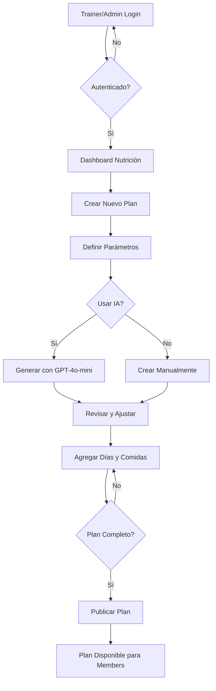
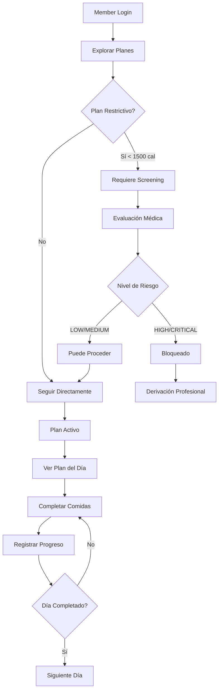
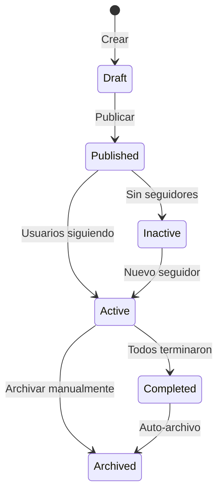
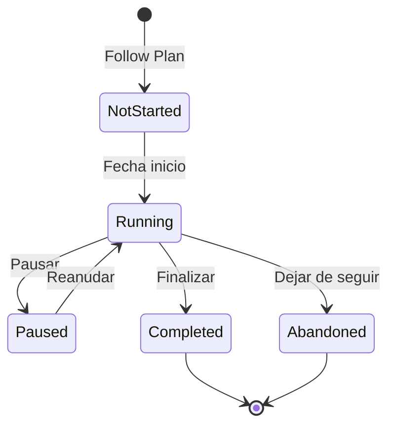
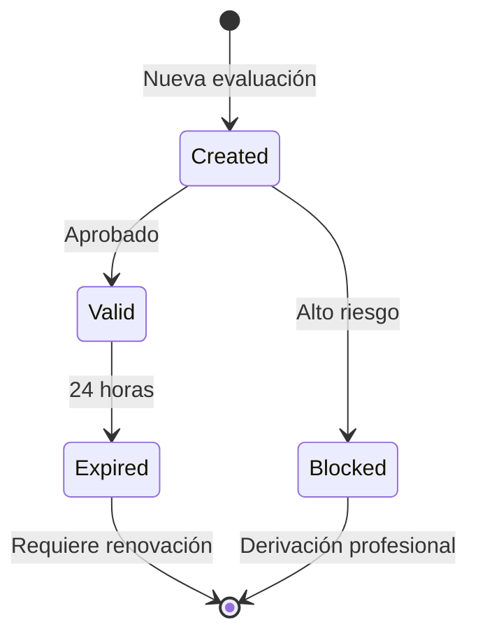

# 🔄 Flujo General del Sistema de Nutrición

## 📋 Índice
1. [Visión General](#visión-general)
2. [Actores del Sistema](#actores-del-sistema)
3. [Flujo de Creación (Trainers/Admin)](#flujo-de-creación-trainersadmin)
4. [Flujo de Consumo (Members)](#flujo-de-consumo-members)
5. [Diagrama de Arquitectura](#diagrama-de-arquitectura)
6. [Estados y Transiciones](#estados-y-transiciones)

## Visión General

El sistema de nutrición opera bajo un modelo **B2B2C** donde los gimnasios, a través de sus trainers y administradores, crean contenido nutricional que los miembros consumen de forma segura y controlada.

### Principios Fundamentales

1. **Separación de responsabilidades**: Creadores vs Consumidores
2. **Protección médica**: Evaluación obligatoria para contenido restrictivo
3. **Flexibilidad profesional**: Trainers tienen libertad creativa
4. **Trazabilidad completa**: Audit logs de todas las acciones críticas

## Actores del Sistema

### 🏋️ Gimnasio (Business)
- Propietario del contenido
- Define políticas y configuraciones
- Gestiona suscripciones y módulos

### 👨‍⚕️ Trainer/Admin (Business)
**Permisos:**
- ✅ Crear planes nutricionales
- ✅ Usar IA para generar contenido
- ✅ Modificar y gestionar planes
- ✅ Ver métricas y analytics
- ❌ NO requiere screening médico para crear

**Responsabilidades:**
- Diseñar planes nutricionales profesionales
- Adaptar contenido a objetivos específicos
- Monitorear adherencia y resultados

### 👤 Member (Consumer)
**Permisos:**
- ✅ Explorar planes públicos
- ✅ Seguir planes (con restricciones médicas)
- ✅ Registrar progreso
- ✅ Ver su historial
- ❌ NO puede crear planes
- ❌ NO puede usar IA

**Protecciones:**
- Screening médico obligatorio para planes restrictivos
- Bloqueo automático si alto riesgo
- Derivación a profesionales cuando necesario

## Flujo de Creación (Trainers/Admin)



### Paso a Paso: Creación de Plan

#### 1. **Iniciar Sesión**
```http
POST /api/v1/auth/login
{
  "email": "trainer@gym.com",
  "password": "secure_password"
}
```

#### 2. **Crear Plan Base**
```http
POST /api/v1/nutrition/plans
{
  "title": "Plan Definición Muscular",
  "description": "Plan de 30 días para definición",
  "duration_days": 30,
  "daily_calories": 1800,
  "nutrition_goal": "muscle_gain",
  "difficulty_level": "intermediate",
  "plan_type": "template"
}
```

#### 3. **Agregar Días al Plan**
```http
POST /api/v1/nutrition/plans/{plan_id}/days
{
  "day_number": 1,
  "date": null,  // null para templates
  "is_fasting_day": false
}
```

#### 4. **Crear Comidas para Cada Día**
```http
POST /api/v1/nutrition/days/{day_id}/meals
{
  "meal_type": "breakfast",
  "name": "Desayuno Proteico",
  "description": "Alto en proteínas y fibra",
  "preparation_time": 15,
  "calories": 450
}
```

#### 5. **Generar Ingredientes con IA (Opcional)**
```http
POST /api/v1/nutrition/meals/{meal_id}/ingredients/ai-generate
{
  "recipe_name": "Desayuno Proteico",
  "target_calories": 450,
  "meal_type": "breakfast",
  "dietary_restrictions": ["gluten_free"],
  "cuisine_type": "mediterranean"
}
```

#### 6. **Aplicar Ingredientes Generados**
```http
POST /api/v1/nutrition/meals/{meal_id}/ingredients/ai-apply
{
  "ingredients": [...],  // Resultado de ai-generate
  "replace_existing": false
}
```

#### 7. **Publicar Plan**
```http
PUT /api/v1/nutrition/plans/{plan_id}
{
  "is_public": true,
  "status": "published"
}
```

## Flujo de Consumo (Members)



### Paso a Paso: Consumo de Plan

#### 1. **Explorar Planes Disponibles**
```http
GET /api/v1/nutrition/plans/categorized
```

Respuesta:
```json
{
  "live_plans": [...],     // Planes grupales activos
  "template_plans": [...],  // Planes individuales
  "archived_plans": [...],  // Históricos exitosos
  "my_active_plans": [...]  // Mis planes actuales
}
```

#### 2. **Verificar si Requiere Screening**
Si el plan tiene < 1500 calorías o es de pérdida de peso:

```http
POST /api/v1/nutrition/safety-check
{
  "age": 28,
  "is_pregnant": false,
  "is_breastfeeding": false,
  "has_diabetes": false,
  "has_heart_condition": false,
  "has_kidney_disease": false,
  "has_liver_disease": false,
  "has_eating_disorder": false,
  "accepts_disclaimer": true
}
```

Respuesta:
```json
{
  "screening_id": 123,
  "risk_score": 2,
  "risk_level": "LOW",
  "can_proceed": true,
  "expires_in_hours": 24,
  "warnings": []
}
```

#### 3. **Seguir el Plan**
```http
POST /api/v1/nutrition/plans/{plan_id}/follow
```

#### 4. **Ver Plan del Día Actual**
```http
GET /api/v1/nutrition/my-plans/today
```

#### 5. **Completar Comidas**
```http
POST /api/v1/nutrition/meals/{meal_id}/complete
{
  "satisfaction_rating": 5,
  "notes": "Delicioso y fácil de preparar",
  "photo_url": "https://..."
}
```

#### 6. **Ver Progreso**
```http
GET /api/v1/nutrition/my-progress?plan_id={plan_id}
```

## Diagrama de Arquitectura

```
┌─────────────────────────────────────────────────────────────┐
│                         Frontend                            │
│                    (Web/Mobile Apps)                        │
└─────────────────────┬───────────────────────────────────────┘
                      │ HTTPS
                      ▼
┌─────────────────────────────────────────────────────────────┐
│                    API Gateway                              │
│                  (FastAPI + Auth0)                          │
├─────────────────────────────────────────────────────────────┤
│                 Middleware Pipeline                         │
│  • TenantAuthMiddleware (Multi-tenant)                     │
│  • RateLimitMiddleware                                     │
│  • SecurityHeadersMiddleware                               │
└─────────────────────┬───────────────────────────────────────┘
                      │
        ┌─────────────┴─────────────┬──────────────────┐
        ▼                           ▼                  ▼
┌───────────────┐         ┌────────────────┐  ┌──────────────┐
│   Endpoints   │         │   Services     │  │ Repositories │
│               │         │                │  │              │
│ • Plans       │────────▶│ • PlanService  │──▶│ • PlanRepo   │
│ • Meals       │         │ • MealService  │  │ • MealRepo   │
│ • Safety      │         │ • SafetyService│  │ • FollowerRepo│
│ • Progress    │         │ • AIService    │  │ • ProgressRepo│
└───────────────┘         └────────────────┘  └──────┬───────┘
                                                      │
                          ┌───────────────────────────┴───────┐
                          ▼                                   ▼
                  ┌──────────────┐                    ┌──────────────┐
                  │  PostgreSQL  │                    │    Redis     │
                  │              │                    │              │
                  │ • Plans      │                    │ • Cache      │
                  │ • Meals      │                    │ • Sessions   │
                  │ • Progress   │                    │ • Temp Data  │
                  │ • Screenings │                    └──────────────┘
                  │ • Audit Logs │
                  └──────────────┘
                          │
                          ▼
                  ┌──────────────┐
                  │   External   │
                  │   Services   │
                  │              │
                  │ • OpenAI     │
                  │ • Stream Chat│
                  │ • OneSignal  │
                  └──────────────┘
```

## Estados y Transiciones

### Estados de un Plan



### Estados de un Follower (Seguidor)



### Estados de Safety Screening



## Flujos Especiales

### Live Plans (Planes Grupales)

1. **Creación**: Trainer define fecha de inicio global
2. **Inscripción**: Members se unen antes de iniciar
3. **Sincronización**: Todos avanzan al mismo ritmo
4. **Finalización**: Se archiva automáticamente al terminar

### Archived Plans (Planes Históricos)

1. **Origen**: Live plans completados exitosamente
2. **Conversión**: Se transforman a template
3. **Reutilización**: Members pueden usarlos individualmente
4. **Métricas**: Mantienen estadísticas del live original

### Sistema de Notificaciones

```http
PUT /api/v1/nutrition/notifications/settings
{
  "breakfast_time": "08:00",
  "lunch_time": "13:00",
  "dinner_time": "20:00",
  "enabled": true
}
```

## Consideraciones de Performance

### Cache Strategy

- **Plans**: Cache 5 minutos (cambian poco)
- **Daily Plans**: Cache 2 minutos (progreso activo)
- **User Progress**: Cache 30 segundos (tiempo real)
- **Safety Screenings**: Cache 1 hora (validez 24h)

### Rate Limiting

- **General**: 60 requests/min
- **AI Generation**: 10 requests/min
- **Safety Screening**: 5 requests/min

### Optimizaciones

1. **Eager Loading**: Usar `joinedload` para relaciones
2. **Batch Operations**: Procesar múltiples días/comidas juntos
3. **Async Operations**: AI generation, notifications
4. **Redis Cache**: Reducir hits a PostgreSQL

## Seguridad y Compliance

### Multi-tenancy

- Cada gimnasio es completamente aislado
- Validación automática de `gym_id` en todos los endpoints
- Cache segmentado por prefijos `gym:{gym_id}:`

### Audit Trail

Todas las acciones críticas se registran:
- Creación de planes con IA
- Evaluaciones de seguridad
- Bloqueos por condiciones médicas
- Seguimiento de planes restrictivos

### GDPR Compliance

- Derecho al olvido implementado
- Exportación de datos disponible
- Consentimientos explícitos
- Datos médicos encriptados

---

*Siguiente: [API Reference Completa →](./02_API_REFERENCE.md)*