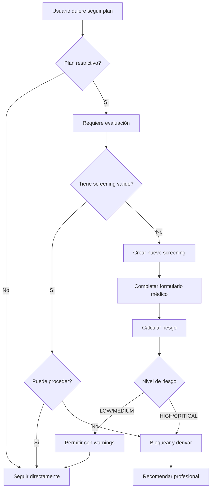
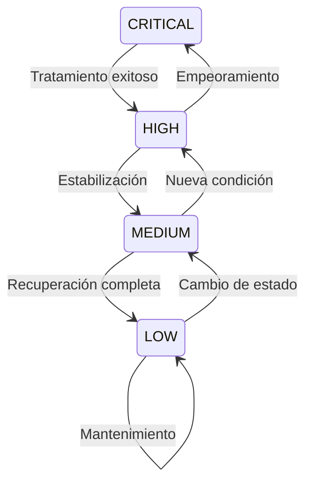

# 🏥 Sistema de Seguridad Médica

## 📋 Índice
1. [Introducción](#introducción)
2. [¿Cuándo se Requiere?](#cuándo-se-requiere)
3. [Proceso de Evaluación](#proceso-de-evaluación)
4. [Niveles de Riesgo](#niveles-de-riesgo)
5. [Grupos de Alto Riesgo](#grupos-de-alto-riesgo)
6. [Validaciones y Restricciones](#validaciones-y-restricciones)
7. [Audit Logs](#audit-logs)
8. [Disclaimers Médicos](#disclaimers-médicos)
9. [Casos Especiales](#casos-especiales)

## Introducción

El sistema de seguridad médica protege a los usuarios de recomendaciones nutricionales potencialmente peligrosas, especialmente en planes restrictivos o para usuarios con condiciones médicas especiales.

### Objetivos Principales

1. **Proteger la salud** de usuarios vulnerables
2. **Cumplir con regulaciones** médicas y legales
3. **Derivar a profesionales** cuando es necesario
4. **Mantener trazabilidad** completa para auditorías

### Filosofía del Sistema

```
Libertad para Profesionales + Protección para Consumidores
```

- Los **trainers/admin** pueden crear cualquier contenido (son profesionales)
- Los **members** son evaluados antes de consumir contenido restrictivo

## ¿Cuándo se Requiere?

### Planes Restrictivos

Un plan se considera **restrictivo** y requiere evaluación si cumple alguna de estas condiciones:

| Condición | Valor | Ejemplo |
|-----------|-------|---------|
| Calorías diarias | < 1500 | Plan de 1200 cal/día |
| Título contiene | "pérdida", "weight loss", "detox", "adelgazar" | "Plan Pérdida Rápida" |
| Objetivo nutricional | weight_loss | nutrition_goal = "weight_loss" |
| Restricción extrema | Ayuno prolongado | is_fasting_day repetido |

### Decisión de Evaluación

```python
def requiere_evaluacion(plan):
    # Verificar calorías
    if plan.daily_calories < 1500:
        return True

    # Verificar título
    palabras_clave = ["pérdida", "weight loss", "detox", "adelgazar"]
    if any(palabra in plan.title.lower() for palabra in palabras_clave):
        return True

    # Verificar objetivo
    if plan.nutrition_goal == "weight_loss":
        return True

    return False
```

## Proceso de Evaluación

### Flujo de Evaluación



### Formulario de Evaluación

```json
POST /api/v1/nutrition/safety-check

{
  // Datos demográficos
  "age": 28,

  // Estados especiales
  "is_pregnant": false,
  "is_breastfeeding": false,

  // Condiciones médicas
  "has_diabetes": false,
  "has_heart_condition": false,
  "has_kidney_disease": false,
  "has_liver_disease": false,
  "has_eating_disorder": false,
  "has_other_condition": false,
  "other_condition_details": "",

  // Medicamentos
  "takes_medications": false,
  "medication_list": "",

  // Consentimientos
  "parental_consent_email": null,  // Requerido si < 18 años
  "accepts_disclaimer": true
}
```

### Cálculo de Risk Score

El sistema calcula un **risk score** de 0-10 basado en las respuestas:

| Condición | Puntos | Razón |
|-----------|--------|-------|
| Embarazo | +5 | Necesidades nutricionales especiales |
| Lactancia | +5 | Requerimientos calóricos aumentados |
| TCA (Trastorno Alimentario) | +8 | Alto riesgo de recaída |
| Diabetes | +3 | Control glucémico crítico |
| Enfermedad cardíaca | +3 | Restricciones de sodio/grasas |
| Enfermedad renal | +3 | Restricciones proteicas |
| Enfermedad hepática | +3 | Metabolismo comprometido |
| Menor de 18 | +3 | En desarrollo, requiere supervisión |
| Mayor de 65 | +2 | Necesidades especiales |
| Múltiples condiciones | +1 c/u | Riesgo compuesto |

## Niveles de Riesgo

### Clasificación

| Nivel | Score | Can Proceed | Descripción | Acción |
|-------|-------|-------------|-------------|--------|
| **LOW** 🟢 | 0-2 | ✅ Sí | Sin condiciones significativas | Proceder normalmente |
| **MEDIUM** 🟡 | 3-4 | ✅ Sí* | Condiciones menores | Proceder con precauciones |
| **HIGH** 🟠 | 5-7 | ⚠️ No recomendado | Condiciones serias | Fuerte recomendación profesional |
| **CRITICAL** 🔴 | 8+ | ❌ No | Condiciones críticas | Bloqueo obligatorio |

### Respuestas por Nivel

#### LOW Risk Response
```json
{
  "risk_level": "LOW",
  "can_proceed": true,
  "message": "Puedes seguir este plan de manera segura",
  "warnings": [
    {
      "type": "reminder",
      "message": "Mantén una hidratación adecuada",
      "severity": "info"
    }
  ]
}
```

#### MEDIUM Risk Response
```json
{
  "risk_level": "MEDIUM",
  "can_proceed": true,
  "message": "Puedes proceder con precauciones",
  "warnings": [
    {
      "type": "medical_condition",
      "message": "Tu condición requiere monitoreo regular",
      "severity": "warning"
    }
  ],
  "recommendations": [
    "Consulta con tu médico cada 2 semanas",
    "Monitorea tus niveles de glucosa"
  ]
}
```

#### HIGH Risk Response
```json
{
  "risk_level": "HIGH",
  "can_proceed": false,
  "requires_professional": true,
  "message": "Se recomienda fuertemente supervisión profesional",
  "warnings": [
    {
      "type": "high_risk",
      "message": "Múltiples condiciones médicas detectadas",
      "severity": "high"
    }
  ],
  "recommended_specialists": [
    "Nutricionista clínico",
    "Médico especialista"
  ]
}
```

#### CRITICAL Risk Response
```json
{
  "risk_level": "CRITICAL",
  "can_proceed": false,
  "requires_professional": true,
  "message": "Tu seguridad requiere supervisión médica obligatoria",
  "warnings": [
    {
      "type": "critical_condition",
      "message": "Historial de TCA detectado",
      "severity": "critical",
      "requires_action": true
    }
  ],
  "professional_referral_reasons": [
    "Alto riesgo de complicaciones médicas",
    "Requiere plan personalizado supervisado"
  ],
  "recommended_specialists": [
    "Psicólogo especializado en TCA",
    "Nutricionista clínico",
    "Médico psiquiatra"
  ]
}
```

## Grupos de Alto Riesgo

### 1. Embarazadas 🤰

**Restricciones:**
- ❌ NO planes de pérdida de peso
- ❌ NO restricción calórica severa
- ❌ NO ayunos prolongados

**Recomendaciones:**
- Mínimo 1800-2000 calorías/día
- Suplementación de ácido fólico
- Consulta con obstetra

**Especialistas recomendados:**
- Obstetra
- Nutricionista perinatal

### 2. Lactancia 🤱

**Restricciones:**
- ❌ NO menos de 1800 calorías
- ❌ NO dietas cetogénicas extremas
- ❌ NO detox agresivos

**Recomendaciones:**
- Extra 500 calorías/día
- Hidratación aumentada
- Nutrientes para producción de leche

### 3. Trastornos Alimentarios (TCA) 🧠

**Restricciones:**
- ❌ NO planes restrictivos sin supervisión
- ❌ NO conteo obsesivo de calorías
- ❌ NO metas de peso agresivas

**Protocolos especiales:**
```python
if user.has_eating_disorder_history:
    risk_score += 8  # Máxima prioridad
    can_proceed = False
    require_professional = True
    specialists = [
        "Psicólogo especializado en TCA",
        "Nutricionista con experiencia en TCA",
        "Psiquiatra si medicación"
    ]
```

### 4. Menores de Edad 👶

**Requisitos:**
- ✅ Consentimiento parental obligatorio
- ✅ Supervisión adulta recomendada
- ✅ Planes apropiados para desarrollo

**Proceso de consentimiento:**
```json
{
  "age": 16,
  "parental_consent_email": "padre@email.com",
  "parental_consent_token": "uuid-token",
  "parental_consent_verified": false
}
```

### 5. Diabetes Tipo 1 💉

**Consideraciones:**
- Control glucémico crítico
- Ajustes de insulina necesarios
- Monitoreo continuo

**Warnings automáticos:**
- "Monitorea tu glucosa antes y después de comidas"
- "Ajusta insulina según indicación médica"
- "Ten carbohidratos de acción rápida disponibles"

### 6. Condiciones Cardíacas ❤️

**Restricciones:**
- Límite de sodio
- Control de grasas saturadas
- Evitar estimulantes

### 7. Enfermedad Renal 🫘

**Restricciones:**
- Límite de proteínas
- Control de potasio y fósforo
- Restricción de líquidos si indicado

## Validaciones y Restricciones

### Matriz de Validación

| Condición | Pérdida Peso | Mantenimiento | Ganancia | Detox |
|-----------|--------------|---------------|----------|-------|
| Saludable | ✅ | ✅ | ✅ | ✅* |
| Embarazo | ❌ | ✅ | ✅ | ❌ |
| TCA | ❌ | ⚠️ | ⚠️ | ❌ |
| Diabetes | ⚠️ | ✅ | ✅ | ⚠️ |
| Menor 18 | ⚠️ | ✅ | ✅ | ❌ |
| IMC < 18.5 | ❌ | ✅ | ✅ | ❌ |

*Con evaluación médica

### Validación de IMC

```python
def validate_bmi_for_weight_loss(user):
    if user.height > 0:
        height_m = user.height / 100
        bmi = user.weight / (height_m ** 2)

        if bmi < 18.5:
            return False, "IMC bajo, no recomendado pérdida de peso"
        elif bmi > 35:
            return True, "Requiere supervisión médica"
        else:
            return True, "IMC normal para pérdida de peso"
```

### Expiración de Screenings

- **Validez**: 24 horas desde creación
- **Renovación**: Automática al expirar
- **Notificación**: 2 horas antes de expirar

```python
def is_screening_valid(screening):
    now = datetime.utcnow()
    expires_at = screening.created_at + timedelta(hours=24)

    if now > expires_at:
        return False, "Screening expirado"

    hours_remaining = (expires_at - now).total_seconds() / 3600

    if hours_remaining < 2:
        send_renewal_reminder(screening.user_id)

    return True, f"{hours_remaining:.1f} horas restantes"
```

## Audit Logs

### Eventos Registrados

Todos los eventos de seguridad se registran para cumplimiento legal:

| Evento | Datos Registrados | Retención |
|--------|------------------|-----------|
| Screening creado | Usuario, respuestas, risk score | 2 años |
| Plan bloqueado | Usuario, plan, razón | 2 años |
| Override médico | Profesional, justificación | 5 años |
| Consentimiento parental | Email, token, verificación | Hasta mayoría de edad |
| Derivación profesional | Usuario, condición, especialista | 2 años |

### Estructura de Audit Log

```json
{
  "id": 12345,
  "timestamp": "2024-12-29T14:00:00Z",
  "user_id": 456,
  "gym_id": 1,
  "action_type": "follow_plan_blocked",
  "action_details": {
    "plan_id": 123,
    "plan_title": "Plan Detox Extremo",
    "plan_calories": 800,
    "risk_level": "CRITICAL",
    "reason": "multiple_conditions"
  },
  "was_allowed": false,
  "denial_reason": "Alto riesgo médico detectado",
  "ip_address": "192.168.1.1",
  "user_agent": "Mozilla/5.0..."
}
```

### Queries de Auditoría

```sql
-- Usuarios bloqueados por condición médica
SELECT user_id, COUNT(*) as blocks
FROM nutrition_safety_audit_logs
WHERE action_type = 'follow_plan_blocked'
  AND created_at > NOW() - INTERVAL '30 days'
GROUP BY user_id
HAVING COUNT(*) > 3;

-- Planes más rechazados
SELECT
  action_details->>'plan_id' as plan_id,
  action_details->>'plan_title' as plan_title,
  COUNT(*) as rejections
FROM nutrition_safety_audit_logs
WHERE was_allowed = false
GROUP BY 1, 2
ORDER BY rejections DESC;

-- Condiciones más comunes
SELECT
  action_details->>'risk_level' as risk_level,
  COUNT(*) as count
FROM nutrition_safety_audit_logs
WHERE screening_id IS NOT NULL
GROUP BY 1;
```

## Disclaimers Médicos

### Por Nivel de Riesgo

#### Disclaimer LOW Risk
```
Este plan nutricional es de carácter informativo. Consulta con un
profesional de la salud si experimentas cualquier malestar.
```

#### Disclaimer MEDIUM Risk
```
⚠️ AVISO IMPORTANTE: Debido a tus condiciones médicas, este plan debe
ser complementado con supervisión médica regular. No suspendas ningún
tratamiento sin consultar a tu médico.
```

#### Disclaimer HIGH Risk
```
🚨 ADVERTENCIA MÉDICA: Tu perfil de salud presenta factores de riesgo
significativos. Se recomienda FUERTEMENTE la supervisión de un
profesional de la salud antes y durante el seguimiento de este plan.

Especialistas recomendados:
- Nutricionista clínico
- Médico especialista

Este contenido NO reemplaza el consejo médico profesional.
```

#### Disclaimer CRITICAL Risk
```
❌ ALTO RIESGO MÉDICO DETECTADO

Tu seguridad es nuestra prioridad. Las condiciones médicas que has
indicado requieren OBLIGATORIAMENTE supervisión profesional para
cualquier cambio en tu alimentación.

NO PROCEDAS sin consultar a:
- Médico especialista
- Nutricionista clínico certificado
- Profesional de salud mental (si aplica)

El uso de este contenido sin supervisión médica podría resultar en
complicaciones graves de salud.
```

### Disclaimer Legal General

```
DESCARGO DE RESPONSABILIDAD MÉDICA

La información nutricional proporcionada en esta plataforma tiene
fines educativos e informativos únicamente. No constituye consejo
médico, diagnóstico o tratamiento.

• Siempre consulta con un profesional de la salud calificado antes
  de comenzar cualquier programa nutricional
• No ignores el consejo médico profesional debido a algo que hayas
  leído en esta plataforma
• Si experimentas cualquier síntoma adverso, suspende inmediatamente
  y busca atención médica

GymAPI y sus afiliados no se hacen responsables por el uso indebido
de la información proporcionada.

Al continuar, confirmas que has leído y aceptado estos términos.

[✓] Acepto los términos y condiciones
```

## Casos Especiales

### 1. Override Médico

Un profesional certificado puede sobrescribir las restricciones:

```json
POST /api/v1/nutrition/safety-check/override
{
  "user_id": 456,
  "professional_license": "MD123456",
  "justification": "Paciente bajo mi supervisión directa",
  "override_duration_days": 30,
  "conditions": [
    "Monitoreo semanal obligatorio",
    "Ajustes según evolución"
  ]
}
```

### 2. Planes Terapéuticos

Planes especiales prescritos por profesionales:

```json
{
  "plan_type": "therapeutic",
  "prescribed_by": "Dr. Juan Pérez",
  "license_number": "MD123456",
  "medical_purpose": "Control diabetes tipo 2",
  "requires_monitoring": true,
  "monitoring_frequency": "weekly"
}
```

### 3. Emergencias Médicas

Protocolo si se detecta emergencia:

```python
def handle_medical_emergency(user, symptoms):
    if symptoms in EMERGENCY_SYMPTOMS:
        # 1. Bloquear todas las funciones
        block_user_nutrition(user.id)

        # 2. Notificar emergencia
        notify_emergency_contact(user.emergency_contact)

        # 3. Mostrar mensaje urgente
        return {
            "status": "EMERGENCY",
            "message": "BUSCA ATENCIÓN MÉDICA INMEDIATA",
            "call": "911 o tu número de emergencia local",
            "symptoms_detected": symptoms
        }
```

### 4. Transición de Riesgo

Cuando un usuario mejora su condición:



## Métricas y KPIs

### Métricas de Seguridad

| Métrica | Target | Actual | Status |
|---------|--------|--------|--------|
| Screenings completados | 100% planes restrictivos | 98.5% | ✅ |
| Derivaciones profesionales | < 5% usuarios | 3.2% | ✅ |
| Incidentes médicos | 0 | 0 | ✅ |
| Tiempo promedio evaluación | < 2 min | 1.5 min | ✅ |
| Renovación de screenings | > 90% | 87% | ⚠️ |

### Dashboard de Monitoreo

```sql
-- Vista de riesgo actual
CREATE VIEW current_risk_distribution AS
SELECT
  risk_level,
  COUNT(*) as users,
  ROUND(COUNT(*) * 100.0 / SUM(COUNT(*)) OVER(), 2) as percentage
FROM nutrition_safety_screenings
WHERE expires_at > NOW()
GROUP BY risk_level;

-- Tendencia de evaluaciones
CREATE VIEW screening_trends AS
SELECT
  DATE_TRUNC('day', created_at) as date,
  COUNT(*) as total_screenings,
  SUM(CASE WHEN can_proceed THEN 1 ELSE 0 END) as approved,
  SUM(CASE WHEN NOT can_proceed THEN 1 ELSE 0 END) as blocked
FROM nutrition_safety_screenings
GROUP BY date
ORDER BY date DESC;
```

## Mejores Prácticas

### Para Desarrolladores

1. **Siempre validar** screening antes de planes restrictivos
2. **Cache screenings** por 1 hora máximo
3. **Log todas** las decisiones de seguridad
4. **Fail safe**: En caso de duda, bloquear
5. **Mensajes claros** sobre por qué se bloquea

### Para Trainers

1. **Educar** sobre la importancia del screening
2. **No presionar** a usuarios bloqueados
3. **Ofrecer alternativas** seguras
4. **Documentar** casos especiales
5. **Derivar** cuando sea necesario

### Para Usuarios

1. **Ser honestos** en la evaluación
2. **Renovar** screening cuando expire
3. **Consultar** profesionales si hay dudas
4. **Reportar** síntomas adversos
5. **Seguir** recomendaciones del sistema

---

*Siguiente: [Generación con IA →](./04_GENERACION_IA.md)*