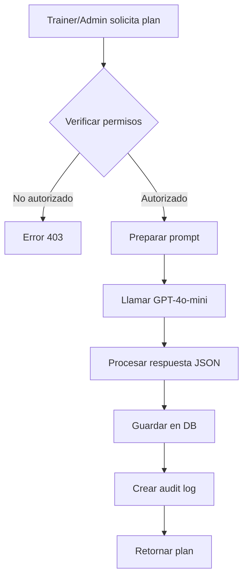

# 🤖 Generación con IA - Sistema de Nutrición

## 📋 Tabla de Contenidos
- [Overview](#overview)
- [Requisitos y Permisos](#requisitos-y-permisos)
- [Flujo de Generación](#flujo-de-generación)
- [Análisis de Imágenes](#análisis-de-imágenes)
- [Plantillas de Prompts](#plantillas-de-prompts)
- [Sistema de Costos](#sistema-de-costos)
- [Mejores Prácticas](#mejores-prácticas)
- [Troubleshooting](#troubleshooting)

## Overview

El sistema de IA utiliza **GPT-4o-mini** de OpenAI para generar planes nutricionales personalizados y analizar imágenes de comidas. Solo **trainers y admins** pueden generar contenido con IA.

### Características Principales
- ✅ Generación de planes completos con 7-30 días
- ✅ Análisis de imágenes de comidas con cálculo de macros
- ✅ Prompts personalizados según objetivo y restricciones
- ✅ Costo optimizado (~$0.002 por plan)
- ✅ Cache de resultados para optimización

## Requisitos y Permisos

### Roles Autorizados
```python
# Solo pueden generar con IA:
- Admin del gimnasio
- Trainers autorizados

# Los members NO pueden generar, solo consumir planes
```

### Configuración Necesaria
```env
# En .env
CHAT_GPT_MODEL=sk-...  # API key de OpenAI
OPENAI_MODEL=gpt-4o-mini  # Modelo optimizado para costos
```

## Flujo de Generación

### 1. Generación de Plan Completo



### Endpoint: Generate with AI
```python
POST /api/v1/nutrition/plans/generate
Authorization: Bearer {token}
Content-Type: application/json

{
    "prompt": "Plan para pérdida de peso, 1800 cal, vegetariano",
    "duration_days": 7,
    "user_context": {
        "age": 30,
        "weight": 80,
        "height": 175,
        "activity_level": "moderate",
        "dietary_restrictions": ["vegetarian"],
        "allergies": ["nuts"]
    }
}
```

### Respuesta Exitosa
```json
{
    "plan_id": 123,
    "name": "Plan Vegetariano 1800cal",
    "description": "Plan optimizado para pérdida de peso...",
    "total_days": 7,
    "nutritional_goal": "weight_loss",
    "target_calories": 1800,
    "daily_plans": [
        {
            "day_number": 1,
            "day_name": "Lunes",
            "total_calories": 1795,
            "meals": [
                {
                    "name": "Desayuno Energético",
                    "type": "breakfast",
                    "calories": 380,
                    "protein": 15,
                    "carbs": 45,
                    "fat": 12,
                    "ingredients": [...]
                }
            ]
        }
    ],
    "ai_metadata": {
        "model": "gpt-4o-mini",
        "cost_usd": 0.0023,
        "generation_time_ms": 3450,
        "prompt_tokens": 850,
        "completion_tokens": 1200
    }
}
```

### 2. Análisis de Imagen de Comida

```python
POST /api/v1/nutrition/meals/analyze
Authorization: Bearer {token}
Content-Type: multipart/form-data

{
    "image": <binary_file>,
    "context": "Almuerzo en restaurante italiano"
}
```

### Respuesta de Análisis
```json
{
    "meal_name": "Pasta Carbonara con Ensalada",
    "estimated_calories": 680,
    "macros": {
        "protein": 28,
        "carbs": 72,
        "fat": 31
    },
    "ingredients_detected": [
        "Pasta (200g)",
        "Bacon (30g)",
        "Queso parmesano (20g)",
        "Huevo (1 unidad)",
        "Lechuga mixta (100g)"
    ],
    "confidence_score": 0.85,
    "nutritional_warnings": [
        "Alto en grasas saturadas",
        "Contiene gluten"
    ],
    "ai_metadata": {
        "model": "gpt-4o-mini",
        "vision_used": true,
        "cost_usd": 0.0008
    }
}
```

## Plantillas de Prompts

### Prompt Base para Planes
```python
PLAN_GENERATION_PROMPT = """
Genera un plan nutricional detallado con las siguientes características:
- Duración: {duration_days} días
- Objetivo: {nutritional_goal}
- Calorías objetivo: {target_calories} kcal/día
- Restricciones: {dietary_restrictions}
- Alergias: {allergies}
- Nivel de actividad: {activity_level}

Requisitos del plan:
1. Debe ser balanceado nutricionalmente
2. Incluir 3-5 comidas por día
3. Especificar cantidades exactas en gramos
4. Calcular macros para cada comida
5. Considerar disponibilidad local de ingredientes
6. Proporcionar alternativas para ingredientes clave

Formato de respuesta: JSON estructurado
{
    "plan_name": "...",
    "daily_plans": [
        {
            "day": 1,
            "meals": [...]
        }
    ]
}
"""
```

### Prompt para Análisis de Imagen
```python
IMAGE_ANALYSIS_PROMPT = """
Analiza esta imagen de comida y proporciona:
1. Identificación de alimentos visibles
2. Estimación de porciones en gramos
3. Cálculo de calorías totales
4. Desglose de macronutrientes
5. Identificación de posibles alérgenos
6. Evaluación nutricional general

Contexto adicional: {user_context}

Sé conservador en las estimaciones de calorías.
Formato: JSON con campos específicos.
"""
```

## Sistema de Costos

### Modelo GPT-4o-mini
```
Costos por token (Diciembre 2024):
- Input: $0.00015 / 1K tokens
- Output: $0.00060 / 1K tokens

Promedio por operación:
- Plan completo (7 días): ~$0.0023
- Análisis de imagen: ~$0.0008
- Ajuste de plan: ~$0.0005
```

### Estimación Mensual
```python
# Ejemplo para gimnasio activo:
- 20 planes generados/mes: $0.046
- 100 análisis de imagen/mes: $0.080
- 50 ajustes de plan/mes: $0.025

TOTAL MENSUAL: ~$0.15 USD
```

### Optimización de Costos

1. **Cache de Resultados**
```python
# Los resultados se cachean por 24 horas
cache_key = f"ai:plan:{hash(prompt)}:{user_context_hash}"
ttl = 86400  # 24 horas

# Reutilización para prompts similares
if cached_result := redis.get(cache_key):
    return cached_result
```

2. **Prompts Optimizados**
```python
# Usar instrucciones concisas
# Evitar repeticiones innecesarias
# Especificar formato de salida exacto
# Limitar tokens de respuesta cuando sea posible
```

3. **Batch Processing**
```python
# Agrupar múltiples solicitudes cuando sea posible
plans_to_generate = [...]
batch_prompt = create_batch_prompt(plans_to_generate)
# Una llamada en lugar de múltiples
```

## Mejores Prácticas

### 1. Validación de Entrada
```python
# Siempre validar antes de llamar a IA
def validate_ai_request(request):
    # Verificar permisos del usuario
    if user.role not in ['admin', 'trainer']:
        raise Forbidden()

    # Validar parámetros
    if request.target_calories < 1200 or request.target_calories > 5000:
        raise ValueError("Calorías fuera de rango seguro")

    # Verificar límites de rate
    if exceeded_rate_limit(user):
        raise RateLimitExceeded()
```

### 2. Manejo de Errores
```python
try:
    response = openai.chat.completions.create(...)
except openai.APIError as e:
    # Log error
    logger.error(f"OpenAI API error: {e}")
    # Fallback a plan predefinido si es posible
    return get_fallback_plan(user_requirements)
except Exception as e:
    # Registro en audit log
    create_audit_log(
        action="ai_generation_failed",
        error=str(e)
    )
    raise
```

### 3. Audit Trail Completo
```python
# Registrar TODA generación con IA
audit_log = SafetyAuditLog(
    user_id=current_user.id,
    gym_id=gym_id,
    action_type="ai_generation",
    ai_model_used="gpt-4o-mini",
    ai_prompt_hash=hashlib.sha256(prompt.encode()).hexdigest(),
    ai_cost_estimate=calculate_cost(tokens),
    was_allowed=True,
    generated_plan_id=plan.id
)
```

### 4. Límites y Quotas
```python
# Implementar límites por gimnasio
class AIQuotaManager:
    MAX_DAILY_GENERATIONS = 50
    MAX_MONTHLY_COST_USD = 10.00

    async def check_quota(self, gym_id: int):
        daily_count = await redis.get(f"ai:quota:daily:{gym_id}")
        if daily_count >= self.MAX_DAILY_GENERATIONS:
            raise QuotaExceeded("Límite diario alcanzado")

        monthly_cost = await calculate_monthly_cost(gym_id)
        if monthly_cost >= self.MAX_MONTHLY_COST_USD:
            raise QuotaExceeded("Límite de costo mensual alcanzado")
```

## Troubleshooting

### Error: "OpenAI API Key Invalid"
```bash
# Verificar configuración
echo $OPENAI_API_KEY

# Probar directamente
curl https://api.openai.com/v1/models \
  -H "Authorization: Bearer $OPENAI_API_KEY"
```

### Error: "Rate Limit Exceeded"
```python
# Implementar retry con backoff
import backoff

@backoff.on_exception(
    backoff.expo,
    openai.RateLimitError,
    max_tries=3,
    max_time=30
)
async def call_openai_with_retry(prompt):
    return await openai.chat.completions.create(...)
```

### Error: "Invalid JSON Response"
```python
# Validar y parsear respuesta
def parse_ai_response(response_text):
    try:
        # Intentar extraer JSON del texto
        json_match = re.search(r'\{.*\}', response_text, re.DOTALL)
        if json_match:
            return json.loads(json_match.group())
    except:
        # Log para debugging
        logger.error(f"Failed to parse AI response: {response_text[:500]}")
        # Usar respuesta de fallback
        return create_fallback_response()
```

### Monitoreo de Costos
```python
# Dashboard de costos en tiempo real
GET /api/v1/nutrition/ai/costs?period=month

{
    "period": "2024-12",
    "total_cost_usd": 2.45,
    "breakdown": {
        "plan_generation": 1.80,
        "image_analysis": 0.45,
        "adjustments": 0.20
    },
    "operations_count": {
        "plans": 120,
        "images": 450,
        "adjustments": 80
    }
}
```

## Consideraciones de Seguridad

### 1. No Exponer Claves API
```python
# NUNCA hacer esto:
response = {"api_key": OPENAI_API_KEY}  # ❌

# Siempre mantener claves en servidor
# Usar variables de entorno
# Rotar claves periódicamente
```

### 2. Sanitización de Prompts
```python
def sanitize_prompt(user_input):
    # Remover comandos de sistema
    forbidden = ["system:", "ignore previous", "###"]
    for word in forbidden:
        if word.lower() in user_input.lower():
            raise ValueError("Input no permitido")

    # Limitar longitud
    if len(user_input) > 2000:
        user_input = user_input[:2000]

    return user_input
```

### 3. Validación de Respuestas
```python
def validate_ai_plan(plan):
    # Verificar estructura
    required_fields = ["daily_plans", "meals", "calories"]

    # Verificar rangos seguros
    for day in plan["daily_plans"]:
        if day["total_calories"] < 800 or day["total_calories"] > 5000:
            raise ValueError("Plan con calorías fuera de rango seguro")

    # Verificar contenido apropiado
    inappropriate_terms = [...]
    # Validar contra términos no permitidos
```

---

**Siguiente:** [05_TIPOS_PLANES.md](05_TIPOS_PLANES.md) - Tipos de planes nutricionales disponibles